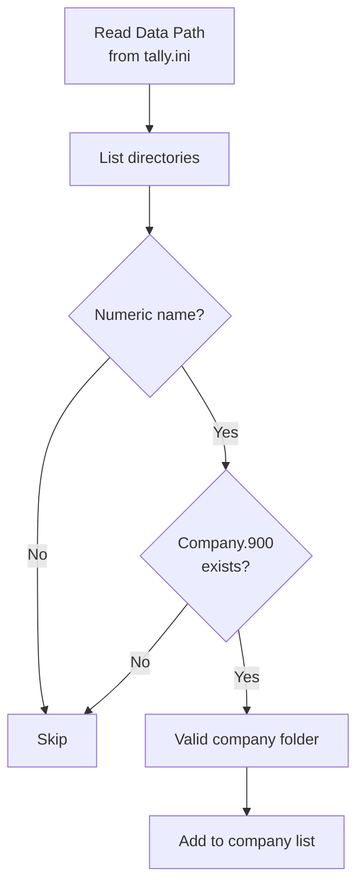
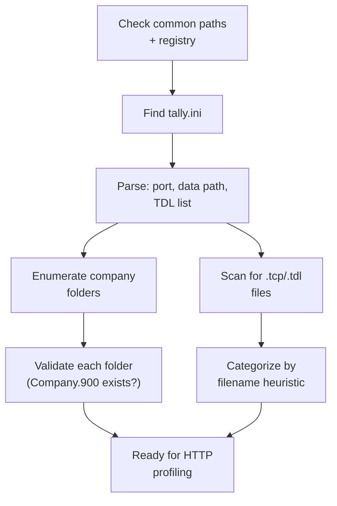

Before the connector can talk to Tally over HTTP, it needs to find where Tally lives on the machine. This means scanning the filesystem for installations, parsing config files, and inventorying any TDL customizations. Think of it as reconnaissance.

## Finding Tally on Windows

### Common Install Paths

The connector checks these locations in order:

```
C:\TallyPrime\
C:\Program Files\TallyPrime\
C:\Program Files (x86)\TallyPrime\
C:\Tally.ERP9\
C:\Program Files\Tally.ERP9\
C:\Program Files (x86)\Tally.ERP9\
```

:::tip
Most stockists install TallyPrime in `C:\TallyPrime\`. It's the default and almost nobody changes it. But "almost" isn't "always," so we check everywhere.
:::

### Windows Registry Keys

For a more reliable detection, query the Windows registry:

```
HKLM\SOFTWARE\Tally Solutions\Install
HKLM\SOFTWARE\WOW6432Node\Tally Solutions
```

These keys typically contain the installation path and version information.

### Running Process Detection

As a fallback, check running processes:

```go
// Find tallyprime.exe or tally.exe
// in the process list and extract
// the executable path
```

This is useful when Tally is installed in a non-standard location but is currently running.

## Version Detection

Once we find the Tally directory, we can determine the version from:

1. **The executable name**: `tallyprime.exe` vs `tally.exe` (ERP 9)
2. **The XML API**: The `TALLYVERSION` tag in responses (most reliable when Tally is running)
3. **File structure**: Presence of `config/` folder indicates TallyPrime 7.0+

| Indicator | Version |
|-----------|---------|
| `tally.exe` | Tally.ERP 9 |
| `tallyprime.exe` | TallyPrime (pre-7.0 or 7.0+) |
| `config/` folder exists | TallyPrime 7.0+ |
| 6-digit company folders | TallyPrime 3.0+ |

## Parsing tally.ini

The `tally.ini` file is the single most important discovery artifact. It lives in the Tally installation directory.

### Structure

```ini
[Tally]
; Installation
Admin = Yes
Launch Browser = No

; Network
Port = 9000
Connect = Yes
Port 2 = 9001

; Data
Data Path = C:\Users\Public\TallyPrime\Data
Export Path = C:\TallyPrime\Export
Log Path = C:\TallyPrime\Logs

; TDL
TDL = Yes
Default TDL = tally.tdl
User TDL = Yes
User TDL0 = MedicalBilling.tcp
User TDL1 = SalesmanTracker.tcp
User TDL2 = C:\Custom\DiscountCalc.tdl
```

### Key Fields to Extract

| Field | Why it matters |
|-------|---------------|
| `Port` | The HTTP server port for XML API |
| `Data Path` | Where company data folders live |
| `User TDL0..N` | List of loaded TDL/TCP files |
| `TDL` | Whether TDL engine is enabled |
| `Export Path` | Where Tally writes exports |
| `Log Path` | Where to find Tally's logs |

:::caution
The `Data Path` field is critical. If you assume the default path (`C:\Users\Public\TallyPrime\Data`), you'll miss companies when the stockist has moved their data to a different drive — which is surprisingly common for machines with small SSDs.
:::

## Enumerating Company Folders

Company data lives in numbered folders under the Data Path:

```
C:\Users\Public\TallyPrime\Data\
├── 10000\          <-- First company
│   ├── Company.900
│   ├── cmpsave.900
│   ├── manager.900
│   ├── tranmgr.900
│   ├── linkmgr.900
│   └── sumtran.900
├── 10001\          <-- Second company
├── 10002\          <-- Third company
└── 100000\         <-- TallyPrime 3.0+ format
```

### Folder Naming Rules

| Pattern | Version |
|---------|---------|
| 5-digit (10000, 10001, ...) | Tally.ERP 9 and older TallyPrime |
| 6-digit (100000, 100001, ...) | TallyPrime 3.0+ (after data migration) |

The connector lists all numeric directories and validates each by checking for the `Company.900` file.



### Key Data Files

| File | Content |
|------|---------|
| `Company.900` | Company master data |
| `cmpsave.900` | Company backup metadata |
| `manager.900` | Master data (ledgers, items) |
| `tranmgr.900` | Transaction manager |
| `linkmgr.900` | Link/reference manager |
| `sumtran.900` | Summary transactions |
| `*.tsf` | Temporary files (ignore) |

:::tip
You can estimate company size by looking at file sizes. A `tranmgr.900` over 500 MB signals a large company that will need careful batching during initial sync.
:::

## Scanning for TDL/TCP Files

TDL (source) and TCP (compiled) files can live in several locations:

### Search Locations

```
1. Tally installation directory
   C:\TallyPrime\*.tcp
   C:\TallyPrime\*.tdl

2. TDL subdirectory
   C:\TallyPrime\tdl\*.tcp

3. Account TDL directory
   %LOCALAPPDATA%\TallyPrime\tdl\*.tcp

4. Custom paths from tally.ini
   User TDL0 = C:\Custom\MyAddon.tcp
```

### TCP vs TDL

| Extension | Type | Readable? |
|-----------|------|-----------|
| `.tdl` | Source TDL | Yes, plain text |
| `.tcp` | Compiled TDL | No, binary format |

TCP files are compiled. You cannot extract UDF definitions from them directly. To discover UDFs created by a TCP, you must export sample objects from Tally while the TCP is loaded and parse the XML for non-standard tags.

## Filename Heuristics for Addon Categorization

TCP filenames are often descriptive enough to categorize the addon:

```go
patterns := map[string]string{
    "medical":   "pharma_billing",
    "pharma":    "pharma_billing",
    "barcode":   "barcode_tracking",
    "ecom":      "ecommerce_integration",
    "amazon":    "ecommerce_integration",
    "salesman":  "salesman_tracking",
    "dsr":       "salesman_tracking",
    "approval":  "workflow_approval",
    "imei":      "serial_tracking",
    "serial":    "serial_tracking",
    "discount":  "discount_management",
    "transport": "logistics",
    "eway":      "logistics",
    "branch":    "multi_branch",
}
```

| Addon Category | Common Filenames | Likely UDFs |
|---------------|-----------------|-------------|
| Pharma billing | `MedicalBilling.tcp`, `Pharma.tcp` | DrugSchedule, PackOf, CompanyBrand |
| Salesman tracking | `SalesmanTracker.tcp`, `DSR.tcp` | SalesmanName, Route, Territory |
| Barcode | `TallyBarcode.tcp` | BarcodeValue, EANCode |
| E-commerce | `eCom2Tally.tcp` | OrderID, MarketplaceName |

:::caution
Filename heuristics are a best-effort guess. Never rely on them for data extraction. Always verify by exporting sample objects and parsing the actual XML response.
:::

## The Tally.imp Log File

Every XML import to Tally writes results to `Tally.imp` in the installation directory. It's a plain text file:

```
Created: 1
Altered: 0
Combined: 0
Cancelled: 0
Deleted: 0
Ignored: 0
Errors: 0
Last Voucher ID: 12345
```

The connector parses this as a secondary confirmation after push operations, especially useful when the HTTP response is ambiguous or times out.

### Where to find it

```
C:\TallyPrime\Tally.imp
```

:::tip
The `Tally.imp` file is overwritten with each import operation. If you need to preserve the response, copy the file immediately after each push or rely on the HTTP response as the primary confirmation mechanism.
:::

## Discovery Flow Summary



At this point, the connector has a map of the Tally installation: where the data lives, what port to connect on, which companies exist, and what TDL addons are installed. The next step is [Tally Profile Detection](/tally-integartion/architecture/tally-profile-detection/) over the HTTP API.
