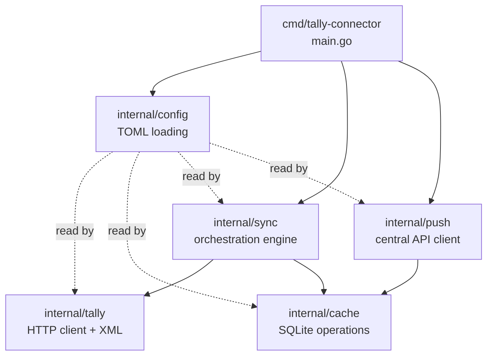

The connector is the workhorse of this system. It runs on the same Windows machine as TallyPrime, talks to Tally's XML API, caches data locally, and pushes upstream. Here's why Go is the right tool and how the code is organized.

## Why Go?

We evaluated Go, Rust, Python, Node.js, and C#. Go won for these reasons:

| Reason | Detail |
|--------|--------|
| Single static binary | No runtime deps on the Windows machine. No JVM, no Node, no .NET. |
| Excellent HTTP client | `net/http` is battle-tested. Perfect for Tally's XML-over-HTTP API. |
| Pure-Go SQLite | `modernc.org/sqlite` needs no CGO. Cross-compiles cleanly. |
| Cross-compilation | Build for Windows from Linux/Mac CI with `GOOS=windows GOARCH=amd64`. |
| Small footprint | The binary is ~15-20 MB. Runs as a Windows service or tray app. |
| Concurrency model | Goroutines make it easy to poll Tally, push upstream, and serve health checks simultaneously. |

:::tip
The pure-Go SQLite driver (`modernc.org/sqlite`) is crucial. CGO-based SQLite drivers like `mattn/go-sqlite3` require a C compiler on Windows. That's a non-starter for stockist machines.
:::

### What about Rust?

Rust would also work well here. Smaller binary, better memory safety. But Go's HTTP ecosystem is more mature, the team knows Go, and the compilation story for Windows is simpler. If we ever need to rewrite, the architecture supports it — the connector is a self-contained binary with a clean interface.

## Module Structure

```
tally-connector/
├── cmd/
│   └── tally-connector/
│       └── main.go
├── internal/
│   ├── tally/
│   │   ├── client.go
│   │   ├── xml_builder.go
│   │   ├── xml_parser.go
│   │   ├── collections.go
│   │   └── types.go
│   ├── cache/
│   │   ├── sqlite.go
│   │   ├── schema.go
│   │   └── upsert.go
│   ├── sync/
│   │   ├── engine.go
│   │   ├── masters.go
│   │   ├── vouchers.go
│   │   ├── reports.go
│   │   └── change_detect.go
│   ├── push/
│   │   ├── client.go
│   │   ├── queue.go
│   │   └── retry.go
│   └── config/
│       └── config.go
├── configs/
│   └── default.toml
├── scripts/
│   └── install-service.ps1
└── go.mod
```

## Module Dependency Diagram



## Module Deep Dives

### `internal/tally/` — Talking to Tally

This module owns all communication with TallyPrime's XML-over-HTTP API.

**`client.go`** — The HTTP client. Sends POST requests to `http://localhost:9000` with XML payloads. Handles timeouts, retries, and connection detection.

**`xml_builder.go`** — Constructs XML request envelopes. Supports all five request types:
- Export Data (reports)
- Export Object (single item)
- Export Collection (lists)
- Import (push masters/vouchers)
- Execute (trigger actions)

**`xml_parser.go`** — Parses XML responses. Handles all the Tally-specific quirks:
- Quantity strings with units (`"100 Strip"`)
- Amount signs (debit-negative convention)
- Date normalization (`YYYYMMDD` to Go `time.Time`)
- `Yes`/`No` booleans
- Both voucher view tag variants
- UDF detection (named and indexed)

**`collections.go`** — Collection-specific fetch logic. Knows how to build the inline TDL for each Tally collection (StockItem, Ledger, Godown, etc.) and what fields to fetch.

**`types.go`** — Go structs mirroring Tally objects. One struct per master type, one per transaction sub-table.

:::caution
Tally uses two different XML structures depending on whether the voucher was entered in "Invoice View" or "Accounting View." The parser must check for both `ALLLEDGERENTRIES.LIST` and `LEDGERENTRIES.LIST`. See the [edge cases doc](/tally-integartion/architecture/risk-register/) for details.
:::

### `internal/cache/` — Local SQLite

**`sqlite.go`** — Database connection management using `modernc.org/sqlite`. WAL mode for concurrent reads during push.

**`schema.go`** — DDL definitions and migration logic. Creates all 11 master tables, 7 transaction tables, and 3 metadata tables on first run.

**`upsert.go`** — Smart upsert with change detection. Compares `alter_id` before writing to avoid unnecessary disk I/O.

### `internal/sync/` — The Orchestration Engine

This is where the magic happens. The sync engine coordinates all data flow.

**`engine.go`** — The main loop. Runs on configurable intervals:

```go
// Simplified sync loop
func (e *Engine) Run(ctx context.Context) {
    masterTick := time.NewTicker(
        e.cfg.MasterInterval,
    )
    voucherTick := time.NewTicker(
        e.cfg.VoucherInterval,
    )
    reportTick := time.NewTicker(
        e.cfg.ReportInterval,
    )
    // select on tickers...
}
```

**`masters.go`** — Pulls master data (stock items, godowns, ledgers, units, etc.). Uses AlterID watermarks for incremental sync.

**`vouchers.go`** — Pulls voucher data with date-range batching. Splits large exports into daily chunks to avoid freezing Tally.

**`reports.go`** — Extracts computed reports like Stock Summary and Batch Summary. These are Tally-calculated values that we trust over our own computations.

**`change_detect.go`** — AlterID-based delta detection. Compares the current max AlterID from Tally against our stored watermark. If they match, we skip the cycle.

### `internal/push/` — Upstream Communication

**`client.go`** — HTTP client for the central API. Sends gzip-compressed JSON payloads. Handles auth via API key.

**`queue.go`** — Manages the `_push_queue` table in SQLite. Enqueues changed objects, dequeues in batches, marks success or failure.

**`retry.go`** — Exponential backoff retry logic. Default schedule: 5s, 30s, 2m, 10m, 1h. After max retries, the item enters dead-letter state for manual review.

### `internal/config/` — Configuration

**`config.go`** — Loads TOML configuration. Supports defaults, environment variable overrides, and hot-reload via SIGHUP (or filesystem watch on Windows).

## Key Dependencies

| Package | Purpose |
|---------|---------|
| `modernc.org/sqlite` | Pure-Go SQLite driver |
| `encoding/xml` | XML parsing (stdlib) |
| `net/http` | HTTP client/server (stdlib) |
| `github.com/BurntSushi/toml` | TOML config parsing |
| `golang.org/x/sys/windows` | Windows service integration |

:::tip
We deliberately keep dependencies minimal. The connector runs on machines we don't control. Fewer dependencies means fewer things to break.
:::

## Build and Deployment

Cross-compile from CI:

```bash
GOOS=windows GOARCH=amd64 \
  go build -o tally-connector.exe \
  ./cmd/tally-connector/
```

The resulting binary is a single `.exe` file. Deploy it by:

1. Copying to the stockist's machine
2. Placing `config.toml` next to it
3. Running `install-service.ps1` to register as a Windows service

Or just double-click for tray-app mode during testing.
