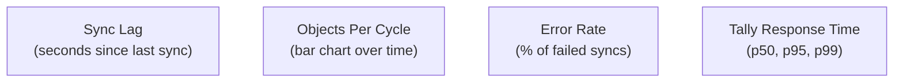

A connector that silently fails is worse than no connector at all. You need to know when things go wrong, how fast data is flowing, and whether the numbers you're serving are fresh. Here's the observability stack.

## Tally's Built-in HTTP Log

TallyPrime logs every HTTP request it receives to `tallyhttp.log`. This is your first line of debugging.

### How to Enable

In TallyPrime:
1. Press F1 (Help) > Settings
2. Go to Advanced Configuration
3. Set `Enable HTTP Log = Yes`

The log file appears in the Tally installation directory.

### What It Captures

```
[2026-03-26 10:30:15] POST / HTTP/1.1
  Content-Length: 842
  Response Time: 1250ms
  Status: 200 OK

[2026-03-26 10:30:17] POST / HTTP/1.1
  Content-Length: 1204
  Response Time: 3500ms
  Status: 200 OK
```

Each entry shows the timestamp, request size, response time, and HTTP status. You can correlate these with connector logs to diagnose slow queries.

:::tip
If you see response times consistently above 5 seconds, the Tally company is probably large. Consider tightening the batch size or switching to daily batching mode.
:::

### Log Location

```
C:\TallyPrime\tallyhttp.log
```

The connector can optionally tail this file to enrich its own telemetry with Tally-side response times.

## Connector-Side Logging

The connector writes structured logs to its own log file.

### Log Levels

| Level | When used |
|-------|-----------|
| `debug` | XML request/response bodies, cache operations |
| `info` | Sync cycle start/end, object counts, push queue status |
| `warn` | Tally unreachable (retrying), slow responses, near-limit batch sizes |
| `error` | Sync failures, push failures, parse errors |

### Key Log Events

```
INFO  sync.masters    pulled=42 items
                      duration=1.2s
                      alter_id=5678

INFO  sync.vouchers   pulled=156 vouchers
                      date_range=2026-03-25
                      duration=3.4s

INFO  push.queue      queued=42
                      pushed=42
                      failed=0
                      duration=0.8s

WARN  tally.client    connection refused
                      host=localhost:9000
                      retry_in=30s

ERROR sync.vouchers   xml_parse_error
                      line=42
                      tag=BATCHALLOCATIONS.LIST
                      err="unexpected EOF"
```

### Sync Duration Tracking

Every sync operation records its duration in `_sync_log`:

```sql
SELECT
    sync_type,
    entity_type,
    AVG(duration_ms) as avg_ms,
    MAX(duration_ms) as max_ms,
    COUNT(*) as cycles
FROM _sync_log
WHERE timestamp > datetime('now', '-1 day')
GROUP BY sync_type, entity_type;
```

## Health Check Endpoint

The connector exposes a local HTTP endpoint for monitoring:

```
GET http://localhost:8377/health
```

### Response

```json
{
  "status": "healthy",
  "uptime_seconds": 86400,
  "tally": {
    "reachable": true,
    "host": "localhost:9000",
    "version": "TallyPrime:Release 7.0",
    "last_response_ms": 450,
    "companies_loaded": 2
  },
  "sync": {
    "last_master_sync": "2026-03-26T10:30:00Z",
    "last_voucher_sync": "2026-03-26T10:31:00Z",
    "last_report_sync": "2026-03-26T10:25:00Z",
    "master_alter_id": 5678,
    "voucher_alter_id": 12345,
    "sync_lag_seconds": 45
  },
  "push": {
    "queue_depth": 0,
    "last_push": "2026-03-26T10:31:05Z",
    "failed_items": 0,
    "dead_letter_items": 0
  },
  "cache": {
    "db_size_mb": 245,
    "stock_items": 1200,
    "vouchers": 34500,
    "oldest_voucher": "2024-04-01"
  }
}
```

### Status Values

| Status | Meaning |
|--------|---------|
| `healthy` | Everything normal |
| `degraded` | Tally unreachable or sync lagging |
| `unhealthy` | Persistent failures, push queue growing |

## Alerting Rules

Set up alerts for conditions that need human attention.

### Critical Alerts

| Condition | Threshold | Action |
|-----------|-----------|--------|
| Tally unreachable | > 30 minutes | Notify stockist. Tally may have been closed. |
| Push queue growing | > 100 items | Check central API health. Network issue? |
| Sync failures | > 3 consecutive | Check Tally logs. Possible data corruption. |
| Dead-letter items | > 0 | Manual review needed. Unrecoverable push failure. |

### Warning Alerts

| Condition | Threshold | Action |
|-----------|-----------|--------|
| Sync lag | > 15 minutes | Tally may be slow or busy |
| Stock position drift | > 5% difference | Schedule full reconciliation |
| Large response time | > 10 seconds | Reduce batch size |
| Cache size | > 1.5 GB | Consider pruning old data |

### How to Deliver Alerts

The connector supports:

```toml
[alerting]
# Webhook URL (Slack, Teams, etc.)
webhook_url = "https://hooks.slack.com/..."
# Email (via central API relay)
email = "admin@stockist.com"
# Just log it (always on)
log_alerts = true
```

:::caution
Don't over-alert. The stockist's IT person (if they have one) will start ignoring alerts. Keep it to conditions that genuinely need attention.
:::

## Dashboard Suggestions

If you're building a monitoring dashboard (Grafana, Datadog, or a custom admin panel), here are the key visualizations:

### Sync Health Panel



### Key Metrics to Track

| Metric | Type | Description |
|--------|------|-------------|
| `sync_lag_seconds` | gauge | Time since last successful sync |
| `objects_pulled_total` | counter | Cumulative objects pulled from Tally |
| `objects_pushed_total` | counter | Cumulative objects pushed to central |
| `push_queue_depth` | gauge | Current push queue size |
| `sync_duration_ms` | histogram | Sync cycle duration distribution |
| `tally_response_ms` | histogram | Tally HTTP response time distribution |
| `sync_errors_total` | counter | Cumulative sync errors |
| `push_errors_total` | counter | Cumulative push errors |
| `cache_size_bytes` | gauge | SQLite file size |

### Suggested Dashboard Layout

| Row | Panel 1 | Panel 2 | Panel 3 |
|-----|---------|---------|---------|
| 1 | Sync lag (gauge) | Tally status (up/down) | Push queue depth |
| 2 | Objects pulled/cycle (timeseries) | Sync duration (timeseries) | Error rate (timeseries) |
| 3 | Tally response time (histogram) | Cache size (gauge) | Dead-letter count |

## Operational Runbook

### "Tally unreachable" alert fired

1. Check if Tally is running on the stockist's machine
2. Check if a company is loaded (Tally needs an open company)
3. Verify the port matches the config (`tally.ini` vs `config.toml`)
4. Check if another process grabbed port 9000
5. If Silver license: check if someone is actively using Tally (single-user lock)

### "Push queue growing" alert fired

1. Check central API health (`/health` endpoint)
2. Check network connectivity from the stockist's machine
3. Look at push error messages in `_push_queue` table
4. If auth errors: rotate/verify the API key
5. If payload errors: check for data issues (malformed GUIDs, encoding)

### "Stock position drift" alert fired

1. Run a manual Stock Summary report pull
2. Compare with central DB positions
3. If drifted: trigger a full reconciliation sync
4. Check if CA made opening balance corrections

:::tip
The `_sync_log` table is your best friend during incident investigation. It records every sync cycle with duration, object counts, and error messages. Query it first.
:::

## Tally.imp as a Monitoring Signal

The `Tally.imp` file (in the Tally install directory) records import results. The connector can parse it after push operations:

```
Created: 1
Altered: 0
Errors: 0
```

If `Errors > 0` but the HTTP response was a 200, something went wrong inside Tally. The connector should log a warning and store the discrepancy.
