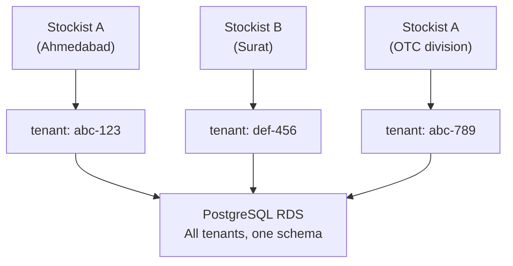
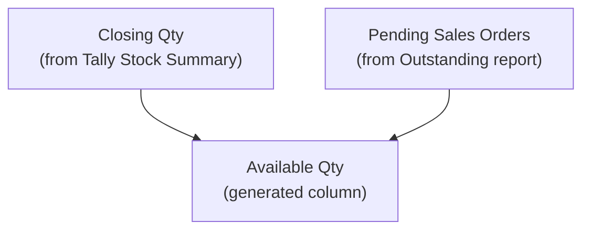
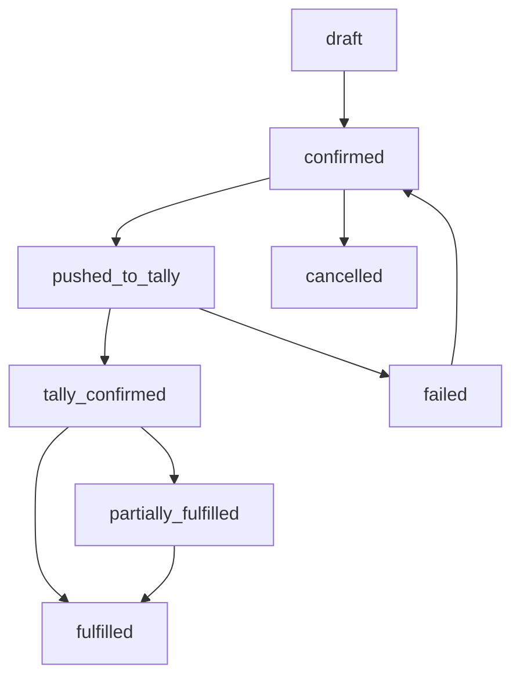

The central PostgreSQL database is where data from all stockist connectors converges. It's multi-tenant by design, pharma-aware by necessity, and built to serve a sales fleet that needs answers fast.

## Multi-Tenant Strategy

We use a **shared-schema, tenant-column** approach. Every table has a `tenant_id` column. Each Tally company maps to one tenant.



:::tip
One stockist can have multiple tenants if they run multiple Tally companies (common for pharma — separate companies for Ethical vs OTC, or per-state GSTIN).
:::

### Tenant Registry

```sql
CREATE TABLE tenants (
  id           UUID PRIMARY KEY
               DEFAULT gen_random_uuid(),
  name         TEXT NOT NULL,
  tally_company TEXT,
  tally_guid   TEXT UNIQUE,
  region       TEXT,
  status       TEXT DEFAULT 'active',
  created_at   TIMESTAMPTZ DEFAULT now()
);
```

### The Compound Key Rule

Every data table uses `(tenant_id, tally_guid)` as its uniqueness constraint. This prevents GUID collisions across tenants while ensuring one object per tenant.

```sql
UNIQUE(tenant_id, tally_guid)
```

## Enum Types

We define enums for commonly referenced status fields:

```sql
CREATE TYPE voucher_category AS ENUM (
  'accounting',
  'inventory',
  'order'
);

CREATE TYPE sync_status AS ENUM (
  'synced',
  'pending_push',
  'push_failed',
  'conflict'
);

CREATE TYPE order_status AS ENUM (
  'draft',
  'confirmed',
  'pushed_to_tally',
  'tally_confirmed',
  'partially_fulfilled',
  'fulfilled',
  'cancelled',
  'failed'
);
```

## Stock Items

The central stock item table includes standard Tally fields plus pharma-specific columns mapped from UDFs during onboarding.

```sql
CREATE TABLE stock_items (
  id             UUID PRIMARY KEY
                 DEFAULT gen_random_uuid(),
  tenant_id      UUID NOT NULL
                 REFERENCES tenants(id),
  tally_guid     TEXT NOT NULL,
  tally_alter_id INTEGER,
  name           TEXT NOT NULL,
  alias          TEXT,
  part_number    TEXT,
  stock_group    TEXT,
  stock_category TEXT,
  base_unit      TEXT,
  alternate_unit TEXT,
  conversion_factor DECIMAL,
  hsn_code       TEXT,
  gst_rate       DECIMAL,
  gst_type_of_supply TEXT,
  standard_cost  DECIMAL,
  standard_selling_price DECIMAL,
  reorder_level  DECIMAL,
  reorder_quantity DECIMAL,
  minimum_order_qty DECIMAL,
  costing_method TEXT,
  is_batch_enabled BOOLEAN DEFAULT false,
  has_expiry_tracking BOOLEAN DEFAULT false,

  -- Pharma-specific (from UDFs)
  drug_schedule       TEXT,
  storage_condition   TEXT,
  manufacturer        TEXT,
  drug_license_required BOOLEAN,

  synced_at TIMESTAMPTZ NOT NULL
            DEFAULT now(),
  UNIQUE(tenant_id, tally_guid)
);
```

### Indexes

```sql
CREATE INDEX idx_stock_items_tenant
  ON stock_items(tenant_id);
CREATE INDEX idx_stock_items_name
  ON stock_items(tenant_id, name);
CREATE INDEX idx_stock_items_hsn
  ON stock_items(tenant_id, hsn_code);
```

:::caution
The pharma columns (`drug_schedule`, `storage_condition`, `manufacturer`) come from TDL-defined UDFs. If the stockist's TDL isn't loaded, these fields will be NULL. The `udf_definitions` table tracks the mapping between UDF indices and these typed columns.
:::

## Stock Positions

This is the critical table for the sales fleet. It stores Tally-reported closing stock — never computed from vouchers.

```sql
CREATE TABLE stock_positions (
  id             UUID PRIMARY KEY
                 DEFAULT gen_random_uuid(),
  tenant_id      UUID NOT NULL
                 REFERENCES tenants(id),
  stock_item_id  UUID NOT NULL
                 REFERENCES stock_items(id),
  godown         TEXT NOT NULL
                 DEFAULT 'Main Location',
  closing_qty    DECIMAL NOT NULL,
  closing_value  DECIMAL NOT NULL,
  closing_rate   DECIMAL,

  -- Order commitments
  sales_order_pending_qty
    DECIMAL DEFAULT 0,
  purchase_order_pending_qty
    DECIMAL DEFAULT 0,

  -- Auto-computed available stock
  available_qty DECIMAL GENERATED ALWAYS AS
    (closing_qty - COALESCE(
      sales_order_pending_qty, 0
    )) STORED,

  as_of_date  DATE NOT NULL,
  synced_at   TIMESTAMPTZ NOT NULL
              DEFAULT now(),
  UNIQUE(tenant_id, stock_item_id,
         godown, as_of_date)
);
```

The `available_qty` column is a generated column. It subtracts pending sales orders from closing stock, giving the sales team a realistic "what can I actually sell?" number.



:::danger
Never compute stock positions from raw vouchers. Tally's Stock Summary report accounts for opening balances, valuation methods, and corrections that you cannot replicate externally. Always trust Tally's reported closing stock.
:::

## Stock Batches

Batch-level tracking with expiry dates. This is non-negotiable for pharma distribution.

```sql
CREATE TABLE stock_batches (
  id            UUID PRIMARY KEY
                DEFAULT gen_random_uuid(),
  tenant_id     UUID NOT NULL
                REFERENCES tenants(id),
  stock_item_id UUID NOT NULL
                REFERENCES stock_items(id),
  batch_name    TEXT NOT NULL,
  godown        TEXT NOT NULL
                DEFAULT 'Main Location',
  mfg_date      DATE,
  expiry_date   DATE,
  closing_qty   DECIMAL NOT NULL,
  closing_value DECIMAL,
  synced_at     TIMESTAMPTZ NOT NULL
                DEFAULT now(),
  UNIQUE(tenant_id, stock_item_id,
         batch_name, godown)
);
```

### Indexes

```sql
CREATE INDEX idx_batches_expiry
  ON stock_batches(tenant_id, expiry_date);
CREATE INDEX idx_batches_item
  ON stock_batches(
    tenant_id, stock_item_id
  );
```

## Field Orders

Orders placed by the sales team flow into this table before being pushed to Tally.

```sql
CREATE TABLE field_orders (
  id               UUID PRIMARY KEY
                   DEFAULT gen_random_uuid(),
  tenant_id        UUID NOT NULL
                   REFERENCES tenants(id),
  order_number     TEXT NOT NULL,
  party_id         UUID REFERENCES parties(id),
  party_ledger_name TEXT NOT NULL,
  salesman_id      UUID,
  territory        TEXT,
  order_date       DATE NOT NULL,
  due_date         DATE,
  total_amount     DECIMAL NOT NULL,
  gst_amount       DECIMAL,
  status           order_status NOT NULL
                   DEFAULT 'draft',
  tally_voucher_guid TEXT,
  tally_master_id  INTEGER,
  tally_voucher_number TEXT,
  tally_push_error TEXT,
  notes            TEXT,
  created_at       TIMESTAMPTZ DEFAULT now(),
  pushed_at        TIMESTAMPTZ,
  fulfilled_at     TIMESTAMPTZ,
  UNIQUE(tenant_id, order_number)
);
```

### Field Order Items

```sql
CREATE TABLE field_order_items (
  id              UUID PRIMARY KEY
                  DEFAULT gen_random_uuid(),
  order_id        UUID NOT NULL
                  REFERENCES field_orders(id)
                  ON DELETE CASCADE,
  stock_item_id   UUID
                  REFERENCES stock_items(id),
  stock_item_name TEXT NOT NULL,
  quantity        DECIMAL NOT NULL,
  unit            TEXT NOT NULL,
  rate            DECIMAL NOT NULL,
  amount          DECIMAL NOT NULL,
  gst_rate        DECIMAL,
  gst_amount      DECIMAL,
  godown          TEXT DEFAULT 'Main Location',
  due_date        DATE,
  fulfilled_qty   DECIMAL DEFAULT 0,
  sort_order      INTEGER DEFAULT 0
);
```

### Order Lifecycle



## UDF Storage

UDFs (User Defined Fields) vary per stockist. Instead of adding columns for every possible UDF, we use a flexible key-value store.

### UDF Definitions

```sql
CREATE TABLE udf_definitions (
  id             UUID PRIMARY KEY
                 DEFAULT gen_random_uuid(),
  tenant_id      UUID NOT NULL
                 REFERENCES tenants(id),
  object_type    TEXT NOT NULL,
  udf_name       TEXT NOT NULL,
  udf_index      INTEGER NOT NULL,
  udf_data_type  TEXT NOT NULL,
  display_label  TEXT,
  is_pharma_mapped BOOLEAN DEFAULT false,
  mapped_column  TEXT,
  UNIQUE(tenant_id, object_type, udf_index)
);
```

### UDF Values

```sql
CREATE TABLE udf_values (
  id               BIGSERIAL PRIMARY KEY,
  tenant_id        UUID NOT NULL,
  object_type      TEXT NOT NULL,
  object_id        UUID NOT NULL,
  udf_definition_id UUID
                   REFERENCES udf_definitions(id),
  value_text       TEXT,
  value_numeric    DECIMAL,
  value_date       DATE,
  value_boolean    BOOLEAN
);
CREATE INDEX idx_udf_values_object
  ON udf_values(
    tenant_id, object_type, object_id
  );
```

:::tip
When a UDF is identified as pharma-relevant (like `DrugSchedule`), it gets mapped to a typed column on `stock_items` via the `mapped_column` field. This gives you the best of both worlds: flexible storage for arbitrary UDFs, plus fast typed queries for known pharma fields.
:::

## Design Decisions

| Decision | Rationale |
|----------|-----------|
| Shared schema, not schema-per-tenant | Simpler operations. Indexing on `tenant_id` is fast enough for our scale. |
| `available_qty` as generated column | Always consistent. No application-level sync bugs. |
| Separate `stock_positions` table | Positions change every sync cycle. Keeping them separate from `stock_items` avoids high churn on the master table. |
| UDF key-value store | Every stockist has different TDL customizations. We can't predict the columns. |
| `tally_guid` as text, not UUID | Tally GUIDs follow their own format. Trying to parse them as PostgreSQL UUIDs would break. |
