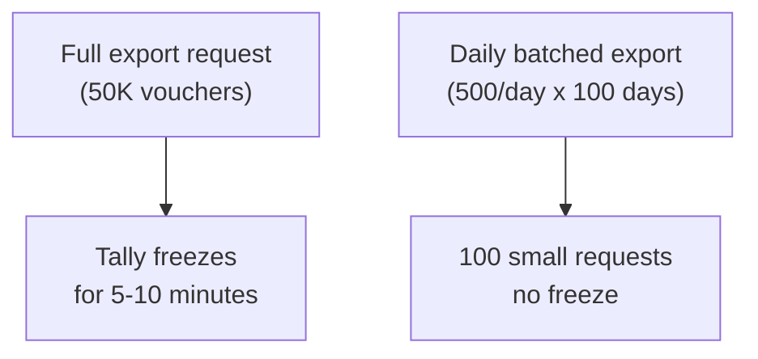
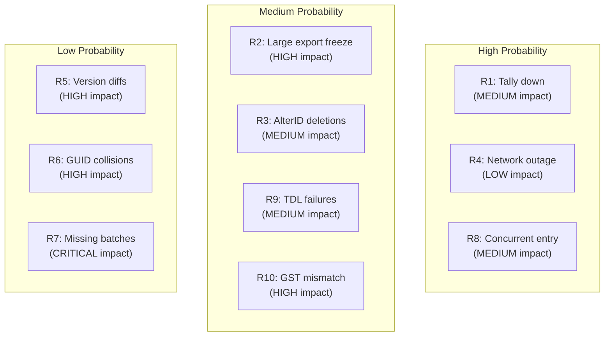

Every integration has risks. The ones you plan for are manageable. The ones you don't plan for become incidents. Here's every risk we've identified, rated and mitigated.

## How to Read This Register

- **Probability**: How likely is this to happen? (LOW / MEDIUM / HIGH)
- **Impact**: How bad is it when it happens? (LOW / MEDIUM / HIGH / CRITICAL)
- **Risk Score**: Probability x Impact. Focus on HIGH and CRITICAL first.

## Risk Table

| # | Risk | Prob. | Impact | Mitigation |
|---|------|-------|--------|------------|
| 1 | Tally not running during polls | HIGH | MEDIUM | Retry with exponential backoff. Local cache serves stale-but-available data. Alert after 30 min. Connector queues all pending work. |
| 2 | Large exports freezing Tally | MEDIUM | HIGH | Aggressive batching: max 5000 objects per export request. Day-by-day voucher batching. Schedule heavy syncs during off-hours (lunch, night). |
| 3 | AlterID misses deletions | MEDIUM | MEDIUM | AlterID only tracks creates and updates, not deletes. Run periodic full reconciliation (default: every 24h) to detect missing GUIDs and mark them deleted. |
| 4 | Network outage to central API | HIGH | LOW | Local SQLite push queue with automatic retry. Data accumulates locally and drains when connectivity returns. Orders still exist in Tally regardless. |
| 5 | Version differences: ERP 9 vs TallyPrime | LOW | HIGH | Profile detection on first connect. Version-specific XML parsers. No JSON for ERP 9. Different max collection sizes. Both code paths covered by fixture tests. |
| 6 | Multi-company GUID collisions | LOW | HIGH | Compound key `(tenant_id, tally_guid)` in PostgreSQL. Each Tally company is a separate tenant. GUIDs are only unique within a company. |
| 7 | Missing batch/expiry data | LOW | CRITICAL | Pharma-critical. If batch tracking is enabled in Tally but batch data is incomplete, alert immediately. Validate batch completeness on every sync. Block orders for items with missing expiry dates. |
| 8 | Concurrent data entry during sync | HIGH | MEDIUM | Accept eventual consistency. Tally does not provide snapshot isolation for HTTP exports. A voucher entered mid-export may appear partially. AlterID-based re-sync on next cycle catches the gap. |
| 9 | TDL-related failures | MEDIUM | MEDIUM | Custom TDL validations can reject valid-looking import XML. Adaptive push: try minimal fields first, add fields on retry. Log all unknown validation errors for manual mapping. |
| 10 | GST calculation mismatches | MEDIUM | HIGH | When the app computes GST differently from Tally, the `Dr = Cr` balance check fails and the import is rejected. Pull GST rates from stock item master. Validate totals before push. Consider letting Tally auto-calculate tax. |

## Detailed Analysis

### Risk 1: Tally Not Running During Polls

**Why it's HIGH probability:** Tally is a GUI desktop app. Someone closes it to go home. Someone reboots the PC. The power goes out. This will happen regularly.

**What happens:** The connector gets a "connection refused" error. No data flows.

**Mitigation stack:**
1. Retry with backoff (30s, 1m, 5m, 15m)
2. Serve cached data from SQLite
3. Alert after 30 minutes of continuous failure
4. Resume sync automatically when Tally comes back
5. No data loss — everything is queued

:::tip
The connector should be registered as a Windows service that starts on boot. When the machine restarts, the connector starts before the operator opens Tally. It'll retry until Tally is ready.
:::

### Risk 2: Large Exports Freezing Tally

**Why it matters:** When the connector asks Tally to export 50,000 vouchers in one request, Tally loads everything into RAM. The GUI freezes. The billing clerk can't work.

**Mitigation:**



Always use `date_batch_mode = "daily"` and keep `voucher_batch_size <= 5000`.

### Risk 3: AlterID Misses Deletions

**Why it happens:** When a CA deletes a voucher, the voucher's GUID simply disappears. No AlterID is bumped. The incremental sync has no signal.

**Mitigation:** Periodic full reconciliation. Compare the set of GUIDs in SQLite against the set returned by Tally. Any GUID in SQLite but not in Tally is marked as deleted.

:::caution
Full reconciliation is expensive. For a company with 30,000 vouchers, it means pulling all GUIDs from Tally and diffing. Schedule it during off-hours, default every 24 hours.
:::

### Risk 5: Version Differences

| Feature | ERP 9 | TallyPrime | TallyPrime 7.0+ |
|---------|-------|------------|-----------------|
| JSON API | No | No | Yes |
| Max export | ~2000 | ~5000 | ~5000 |
| Company folders | 5-digit | 5-digit | 6-digit |
| Config | tally.ini | tally.ini | tally.ini + config/ |

The profile detection phase catches the version and adjusts behavior accordingly.

### Risk 7: Missing Batch/Expiry Data

**Why it's CRITICAL for pharma:** Drug regulatory compliance requires batch tracking. A medicine without an expiry date cannot be legally sold. If the connector syncs stock without batch data, the sales app shows items as available that shouldn't be sold.

**Detection:**

```sql
-- Find items with batch tracking
-- but no batch records
SELECT si.name
FROM stock_items si
LEFT JOIN stock_batches sb
  ON sb.stock_item_id = si.id
WHERE si.is_batch_enabled = true
  AND sb.id IS NULL;
```

**Response:** Flag these items in the API response. The sales app should show a warning: "Batch data unavailable — cannot place order."

:::danger
For pharma distribution, missing expiry dates are a regulatory risk. The connector must validate batch completeness and surface gaps immediately, not silently serve incomplete data.
:::

### Risk 8: Concurrent Data Entry During Sync

**The scenario:** The billing clerk enters a sales invoice at 10:30:15. The connector's voucher export request covers 10:30:00 to 10:31:00. Depending on timing, the voucher might appear partially formed (header but no inventory lines).

**Why we accept this:** Tally doesn't offer transaction-level snapshot isolation for HTTP exports. This is a known limitation of the XML API. The voucher will have a new AlterID, so the next incremental sync picks it up in its complete form.

### Risk 10: GST Calculation Mismatches

**The problem:** The sales app calculates GST as 18% IGST for an interstate sale. But the stockist's Tally has a custom rate for this item or the party's state mapping is different. The voucher import fails with "Voucher totals do not match!"

**Mitigation approaches:**

| Approach | Pros | Cons |
|----------|------|------|
| App computes GST | Consistent UX | Must exactly match Tally's rates |
| Tally computes GST | Always correct | Can't show total in app before push |
| Pre-validate rates | Best of both | Extra round-trip to check rates |

Recommended: Pull GST rates from the `stock_items` table and compute in the app. Pre-validate the total matches before pushing.

## Risk Heatmap



## Residual Risks

These risks cannot be fully mitigated. We accept them and monitor:

1. **Tally's proprietary data format** — We cannot read Tally data files directly. If Tally won't run, we can't extract data. Mitigation: local cache provides last-known state.

2. **TDL ecosystem fragility** — Third-party TDLs can interfere with our exports in unpredictable ways. Mitigation: adaptive parsing, error logging, manual intervention queue.

3. **Stockist IT maturity** — Many stockists have limited technical capability. The connector must be as zero-touch as possible. Mitigation: Windows service auto-start, self-healing retries, remote monitoring.
