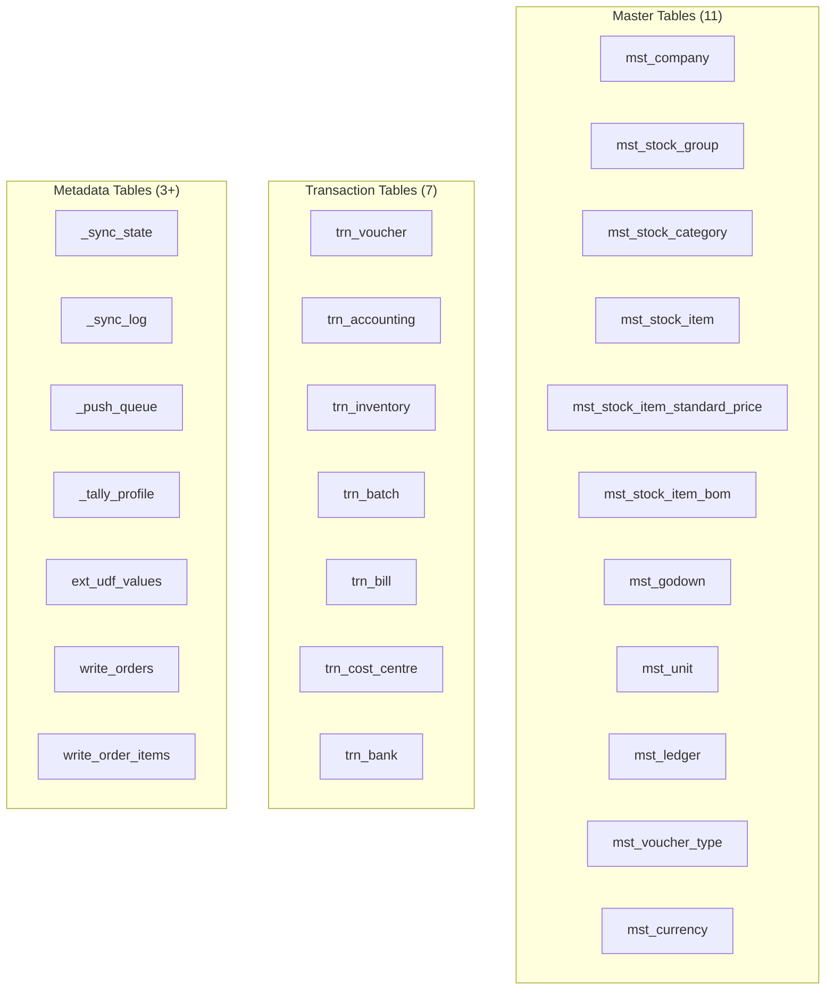

Between Tally and the cloud sits a humble SQLite file. It's the connector's memory, its safety net, and its secret weapon for offline resilience.

## Why SQLite?

| Benefit | Why it matters |
|---------|---------------|
| Zero-config | No database server to install on the stockist's PC |
| Resilient buffer | Data survives network outages, API downtime, even Tally being closed |
| Incremental diff | Compare local cache against Tally responses to detect changes |
| Offline queries | Connector can answer stock-level queries even when everything else is down |
| Single file | Easy to backup, copy, or delete and rebuild |

:::tip
The SQLite database lives right next to the connector binary. Default path: `./tally-cache.db`. The pure-Go driver (`modernc.org/sqlite`) means no C compiler or DLLs needed.
:::

## Schema Overview

The cache mirrors Tally's data model with three categories of tables:



## Master Tables

### mst_company

The root of everything. One row per Tally company.

```sql
CREATE TABLE mst_company (
  guid              TEXT PRIMARY KEY,
  name              TEXT,
  formal_name       TEXT,
  address           TEXT,
  state             TEXT,
  pincode           TEXT,
  phone             TEXT,
  email             TEXT,
  gstin             TEXT,
  pan               TEXT,
  financial_year_from DATE,
  financial_year_to   DATE,
  books_from        DATE,
  currency_name     TEXT,
  is_inventory_on   BOOLEAN,
  is_multi_godown   BOOLEAN,
  is_batch_enabled  BOOLEAN,
  is_bill_of_materials BOOLEAN,
  is_cost_tracking  BOOLEAN,
  is_order_enabled  BOOLEAN,
  alter_id          INTEGER,
  master_id         INTEGER
);
```

### mst_stock_item

The core inventory master. Every medicine, product, or SKU in Tally.

```sql
CREATE TABLE mst_stock_item (
  guid              TEXT PRIMARY KEY,
  name              TEXT,
  alias             TEXT,
  part_number       TEXT,
  parent            TEXT,
  category          TEXT,
  base_units        TEXT,
  additional_units  TEXT,
  conversion        DECIMAL,
  opening_balance_qty   DECIMAL,
  opening_balance_rate  DECIMAL,
  opening_balance_value DECIMAL,
  closing_balance_qty   DECIMAL,
  closing_balance_value DECIMAL,
  standard_cost         DECIMAL,
  standard_selling_price DECIMAL,
  costing_method    TEXT,
  is_batch_enabled  BOOLEAN,
  has_mfg_date      BOOLEAN,
  has_expiry_date   BOOLEAN,
  reorder_level     DECIMAL,
  reorder_quantity  DECIMAL,
  minimum_order_qty DECIMAL,
  gst_type_of_supply TEXT,
  gst_hsn_code      TEXT,
  gst_taxability    TEXT,
  gst_igst_rate     DECIMAL,
  gst_cgst_rate     DECIMAL,
  gst_sgst_rate     DECIMAL,
  gst_cess_rate     DECIMAL,
  description       TEXT,
  narration         TEXT,
  alter_id          INTEGER,
  master_id         INTEGER,
  _synced_at        TIMESTAMP,
  _upstream_pushed  BOOLEAN
);
```

### mst_stock_group / mst_stock_category

Hierarchical classification. Groups and categories both support parent-child nesting.

```sql
CREATE TABLE mst_stock_group (
  guid       TEXT PRIMARY KEY,
  name       TEXT,
  parent     TEXT,
  narration  TEXT,
  alter_id   INTEGER,
  master_id  INTEGER
);

CREATE TABLE mst_stock_category (
  guid       TEXT PRIMARY KEY,
  name       TEXT,
  parent     TEXT,
  alter_id   INTEGER,
  master_id  INTEGER
);
```

### mst_godown

Storage locations. Can be hierarchical (region > warehouse > rack).

```sql
CREATE TABLE mst_godown (
  guid             TEXT PRIMARY KEY,
  name             TEXT,
  parent           TEXT,
  address          TEXT,
  has_sub_locations BOOLEAN,
  alter_id         INTEGER,
  master_id        INTEGER
);
```

### mst_ledger

Accounting masters. Party ledgers under Sundry Debtors are your customers (medical shops). Sundry Creditors are your suppliers.

```sql
CREATE TABLE mst_ledger (
  guid            TEXT PRIMARY KEY,
  name            TEXT,
  parent          TEXT,
  primary_group   TEXT,
  opening_balance DECIMAL,
  closing_balance DECIMAL,
  gstin           TEXT,
  state           TEXT,
  pan             TEXT,
  address         TEXT,
  pincode         TEXT,
  phone           TEXT,
  email           TEXT,
  credit_period   INTEGER,
  credit_limit    DECIMAL,
  is_revenue      BOOLEAN,
  alter_id        INTEGER,
  master_id       INTEGER
);
```

### Other master tables

```sql
CREATE TABLE mst_unit (
  guid             TEXT PRIMARY KEY,
  name             TEXT,
  formal_name      TEXT,
  is_simple_unit   BOOLEAN,
  base_unit        TEXT,
  additional_unit  TEXT,
  conversion       DECIMAL,
  alter_id         INTEGER,
  master_id        INTEGER
);

CREATE TABLE mst_voucher_type (
  guid              TEXT PRIMARY KEY,
  name              TEXT,
  parent            TEXT,
  numbering_method  TEXT,
  is_active         BOOLEAN,
  alter_id          INTEGER,
  master_id         INTEGER
);

CREATE TABLE mst_currency (
  guid           TEXT PRIMARY KEY,
  name           TEXT,
  formal_name    TEXT,
  symbol         TEXT,
  decimal_places INTEGER,
  alter_id       INTEGER,
  master_id      INTEGER
);

CREATE TABLE mst_stock_item_standard_price (
  item_name    TEXT,
  date         DATE,
  rate         DECIMAL,
  price_level  TEXT
);

CREATE TABLE mst_stock_item_bom (
  parent_item       TEXT,
  component_item    TEXT,
  component_quantity DECIMAL,
  component_unit    TEXT,
  component_rate    DECIMAL,
  component_value   DECIMAL
);
```

## Transaction Tables

### trn_voucher

The header for every transaction — sales, purchases, orders, journals, everything.

```sql
CREATE TABLE trn_voucher (
  guid                TEXT PRIMARY KEY,
  date                DATE,
  voucher_type        TEXT,
  voucher_number      TEXT,
  reference_number    TEXT,
  reference_date      DATE,
  narration           TEXT,
  party_name          TEXT,
  place_of_supply     TEXT,
  gstin               TEXT,
  is_invoice          BOOLEAN,
  is_accounting_voucher BOOLEAN,
  is_inventory_voucher  BOOLEAN,
  is_order_voucher    BOOLEAN,
  is_cancelled        BOOLEAN,
  is_optional         BOOLEAN,
  entered_by          TEXT,
  altered_by          TEXT,
  altered_on          TIMESTAMP,
  master_id           INTEGER,
  alter_id            INTEGER,
  _synced_at          TIMESTAMP,
  _upstream_pushed    BOOLEAN
);
```

:::danger
The `is_order_voucher` flag is critical. When it's `1`, the voucher is a Sales Order or Purchase Order and has **zero impact** on stock or accounts. Always filter `is_order_voucher = 0` when computing stock levels.
:::

### trn_inventory

Line items with stock movement. Positive quantity = inward, negative = outward.

```sql
CREATE TABLE trn_inventory (
  guid             TEXT,
  item             TEXT,
  quantity         DECIMAL,
  rate             DECIMAL,
  amount           DECIMAL,
  actual_quantity   DECIMAL,
  billed_quantity   DECIMAL,
  godown           TEXT,
  tracking_number  TEXT,
  order_number     TEXT,
  order_due_date   DATE
);
```

### trn_batch

Batch allocations with manufacturing and expiry dates. Essential for pharma.

```sql
CREATE TABLE trn_batch (
  guid            TEXT,
  item            TEXT,
  batch_name      TEXT,
  godown          TEXT,
  quantity        DECIMAL,
  rate            DECIMAL,
  amount          DECIMAL,
  mfg_date        DATE,
  expiry_date     DATE,
  tracking_number TEXT
);
```

### Other transaction tables

```sql
CREATE TABLE trn_accounting (
  guid       TEXT,
  ledger     TEXT,
  amount     DECIMAL,
  amount_forex DECIMAL,
  currency   TEXT,
  cost_centre TEXT
);

CREATE TABLE trn_bill (
  guid              TEXT,
  ledger            TEXT,
  bill_type         TEXT,
  bill_name         TEXT,
  bill_amount       DECIMAL,
  bill_due_date     DATE,
  bill_credit_period INTEGER
);

CREATE TABLE trn_cost_centre (
  guid          TEXT,
  ledger        TEXT,
  cost_category TEXT,
  cost_centre   TEXT,
  amount        DECIMAL
);

CREATE TABLE trn_bank (
  guid              TEXT,
  ledger            TEXT,
  transaction_type  TEXT,
  instrument_number TEXT,
  instrument_date   DATE,
  bank_name         TEXT,
  amount            DECIMAL,
  status            TEXT
);
```

## Metadata Tables

These are the connector's own housekeeping tables. They don't come from Tally.

### _sync_state — Watermarks

Tracks sync progress per company. The AlterID watermarks are the key to efficient incremental sync.

```sql
CREATE TABLE _sync_state (
  company_guid         TEXT PRIMARY KEY,
  company_name         TEXT NOT NULL,
  last_master_alter_id  INTEGER DEFAULT 0,
  last_voucher_alter_id INTEGER DEFAULT 0,
  last_full_sync       TIMESTAMP,
  last_incr_sync       TIMESTAMP,
  last_push_to_central TIMESTAMP,
  tally_host           TEXT DEFAULT 'localhost',
  tally_port           INTEGER DEFAULT 9000
);
```

### _sync_log — Audit Trail

Every sync operation gets a row. Invaluable for debugging.

```sql
CREATE TABLE _sync_log (
  id              INTEGER PRIMARY KEY AUTOINCREMENT,
  timestamp       TIMESTAMP DEFAULT CURRENT_TIMESTAMP,
  company_guid    TEXT,
  sync_type       TEXT,
  entity_type     TEXT,
  records_pulled  INTEGER,
  records_pushed  INTEGER,
  duration_ms     INTEGER,
  status          TEXT,
  error_message   TEXT
);
```

### _push_queue — Outbound Queue

Changes destined for the central API sit here until successfully pushed.

```sql
CREATE TABLE _push_queue (
  id            INTEGER PRIMARY KEY AUTOINCREMENT,
  entity_type   TEXT,
  entity_guid   TEXT,
  operation     TEXT,
  payload_json  TEXT,
  created_at    TIMESTAMP DEFAULT CURRENT_TIMESTAMP,
  pushed_at     TIMESTAMP,
  push_status   TEXT,
  retry_count   INTEGER DEFAULT 0,
  error_message TEXT
);
```

:::tip
The push queue is the connector's safety valve. If the central API is down, changes accumulate here. When it comes back, the queue drains automatically with exponential backoff retries.
:::

## Key Indexes

```sql
-- Change detection
CREATE INDEX idx_stock_item_alter_id
  ON mst_stock_item(alter_id);
CREATE INDEX idx_voucher_alter_id
  ON trn_voucher(alter_id);
CREATE INDEX idx_voucher_date
  ON trn_voucher(date);
CREATE INDEX idx_voucher_type
  ON trn_voucher(voucher_type);

-- Inventory lookups
CREATE INDEX idx_inventory_item
  ON trn_inventory(item);
CREATE INDEX idx_inventory_godown
  ON trn_inventory(godown);
CREATE INDEX idx_batch_item
  ON trn_batch(item);
CREATE INDEX idx_batch_expiry
  ON trn_batch(expiry_date);

-- Push queue
CREATE INDEX idx_push_queue_status
  ON _push_queue(push_status);
```

## Data Retention

The config key `[cache].retain_days` controls how long voucher data stays in SQLite. Default: 730 days (2 years). Older records are pruned during maintenance windows.

Master data is never pruned — stock items, ledgers, and godowns persist for as long as they exist in Tally.

:::caution
Don't delete `tally-cache.db` unless you want a full re-sync. It can take minutes to hours to rebuild depending on the stockist's data volume.
:::
