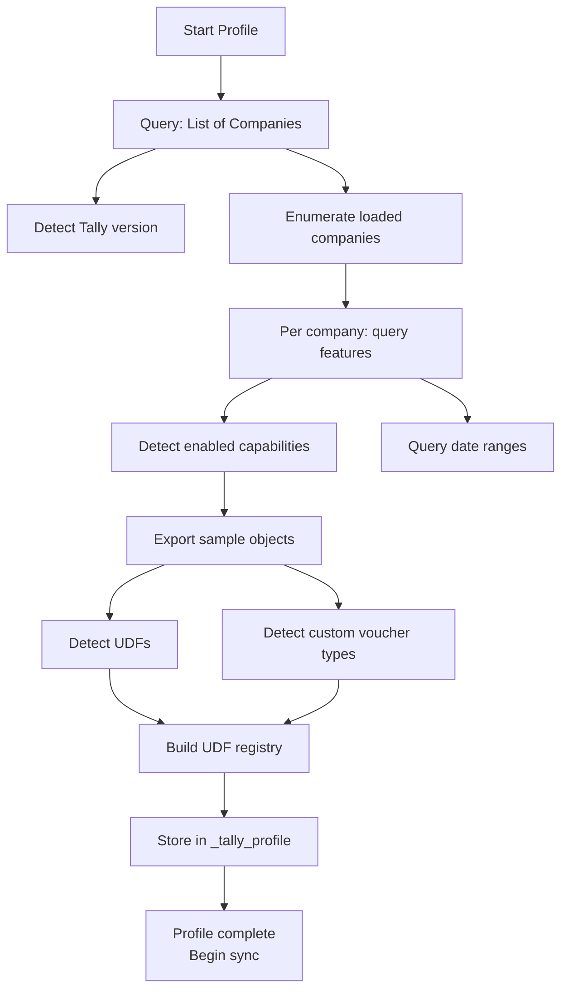
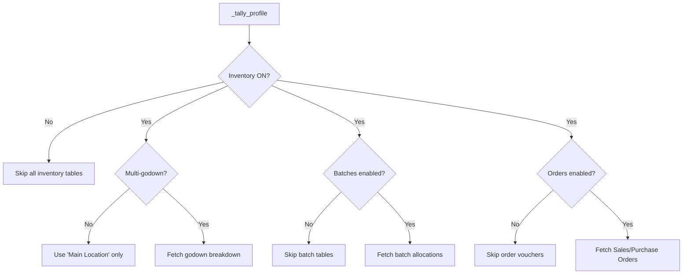

Before the connector pulls a single stock item, it needs to understand what it's dealing with. Every Tally installation is different. Features vary, TDL customizations vary, even the XML structure changes based on what's enabled. That's why we profile first.

## Why Profile Before Sync?

Here's what happens if you skip profiling and just start syncing:

| If you assume... | But actually... | Result |
|------------------|----------------|--------|
| Batches are enabled | They're not | Empty batch tables, misleading data |
| Godowns exist | Single godown mode | XML parsing errors on missing godown tags |
| JSON API works | It's Tally.ERP 9 | Request fails, no JSON support |
| Standard XML tags | TDL adds UDF tags | Unknown fields silently dropped |
| Gold license (multi-user) | Silver (single-user) | Connector locks out the operator |

:::danger
Feature mismatches cause **silent failures**. The connector won't crash. It'll just produce incomplete or wrong data, and you won't know until a salesman tries to sell stock that doesn't exist.
:::

## What Gets Profiled

The connector runs a series of XML queries during the profiling phase and builds a comprehensive picture:



### 1. Tally Version

Detected from the `List of Companies` response:

```xml
<TALLYVERSION>
  TallyPrime:Release 7.0
</TALLYVERSION>
```

Or for older installations:

```xml
<TALLYVERSION>
  Tally.ERP 9:Release 6.6.3
</TALLYVERSION>
```

This tells us whether JSON API is available (7.0+ only), what XML response quirks to expect, and the max safe collection size.

### 2. Enabled Features

Per company, we detect these feature flags:

| Feature | Impact on sync |
|---------|---------------|
| Inventory ON/OFF | If OFF, no stock items exist. Skip inventory tables entirely. |
| Multiple Godowns | If OFF, all stock is in "Main Location". Don't query godown breakdown. |
| Batch-wise details | If ON, must fetch batch allocations. If OFF, skip batch tables. |
| Expiry dates | If ON, batch records include expiry. Critical for pharma. |
| Order processing | If OFF, no Sales Orders or Purchase Orders exist. |
| Bill of Materials | If ON, BOM tables are relevant. |
| Cost tracking | If ON, cost centre allocations appear on vouchers. |

### 3. Loaded TDLs

Discovered via XML API and filesystem scanning:

```xml
<!-- Query TDL Management Report -->
<ENVELOPE>
  <HEADER>
    <VERSION>1</VERSION>
    <TALLYREQUEST>Export</TALLYREQUEST>
    <TYPE>Data</TYPE>
    <ID>TDL Management</ID>
  </HEADER>
  <BODY><DESC><STATICVARIABLES>
    <SVEXPORTFORMAT>
      $$SysName:XML
    </SVEXPORTFORMAT>
  </STATICVARIABLES></DESC></BODY>
</ENVELOPE>
```

The connector also scans the filesystem for `.tcp` and `.tdl` files (see [Filesystem Scanning](/tally-integartion/architecture/filesystem-scanning/)).

### 4. UDF Discovery

This is the trickiest part. UDFs (User Defined Fields) add custom tags to Tally's XML output, but only when the defining TDL is loaded.

**Step 1:** Export a full Stock Item object without field filtering:

```xml
<ENVELOPE>
  <HEADER>
    <TALLYREQUEST>Export</TALLYREQUEST>
    <TYPE>Object</TYPE>
    <SUBTYPE>Stock Item</SUBTYPE>
    <ID>##ANY_ITEM##</ID>
  </HEADER>
  <BODY><DESC><STATICVARIABLES>
    <SVEXPORTFORMAT>
      $$SysName:XML
    </SVEXPORTFORMAT>
    <EXPLODEFLAG>Yes</EXPLODEFLAG>
  </STATICVARIABLES></DESC></BODY>
</ENVELOPE>
```

**Step 2:** Parse the response for tags with `Index` attributes. Standard Tally tags don't have `Index`. UDFs do:

```xml
<!-- Standard tag (no Index) -->
<GSTDETAILS.LIST>...</GSTDETAILS.LIST>

<!-- UDF tag (has Index) - TDL loaded -->
<DRUGSCHEDULE.LIST Index="30">
  <DRUGSCHEDULE>H</DRUGSCHEDULE>
</DRUGSCHEDULE.LIST>

<!-- UDF tag - TDL NOT loaded -->
<UDF_STRING_30.LIST Index="30">
  <UDF_STRING_30>H</UDF_STRING_30>
</UDF_STRING_30.LIST>
```

:::caution
If the TDL that defines a UDF is not loaded, the data is still there but the tag name becomes generic (`UDF_STRING_30`). The connector must handle both named and indexed UDF tags as potentially referring to the same field.
:::

**Step 3:** Build the UDF registry:

```json
{
  "stock_item": [
    {
      "name": "DrugSchedule",
      "index": 30,
      "type": "String"
    },
    {
      "name": "Manufacturer",
      "index": 31,
      "type": "String"
    },
    {
      "name": "StorageTemp",
      "index": 32,
      "type": "String"
    }
  ],
  "voucher": [
    {
      "name": "SalesmanName",
      "index": 40,
      "type": "String"
    }
  ]
}
```

**Step 4:** Repeat for Voucher and Ledger objects.

### 5. License Type

Silver vs Gold affects how aggressively we can poll:

| License | Concurrent users | Connector impact |
|---------|-----------------|-----------------|
| Silver | 1 | Connector competes with operator. Use light polling. |
| Gold | Multiple | Connector runs alongside humans. Full polling OK. |

### 6. Company Date Ranges

From the company listing, we extract:

- **Financial Year From/To** — Bounds for voucher date filtering
- **Books Beginning From** — Earliest possible data
- **First Voucher Date** — Actual start of transactions
- **Last Voucher Date** — Most recent activity

These determine the sync window based on the `historical_depth` config setting.

## The _tally_profile Table

All profiling data is stored locally in SQLite:

```sql
CREATE TABLE _tally_profile (
  company_guid       TEXT PRIMARY KEY,
  tally_version      TEXT,
  is_json_supported  BOOLEAN,
  is_multi_godown    BOOLEAN,
  is_batch_enabled   BOOLEAN,
  is_order_enabled   BOOLEAN,
  is_bom_enabled     BOOLEAN,
  is_cost_tracking   BOOLEAN,
  loaded_tdl_files   TEXT,
  discovered_udfs    TEXT,
  custom_voucher_types TEXT,
  financial_year_from  DATE,
  financial_year_to    DATE,
  books_from         DATE,
  first_voucher_date DATE,
  last_voucher_date  DATE,
  last_profiled_at   TIMESTAMP
);
```

The `loaded_tdl_files`, `discovered_udfs`, and `custom_voucher_types` columns store JSON arrays.

## When Does Profiling Run?

| Trigger | What happens |
|---------|-------------|
| First startup | Full profile from scratch |
| Every startup (if `profile_on_start = true`) | Re-profile to catch changes |
| Company GUID change detected | Full re-profile (company was split or restored) |
| Manual trigger via health endpoint | On-demand re-profile |

## Profile-Driven Sync Behavior

The profile directly controls what the sync engine does:



:::tip
The profile is your safety net. It prevents the connector from asking Tally for data that doesn't exist, which avoids confusing empty responses and wasted HTTP round-trips.
:::

## Custom Voucher Types

Tally allows creating custom voucher types (e.g., "Field Sales Order" as a child of "Sales Order"). The profile discovers these so the connector knows which voucher type names to use during write-back.

```xml
<!-- Never hardcode voucher type names -->
<!-- Instead, look up from profile -->
<VOUCHERTYPENAME>
  Field Sales Order
</VOUCHERTYPENAME>
```

The `parent` field in `mst_voucher_type` tells you the base behavior. A custom type with `parent = "Sales Order"` behaves like a Sales Order regardless of its name.
