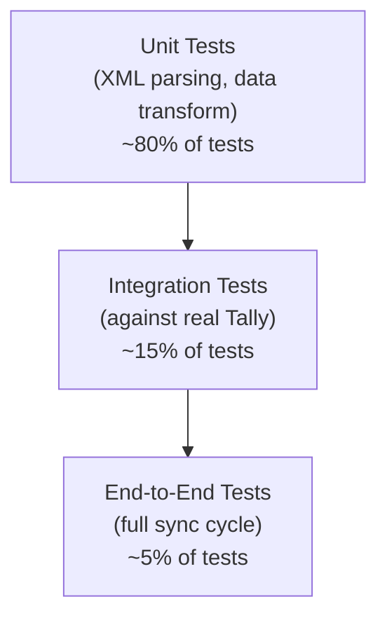

Testing a Tally integration is tricky. Tally is a Windows GUI app that can't run in a Docker container. You can't spin it up in CI. But you still need confidence that your connector works. Here's how we approach it.

## The Testing Pyramid



Most of your test coverage comes from unit tests against saved XML fixtures. Integration tests require a real Tally instance. E2E tests are expensive and run less frequently.

## Setting Up a Test Tally Instance

### Requirements

- A Windows machine (physical or VM)
- TallyPrime installed (Educational Mode works for testing — no license needed)
- HTTP server enabled (F1 > Settings > Advanced > Enable HTTP Server)

:::tip
TallyPrime runs in **Educational Mode** without a license. It adds a watermark to printed reports but the HTTP API works fully. Perfect for development and testing.
:::

### Demo Companies

TallyPrime ships with sample companies. Load them via:

```
Gateway of Tally > Alt+F3 > Select Company
> sample_company_path
```

Demo companies include stock items, ledgers, vouchers, and most feature configurations. They're a solid starting point for integration tests.

### Creating a Test Company

For more controlled testing, create a fresh company:

1. Gateway > Alt+F3 > Create Company
2. Enable features you want to test:
   - F11: Inventory Features
   - Enable Batches, Godowns, Expiry, Orders
3. Create a handful of masters:
   - 3-5 stock groups
   - 10-20 stock items (with batches)
   - 5-10 ledgers (Sundry Debtors)
   - 2-3 godowns
4. Enter some vouchers:
   - A few purchases (stock IN)
   - A few sales (stock OUT)
   - A sales order or two

:::caution
Keep test companies small. A company with 50 stock items and 100 vouchers is plenty for integration testing. Large test datasets slow down test runs and make failures harder to diagnose.
:::

## Unit Testing: XML Parsing

This is where you get the most bang for your buck. Save real Tally XML responses as fixtures and test your parser against them.

### Fixture Organization

```
testdata/
├── responses/
│   ├── stock_items_basic.xml
│   ├── stock_items_with_batches.xml
│   ├── stock_items_with_udfs.xml
│   ├── stock_items_udf_no_tdl.xml
│   ├── voucher_invoice_view.xml
│   ├── voucher_accounting_view.xml
│   ├── voucher_sales_order.xml
│   ├── stock_summary.xml
│   ├── company_list.xml
│   ├── import_success.xml
│   ├── import_error_ledger.xml
│   └── import_error_balance.xml
├── requests/
│   ├── export_stock_items.xml
│   ├── export_vouchers.xml
│   ├── import_sales_order.xml
│   └── import_ledger.xml
└── edge_cases/
    ├── ampersand_in_name.xml
    ├── negative_stock.xml
    ├── compound_units.xml
    ├── zero_value_line.xml
    ├── hindi_characters.xml
    └── empty_response.xml
```

### What to Test

| Test case | What you're verifying |
|-----------|----------------------|
| Parse stock item with batches | Batch allocation arrays are correctly extracted |
| Parse UDFs (named) | `DRUGSCHEDULE.LIST` parsed by name |
| Parse UDFs (indexed) | `UDF_STRING_30.LIST` parsed by index |
| Parse Invoice View voucher | `ALLLEDGERENTRIES.LIST` tag variant |
| Parse Accounting View voucher | `LEDGERENTRIES.LIST` tag variant |
| Quantity string parsing | `"100 Strip"` becomes `{100, "Strip"}` |
| Compound quantity parsing | `"2 Box of 10 Strip"` handled |
| Rate string parsing | `"50.00/Strip"` becomes `{50.00, "Strip"}` |
| Amount sign convention | Negative = debit, positive = credit |
| Date normalization | `"20260325"` becomes `2026-03-25` |
| Boolean conversion | `"Yes"` becomes `true` |
| Ampersand in names | `"Patel &amp; Sons"` decoded correctly |
| Empty/missing tags | No panic on `<HSNCODE/>` |
| Import success response | `CREATED=1, ERRORS=0` parsed |
| Import error response | Error message extracted |

### Example Test Pattern

```go
func TestParseStockItems(t *testing.T) {
    data, _ := os.ReadFile(
        "testdata/responses/stock_items_basic.xml",
    )
    items, err := parser.ParseStockItems(data)
    require.NoError(t, err)
    require.Len(t, items, 3)

    assert.Equal(t,
        "Paracetamol 500mg Strip/10",
        items[0].Name,
    )
    assert.Equal(t, "Strip", items[0].BaseUnit)
    assert.Equal(t, 12.0, items[0].GSTRate)
}
```

## Collecting Fixtures from Real Tally

The best fixtures come from real Tally instances. Use a helper script:

```go
// Save every XML response to a file
// during development
func (c *Client) SaveFixture(
    name string,
    resp []byte,
) {
    path := filepath.Join(
        "testdata", "responses", name,
    )
    os.WriteFile(path, resp, 0644)
}
```

:::tip
Run the connector once against a real Tally with fixture saving enabled. Capture responses for every collection and report type. These fixtures become your test suite.
:::

## Mock Strategies for CI/CD

Tally can't run in CI. Here's how to handle that.

### Option 1: Fixture-Based Mocking (Recommended)

Replace the Tally HTTP client with a mock that returns saved fixtures:

```go
type MockTallyClient struct {
    fixtures map[string][]byte
}

func (m *MockTallyClient) Send(
    req []byte,
) ([]byte, error) {
    // Match request type to fixture
    key := extractRequestKey(req)
    if data, ok := m.fixtures[key]; ok {
        return data, nil
    }
    return nil, fmt.Errorf("no fixture: %s", key)
}
```

This tests everything except the actual HTTP transport.

### Option 2: HTTP Test Server

Spin up a local HTTP server that mimics Tally's API:

```go
func NewFakeTally(t *testing.T) *httptest.Server {
    return httptest.NewServer(
        http.HandlerFunc(func(w http.ResponseWriter, r *http.Request) {
            body, _ := io.ReadAll(r.Body)
            resp := matchFixture(body)
            w.Write(resp)
        }),
    )
}
```

This tests the full HTTP path including request construction and response parsing.

### Option 3: Windows VM in CI (Expensive)

For full integration testing, you can:

1. Maintain a Windows VM with Tally installed
2. Run integration tests on schedule (nightly, not per-commit)
3. Use GitHub Actions with self-hosted Windows runners

:::caution
Windows VMs with Tally are expensive and fragile. Use them for nightly integration tests, not for every PR. Fixture-based tests catch 95% of issues.
:::

## Integration Test Patterns

When you do have access to a real Tally instance:

### Full Sync Test

```go
func TestFullSync(t *testing.T) {
    if testing.Short() {
        t.Skip("requires Tally")
    }
    // 1. Connect to Tally
    // 2. Run full sync
    // 3. Verify master counts match
    // 4. Verify voucher counts match
    // 5. Verify Stock Summary values
}
```

### Write-Back Test

```go
func TestSalesOrderPush(t *testing.T) {
    if testing.Short() {
        t.Skip("requires Tally")
    }
    // 1. Create a test Sales Order
    // 2. Push to Tally
    // 3. Verify CREATED=1 in response
    // 4. Pull back the order from Tally
    // 5. Compare pushed vs pulled values
    // 6. Clean up: delete the test order
}
```

### Incremental Sync Test

```go
func TestIncrementalSync(t *testing.T) {
    if testing.Short() {
        t.Skip("requires Tally")
    }
    // 1. Run full sync, record watermark
    // 2. Create a new stock item in Tally
    //    (manual or via import)
    // 3. Run incremental sync
    // 4. Verify only the new item was pulled
    // 5. Verify watermark advanced
}
```

## Edge Case Test Matrix

These should all be covered by unit tests with fixtures:

| # | Scenario | Fixture file |
|---|----------|-------------|
| 1 | `&` in ledger name | `ampersand_in_name.xml` |
| 2 | Negative stock quantities | `negative_stock.xml` |
| 3 | Compound unit strings | `compound_units.xml` |
| 4 | Zero-value line item | `zero_value_line.xml` |
| 5 | Hindi/Unicode characters | `hindi_characters.xml` |
| 6 | Empty collection response | `empty_response.xml` |
| 7 | Both voucher view formats | `voucher_*_view.xml` |
| 8 | UDFs with and without TDL | `*_udfs*.xml` |
| 9 | Import error responses | `import_error_*.xml` |
| 10 | Large response (>1MB) | `large_stock_export.xml` |

## Test Tally Data Seeding

For reproducible integration tests, create a seed script that imports test data into Tally:

```xml
<!-- seed_stock_items.xml -->
<ENVELOPE>
  <HEADER>
    <TALLYREQUEST>Import</TALLYREQUEST>
    <TYPE>Data</TYPE>
    <ID>All Masters</ID>
  </HEADER>
  <BODY>
    <DATA><TALLYMESSAGE>
      <STOCKITEM NAME="Test Item A"
                 ACTION="Create">
        <PARENT>Primary</PARENT>
        <BASEUNITS>pcs</BASEUNITS>
      </STOCKITEM>
    </TALLYMESSAGE></DATA>
  </BODY>
</ENVELOPE>
```

Run the seed before integration tests. Tear down after.

:::danger
Never run integration tests against a production Tally instance. Write-back tests create real vouchers. Always use a dedicated test company.
:::
