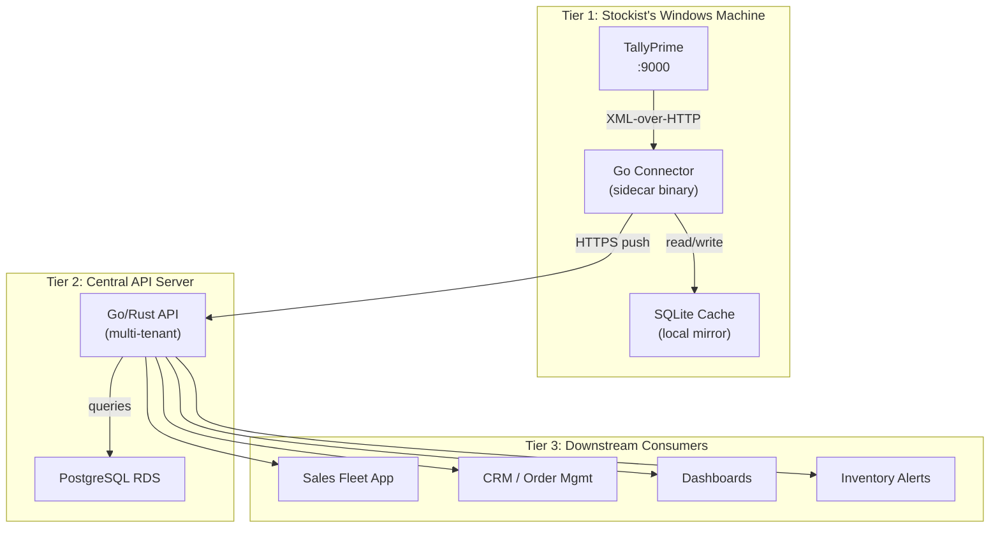
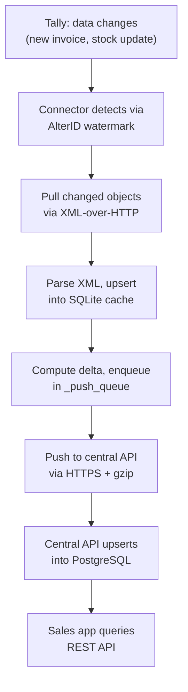

The whole system is built around one core insight: **Tally lives on a Windows desktop, but your sales team lives on their phones.** Bridging that gap takes three layers, each with a clear job.

## The Big Picture

## Tier 1 — The Stockist's Windows Machine

This is where data is born. TallyPrime runs on a regular Windows PC at the stockist's office. Our Go connector sits right next to it on the same machine.

### What lives here

| Component | Role |
|-----------|------|
| TallyPrime | Source of truth for all inventory and accounting data |
| Go Connector | Sidecar binary that talks to Tally's XML API |
| SQLite Cache | Local mirror that buffers data and enables offline operation |

### How it works

The connector polls Tally on a configurable interval (default: every 60 seconds for vouchers, every 5 minutes for masters). It pulls data via Tally's XML-over-HTTP API, parses it, and stores everything in a local SQLite database.

:::tip
The connector is a single static binary. No Java, no Node.js, no runtime dependencies. Drop it on the machine and run it.
:::

## Tier 2 — The Central API Server

This is the brain. A Go or Rust API server backed by PostgreSQL on RDS. It receives data from potentially dozens of stockist connectors and serves it to downstream consumers.

### What it does

- **Receives pushes** from connectors (stock items, vouchers, positions)
- **Stores multi-tenant data** with compound keys `(tenant_id, tally_guid)`
- **Serves REST APIs** to the sales fleet app, CRM, and dashboards
- **Accepts field orders** and queues them for write-back to Tally

Each Tally company maps to a `tenant_id`. One stockist with two companies (say, Ethical and OTC) gets two tenants.

## Tier 3 — Downstream Consumers

These are the apps that actually use the data. They never talk to Tally directly.

| Consumer | What it needs |
|----------|--------------|
| Sales fleet app | Stock levels, party info, order placement |
| CRM / order mgmt | Customer history, outstanding bills, order tracking |
| Dashboards | Inventory trends, sales velocity, sync health |
| Inventory alerts | Expiry warnings, reorder triggers, stock drift |

## Why This Architecture?

### Resilience through local caching

The internet goes down in a Gujarat industrial area? No problem. The SQLite cache has everything. When connectivity returns, the push queue drains automatically.

:::caution
Tally is a GUI desktop app, not a server. If someone closes it, the connector can't pull data. But the local cache still serves the last-known state.
:::

### Offline capability

The connector can answer local queries even when both Tally and the central API are unreachable. The SQLite cache is the connector's memory.

### Multi-tenant scaling

The central API handles many stockists. Each one is a tenant. Adding a new stockist means:

1. Install the connector on their Windows machine
2. Configure the `tenant_id` and API key
3. Start the service

That's it. The central schema handles isolation through compound keys.

### Incremental diff at the edge

Instead of shipping raw Tally XML to the cloud, the connector computes diffs locally. Only changed objects get pushed upstream. This keeps bandwidth low and central API load predictable.

## Data Flow in Detail

### The reverse flow (write-back)

When a salesman places an order on the fleet app:

1. Order hits the central API
2. API stores it and marks status `confirmed`
3. Connector pulls pending orders from central
4. Connector builds Tally XML and pushes a Sales Order
5. Tally responds with success/failure
6. Connector updates order status upstream

:::danger
Write-back is not optional for the sales workflow. If the Sales Order doesn't appear in Tally, the warehouse has zero visibility of what to pick and pack.
:::

## Design Principles

| Principle | What it means in practice |
|-----------|--------------------------|
| Tally is the source of truth | We mirror, never override. Stock Summary from Tally always wins. |
| Local-first | The connector works even if the cloud is down. |
| Eventual consistency | Data reaches the central DB within seconds normally, but we accept minutes during outages. |
| Fail-safe defaults | On any error, the connector retries. Data sits in the push queue until it succeeds. |
| Zero-touch operation | Once installed, the connector runs as a Windows service. No manual intervention. |
