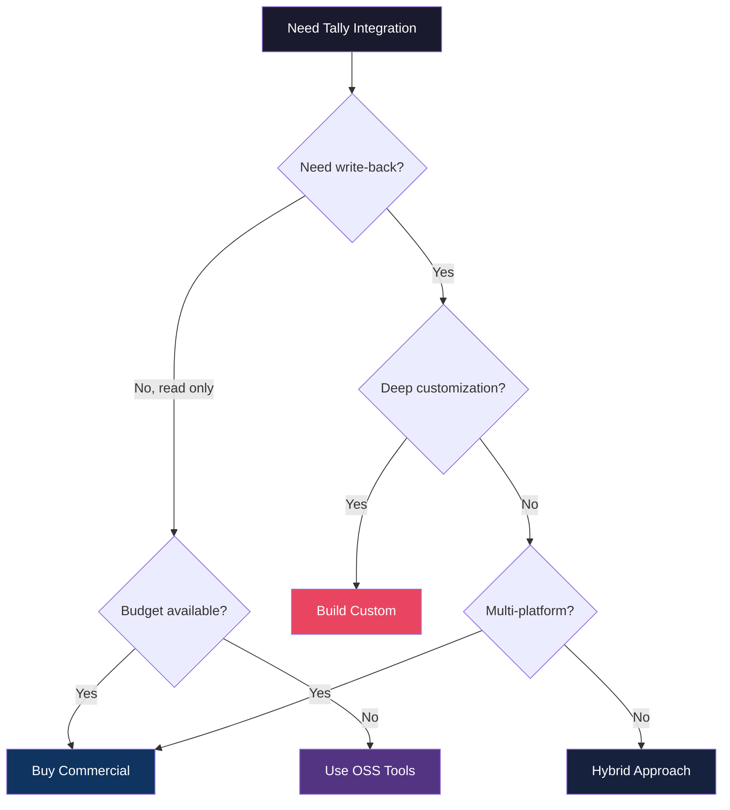
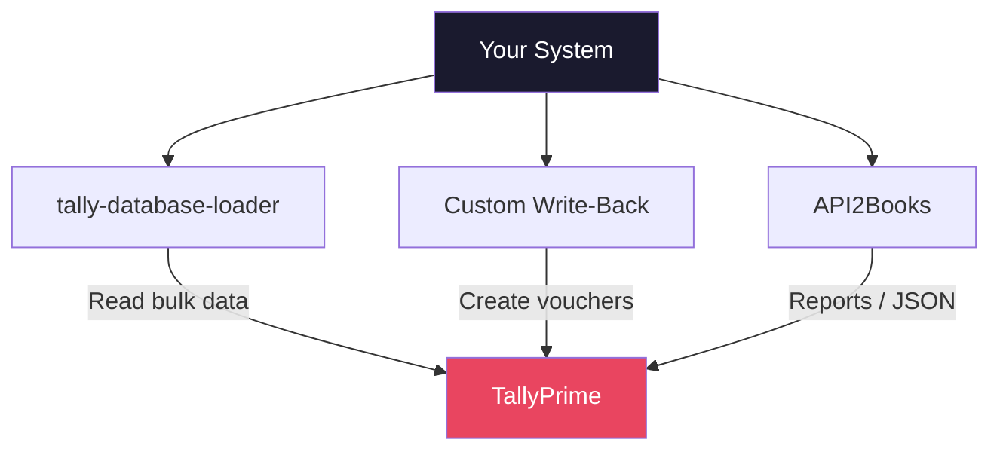

You've seen the ecosystem. You know the tools. Now the hard question: should you build your own Tally integration, buy a commercial one, or mix and match?

This isn't a question with a universal answer. But we can give you a framework to find *your* answer.

## The Three Paths



Let's dig into each one.

---

## Build Your Own

Rolling your own Tally connector. Full control, full responsibility.

### Build When...

- **You need deep customization** — Your integration requires Tally-specific features like complex voucher types, custom TDL fields, or vertical-specific logic that no commercial tool supports.
- **You need write-back** — You're not just reading data; you're creating vouchers, updating ledgers, and modifying inventory in Tally.
- **You need full control** — Latency, retry logic, error handling, data transformation — you want to own every decision.
- **You have engineering capacity** — A team comfortable with Go or Python and willing to learn Tally's XML quirks.
- **You're building a product** — If Tally integration is core to your product (not just a feature), owning the connector is often the right call.

### The Real Cost of Building

Here's the part nobody tells you upfront:

:::danger[The 90% warning]
Getting basic Tally reads working takes a weekend. Getting it production-ready takes months. 90% of the work is edge cases — companies with non-standard configurations, voucher types you've never seen, XML responses that break your parser, and Tally versions that behave slightly differently.
:::

**Week 1:** "This is easy! I can read ledgers!"

**Month 2:** "Why does this one customer's Tally return different XML for the same request?"

**Month 4:** "There are HOW many voucher types?"

Budget accordingly.

### Estimated Effort

| Component | Time Estimate |
|-----------|--------------|
| Basic read connector | 1-2 weeks |
| Write-back (vouchers) | 2-4 weeks |
| Incremental sync | 1-2 weeks |
| Error handling + retries | 1-2 weeks |
| Edge cases + hardening | 2-3 months |
| **Total to production** | **3-5 months** |

---

## Buy a Commercial Platform

Let someone else deal with the XML. Pay money, save time.

### Buy When...

- **You need quick time-to-market** — A commercial platform gets you integrating in days, not months.
- **You don't want to maintain XML parsing** — Let's be honest, parsing Tally's XML is not where you want your engineers spending their time.
- **You have budget** — Commercial platforms cost money. If you have it, this can be the most efficient path.
- **You need mostly read access** — If you're pulling reports, syncing data to a dashboard, or feeding a BI tool, commercial platforms handle this beautifully.
- **You want support** — When something breaks at 2 AM, it's nice to have a vendor to call.

### The Real Cost of Buying

| Cost Factor | Consideration |
|-------------|--------------|
| License fees | Monthly/annual, per-company |
| Vendor lock-in | Switching costs if they change terms |
| Feature gaps | You get what they built |
| Update dependency | Their timeline, not yours |

### When Buying Goes Wrong

Buying feels great until you need something the platform doesn't support. "Can we add a custom field to the voucher export?" "Can we filter by a non-standard attribute?" If the answer is "submit a feature request," you might be stuck.

---

## Hybrid Approach

The pragmatic middle ground. Use OSS or commercial tools for what they're good at, and build custom for the rest.

### The Hybrid Pattern

This is what most successful Tally integrations end up doing:

1. **Use tally-database-loader** for bulk data extraction into your database
2. **Build custom write-back** logic for creating vouchers and updating ledgers
3. **Use a commercial API** (like API2Books) for specific features you don't want to build



### Why Hybrid Works

- **Fast start** — OSS tools get you reading data immediately
- **Custom where it matters** — Your write logic is exactly what you need
- **No reinventing wheels** — Why build a bulk extractor when a good one exists?

### Hybrid When...

- You need read *and* write, but building everything from scratch is overkill
- You want to leverage OSS for the solved problems and focus engineering effort on the unsolved ones
- You're okay managing multiple components

---

## Decision Matrix

Here's the full picture in one table:

| Factor | Build | Buy | Hybrid |
|--------|-------|-----|--------|
| Time to first integration | Weeks | Days | Days |
| Time to production | Months | Weeks | Weeks |
| Upfront cost | Engineering time | License fee | Both (lower) |
| Ongoing maintenance | High | Low | Medium |
| Customization | Unlimited | Limited | High |
| Write-back support | Full | Varies | Full |
| Vendor dependency | None | High | Low |

---

## Total Cost of Ownership

Don't just compare sticker prices. Think about the full cost over 2-3 years.

### Build: TCO Estimate

```
Initial development:  3-5 months eng time
Ongoing maintenance:  ~20% of eng time/year
Edge case fixes:      Ongoing, unpredictable
Tally version updates: 1-2 weeks/year
Infrastructure:       Your servers, your ops
```

### Buy: TCO Estimate

```
License fees:         $X/month * 36 months
Integration effort:   1-2 weeks
Vendor management:    Ongoing, low effort
Feature gap workarounds: Unpredictable
Migration risk:       If vendor pivots/shuts down
```

### Hybrid: TCO Estimate

```
OSS setup:            1-2 weeks
Custom write-back:    2-4 weeks eng time
Commercial license:   $X/month (fewer modules)
Maintenance:          ~10% of eng time/year
Coordination:         Managing multiple pieces
```

---

## The Questions That Actually Matter

Forget the framework for a second. Ask yourself these:

**1. Is Tally integration core to your product?**

If yes, build (or hybrid). You don't want a vendor controlling your core value proposition.

**2. How many Tally companies will you connect to?**

One or two? Build it. Hundreds? You need the robustness of a well-tested tool (buy or hybrid).

**3. Do you need to write data back to Tally?**

If yes, your options narrow. Most commercial read-only tools won't help. Build or hybrid.

**4. What's your team's appetite for XML?**

Be honest. If your team groans at the thought of debugging XML parsing issues, buy.

**5. What's your timeline?**

Needed it yesterday? Buy. Can invest a quarter? Build or hybrid.

:::tip[The right answer changes over time]
Many teams start by buying, then migrate to hybrid as they understand their needs better, and eventually build a full custom connector when Tally integration becomes core to their product. There's no shame in evolving your approach.
:::

## Our Recommendation

For most teams, **start hybrid**:

1. Use [tally-database-loader](/tally-integartion/community/tally-database-loader/) to get data flowing immediately
2. Build your write-back logic in Go or Python using the [language recipes](/tally-integartion/community/language-recipes/)
3. Only evaluate commercial platforms if you need features you can't build in a reasonable time

This gets you to production fast while keeping your options open.

The one exception: if you're building a multi-platform SaaS product and Tally is just one of many accounting backends, go with a unified API provider like RootFi. The abstraction penalty is worth the multi-platform coverage.

Now go build something.
