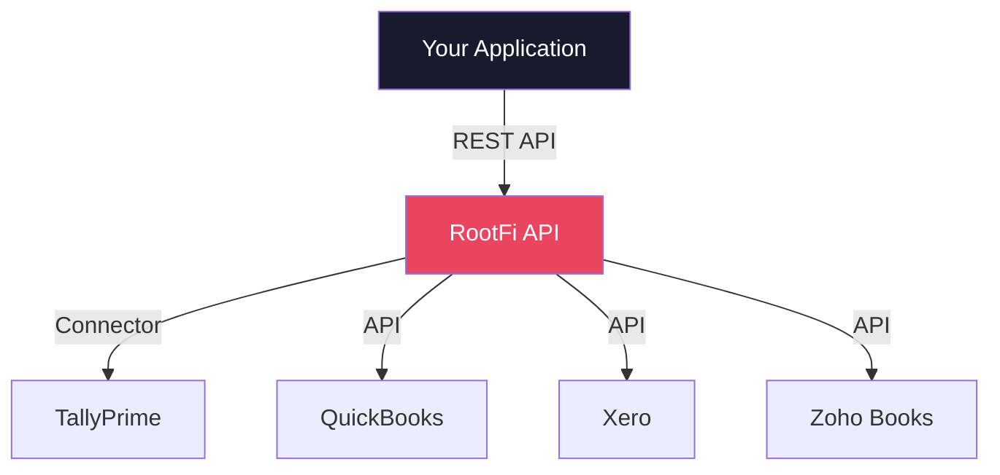

Sometimes you don't want to wrangle XML yourself. Sometimes you have a budget and a deadline. That's where commercial platforms come in.

These companies turned "Tally integration is painful" into a product. Let's walk through the major players.

## API2Books

**The first open API integration platform for TallyPrime.**

API2Books is what happens when someone finally says "Tally should just have a REST API" and *builds one*. It sits between your application and TallyPrime, translating clean JSON API calls into Tally's XML dialect.

### How It Works

API2Books installs a plugin inside TallyPrime. That plugin exposes two types of APIs:

**GET API** — Extract Masters (ledgers, stock items, cost centers), Vouchers (sales, purchases, journals), and Reports (balance sheet, P&L, trial balance). Everything comes back as JSON. Clean, parseable, modern JSON.

**POST API** — Bulk import data *into* Tally. We're talking 10,000+ vouchers in a single batch. Sales invoices, purchase orders, journal entries — all via JSON POST.

```
Your App --> JSON --> API2Books Plugin
                       |
                       v
                  TallyPrime (XML)
```

### Why It Matters

API2Books wraps Tally's XML complexity into something a modern developer can actually work with. No TDL, no hand-crafted XML, no guessing which tags are case-sensitive (spoiler: all of them).

### Pricing

API2Books uses a tiered model based on module count:

| Tier | Modules | Use Case |
|------|---------|----------|
| Basic | 3 modules | Simple read access |
| Standard | 5 modules | Read + some write |
| Premium | 10 modules | Full integration |

:::tip[When to pick API2Books]
You want JSON in and JSON out. You don't want to think about XML. You need both read *and* write access. And you're okay running a plugin inside Tally.
:::

---

## Suvit (now Vyapar TaxOne)

**AI-powered automation for Chartered Accountants.**

Suvit isn't really a developer integration platform — it's more of an automation tool for CA firms. But it's worth knowing about because it solves a huge pain point in the Tally ecosystem.

### What It Does

1. **OCR + AI** reads invoices, bank statements, and other documents
2. **Auto-mapping** matches extracted data to the correct Tally ledgers
3. **Bulk posting** pushes hundreds of vouchers into Tally in one shot

The claim: **90% reduction in manual data entry work**. If you've ever watched a CA manually type 500 invoices into Tally, you know why this matters.

### Who It's For

CA firms. Accounting teams. People who spend their days entering data into Tally by hand. This is *not* a developer tool — there's no API you call. It's a product that sits on top of Tally and automates the drudge work.

### Why You Should Care

Even if Suvit isn't for you, it demonstrates a pattern: AI + Tally integration is a real market. If you're building something in this space, document-to-Tally automation is a proven use case.

---

## RootFi

**Unified Accounting API — Tally and 15+ others through one interface.**

RootFi takes a different approach. Instead of building a Tally-specific tool, they built a unified REST API that works with Tally, QuickBooks, Xero, Zoho Books, and a dozen other platforms. One integration, many backends.

### Architecture



For Tally specifically, RootFi runs a **Tally Connector** on-premise (because Tally runs locally, remember). This connector:

1. Communicates with TallyPrime via XML-over-HTTP
2. Exposes Tally data through RootFi's unified REST API
3. Supports **bidirectional sync** — read *and* write
4. Abstracts away all Tally-specific XML complexity

### The Trade-Off

The upside: you write one integration and get Tally + 15 other platforms.

The downside: abstraction means lowest-common-denominator. Tally has features (like cost centers, godowns, and voucher types) that don't map cleanly to a "unified" accounting model. You might lose access to Tally-specific capabilities.

:::caution[Abstraction cost]
Unified APIs are great until you need something Tally-specific. If your use case requires deep Tally features — complex voucher types, TDL customizations, detailed stock categories — a Tally-specific integration might serve you better.
:::

### When RootFi Makes Sense

- You're building a SaaS product that needs to integrate with *multiple* accounting platforms
- Tally is just one of several backends you need to support
- You need standard CRUD operations, not Tally-specific deep features

---

## CData

**Enterprise-grade ODBC/JDBC/ADO.NET drivers for Tally.**

CData is the enterprise play. They sell commercial drivers that let you access Tally data using standard database protocols. If you've ever used an ODBC driver, you know the drill.

### What You Get

| Driver | Use Case |
|--------|----------|
| ODBC | Excel, Power BI, Tableau |
| JDBC | Java applications |
| ADO.NET | .NET applications |
| Python Connector | Python scripts |

The magic: you write SQL queries, and CData translates them into Tally XML requests. Want all ledgers with a balance over 10,000? Write a `SELECT` statement. CData handles the rest.

```sql
SELECT Name, ClosingBalance
FROM Ledgers
WHERE ClosingBalance > 10000
```

### Who It's For

Enterprises. BI teams. Anyone who wants to query Tally like it's a SQL database. The pricing reflects the enterprise target — this isn't a weekend project tool.

### The CData Pattern

CData isn't Tally-specific. They sell drivers for *hundreds* of data sources. Tally is just one connector in their catalog. This means:

- **Pro:** Battle-tested driver architecture, good support, enterprise SLAs
- **Con:** Not built by Tally experts. Edge cases in Tally's quirky data model might surprise you.

---

## AI Accountant

**Tally integration with AI for automation, reconciliation, and data entry.**

AI Accountant combines Tally integration with artificial intelligence to automate common accounting workflows. Think bank reconciliation, automated data entry, and anomaly detection — all wired into TallyPrime.

### Key Capabilities

- **Automated reconciliation** — Match bank statements to Tally vouchers using AI
- **Smart data entry** — AI-assisted voucher creation with auto-classification
- **Error detection** — Flag mismatches, duplicates, and anomalies

This sits in a similar space to Suvit but with a broader automation focus beyond just OCR and posting.

---

## Platform Comparison

| Platform | Type | Direction | Best For |
|----------|------|-----------|----------|
| API2Books | JSON API | Read + Write | Developers |
| Suvit | Automation | Write | CA firms |
| RootFi | Unified API | Read + Write | Multi-platform SaaS |
| CData | SQL Drivers | Read | BI / Enterprise |
| AI Accountant | AI Automation | Read + Write | Accounting teams |

## How to Choose

The decision usually comes down to two questions:

**"Am I building for Tally specifically, or for multiple accounting platforms?"**
- Tally only: API2Books or direct integration
- Multiple platforms: RootFi

**"Am I a developer, or an accountant?"**
- Developer: API2Books, RootFi, CData
- Accountant/CA: Suvit, AI Accountant

:::tip[Try before you commit]
Most of these platforms offer free trials or demo periods. Test with your actual Tally data before signing a contract. Pay special attention to how they handle your specific voucher types and custom fields.
:::

If none of these fit, you might need to [build your own](/tally-integartion/community/build-vs-buy/). But read the decision framework first — it's more work than you think.
