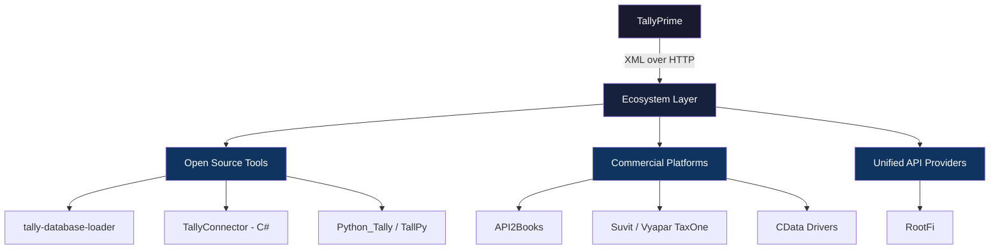

Tally is *everywhere* in India. Over 7 million businesses run their accounting on TallyPrime, making it the undisputed king of Indian accounting software. But here's the catch — Tally has no modern REST API.

What it *does* have is an XML-over-HTTP interface that feels like it was designed in 2003 (because it was). You POST XML to a local port, and you get XML back. That's it. No OAuth, no JSON, no webhooks.

This gap between Tally's dominance and its ancient integration surface created an entire cottage industry of tools. Welcome to the ecosystem.

## Why This Ecosystem Exists

The story is simple:

1. **Tally is mandatory** — If your customers use Tally, you integrate with Tally. No negotiation.
2. **The XML API is painful** — Hand-crafting TDL-flavored XML requests is nobody's idea of a good time.
3. **Everyone needs the same things** — Read ledgers, post vouchers, sync inventory. The use cases repeat endlessly.

So people built tools. Lots of them.

## The Three Categories

The ecosystem breaks neatly into three buckets.

### 1. Open Source Tools

Community-built libraries and utilities. Free, hackable, and often battle-tested. The star player here is [tally-database-loader](/tally-integartion/community/tally-database-loader/) — a Node.js tool that rips data out of Tally and loads it into real databases.

Others include TallyConnector (C#), Python_Tally, TallPy, and more. We cover these in detail on the next page.

### 2. Commercial Platforms

Companies that turned "Tally integration is hard" into a business. API2Books wraps Tally in clean JSON APIs. Suvit (now Vyapar TaxOne) uses AI to automate data entry. CData sells enterprise ODBC drivers.

These are [covered here](/tally-integartion/community/commercial-platforms/).

### 3. Unified API Providers

The newest entrant. Companies like RootFi offer a single REST API that talks to Tally *and* 15 other accounting platforms. One integration, many backends. The trade-off: abstraction means you lose Tally-specific features.

## The Ecosystem at a Glance



## The Universal Pattern

No matter which tool you pick, they all do roughly the same thing under the hood. Every single Tally integration follows this pattern:

### XML-over-HTTP

You POST an XML request to Tally's HTTP server (usually `localhost:9000`). Tally processes it and returns XML. The request XML uses Tally Definition Language (TDL) syntax to specify what you want.

```xml
<ENVELOPE>
  <HEADER>
    <TALLYREQUEST>Export Data</TALLYREQUEST>
  </HEADER>
  <BODY>
    <EXPORTDATA>
      <REQUESTDESC>
        <REPORTNAME>List of Accounts</REPORTNAME>
      </REQUESTDESC>
    </EXPORTDATA>
  </BODY>
</ENVELOPE>
```

Every tool in this ecosystem is, at its core, a friendlier wrapper around this pattern.

### AlterID Change Detection

Tally assigns an `AlterID` to every object — ledgers, vouchers, stock items, everything. When something changes, its AlterID increments. This is how every sync tool detects changes:

1. Store the last-seen AlterID
2. On next sync, ask Tally for objects with AlterID greater than your stored value
3. Process only the changed records
4. Update your stored AlterID

It's not elegant, but it works. And it's the *only* mechanism Tally gives you for incremental sync.

:::tip[The golden rule]
Every Tally integration — open source, commercial, or custom — is just XML-over-HTTP with AlterID tracking on top. Once you internalize this, the whole ecosystem makes sense.
:::

## How to Navigate This Section

| Page | What You'll Learn |
|------|------------------|
| [OSS Tools](/tally-integartion/community/tally-database-loader/) | Deep dive into open source options |
| [Commercial Platforms](/tally-integartion/community/commercial-platforms/) | When to reach for a paid solution |
| [Language Recipes](/tally-integartion/community/language-recipes/) | Copy-paste code for your language |
| [Build vs Buy](/tally-integartion/community/build-vs-buy/) | Decision framework for your project |

Pick the page that matches where you are in your journey. If you're just exploring, keep reading in order. If you need code *now*, jump to [Language Recipes](/tally-integartion/community/language-recipes/).
