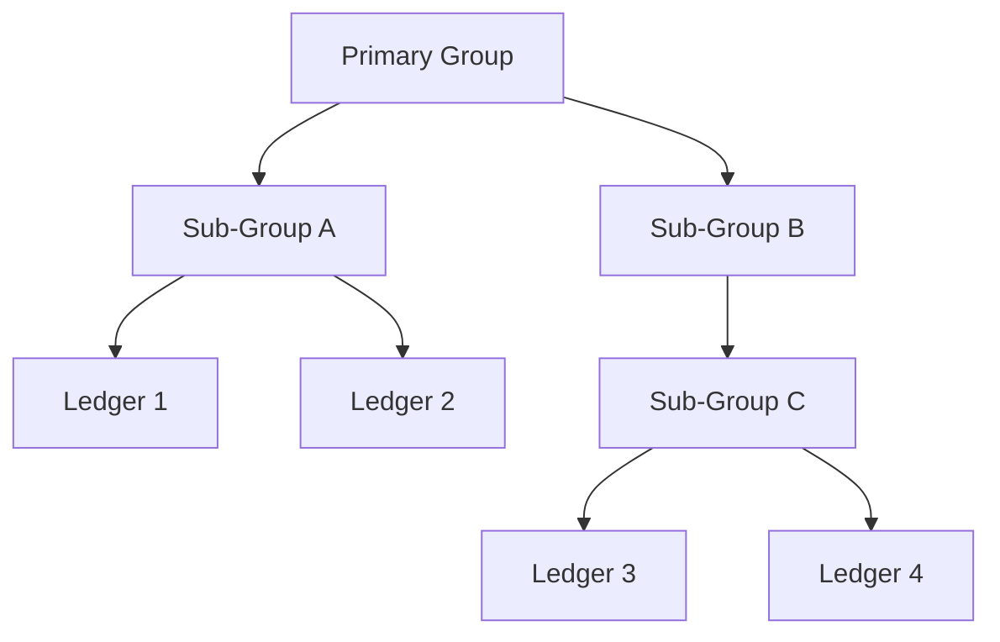

The open source community has built some genuinely impressive tools for working with Tally. Let's start with the gold standard and then tour the rest of the landscape.

## tally-database-loader

**The** OSS project for Tally data extraction. Built by [dhananjay1405](https://github.com/dhananjay1405), it has 500+ stars on GitHub and is actively maintained.

**GitHub:** [github.com/dhananjay1405/tally-database-loader](https://github.com/dhananjay1405/tally-database-loader)

### What It Does

In one sentence: it extracts data from TallyPrime and loads it into a real database. Pick your flavor:

| Target | Status |
|--------|--------|
| SQL Server | Supported |
| MySQL | Supported |
| PostgreSQL | Supported |
| BigQuery | Supported |
| CSV / JSON | Supported |
| Azure Data Lake | Supported |

That's a lot of targets. And it handles them all cleanly.

### Why It's Good

This isn't a toy project. It solves real, hard problems:

**Collection-based extraction** — Instead of pulling records one-by-one, it uses Tally's collection mechanism to batch-fetch data. The result? Roughly 2x faster extraction and 40% less RAM usage compared to naive approaches.

**Hierarchy-to-relational conversion** — Here's the big one. Tally stores everything in deeply nested hierarchies. Ledgers have sub-groups, which have sub-groups, which have... you get it. This tool *flattens* that hierarchy into clean relational tables that your SQL queries can actually work with.

**Incremental sync** — Uses AlterID tracking (the universal pattern we mentioned) to pull only changed records on subsequent runs. Your first sync might take minutes; subsequent ones take seconds.

**Command-line friendly** — It's a CLI tool. Script it, cron it, pipe it. It plays nicely with automation.

### Architecture: The Hierarchy Problem

This is worth understanding because you'll face it too if you build your own connector.

Tally's data model is a tree. A Chart of Accounts isn't a flat list — it's a recursive hierarchy:



When Tally returns this as XML, you get nested `<LEDGER>` elements inside `<GROUP>` elements, recursively. Loading this into a SQL table means:

1. Walking the tree recursively
2. Assigning parent references
3. Flattening into rows with a `parent_group` column
4. Preserving the full path for breadcrumb queries

tally-database-loader does all of this automatically. It breaks Tally's hierarchical XML into normalized tables with proper foreign key relationships.

:::tip[What you can learn from this project]
Even if you don't use it directly, read the source code. The XML request templates and the hierarchy-flattening logic are reusable patterns you'll need in any custom integration.
:::

### Quick Start

```bash
# Clone the repo
git clone https://github.com/dhananjay1405/\
tally-database-loader.git

# Install dependencies
cd tally-database-loader
npm install

# Configure your target database
# Edit config.json with your DB credentials

# Run extraction
node index.js
```

### Command-Line Options

The tool supports a variety of flags for controlling extraction behavior — target database selection, specific company filtering, incremental vs. full sync, and more. Check the project's README for the full list.

### Limitations

Let's be honest about what it *doesn't* do:

- **Read-only** — This tool extracts data *from* Tally. It does not write data *back to* Tally. No voucher creation, no ledger updates. One direction only.
- **Node.js dependency** — You need Node.js installed. If your stack is Python or Go, that's an extra runtime to manage.
- **No real-time sync** — It's a batch extraction tool. Run it on a schedule, not as a live stream.

For write-back, you'll need to build your own XML POST logic or use a commercial tool.

---

## Other Notable OSS Projects

The ecosystem doesn't stop at tally-database-loader. Here are other projects worth knowing about.

### TallyConnector (C#)

**By:** [Accounting-Companion](https://github.com/Accounting-Companion)
**Stars:** 66+
**Language:** C#

A .NET library that acts as a bridge to Tally's XML API. If you're in the Microsoft ecosystem, this is your best friend.

```csharp
// NuGet: Install TallyConnector
var tally = new Tally("http://localhost:9000");
var ledgers = await tally.GetLedgersAsync();
```

It abstracts away the XML construction entirely. You work with C# objects, and TallyConnector handles the serialization and deserialization. Strong typing, proper async/await support, and good documentation.

**Best for:** .NET shops, Windows-first environments, teams that want type safety.

### Python_Tally

**By:** [saivineeth100](https://github.com/saivineeth100)
**Language:** Python

A Python library for talking to Tally. Provides helper functions for common operations — fetching ledgers, stock items, vouchers. Less mature than TallyConnector but useful if Python is your language.

**Best for:** Quick scripts, data analysis pipelines, teams already deep in Python.

### TallPy

**Language:** Python

Another Python connector, this one focused on direct XML communication with Tally. More low-level than Python_Tally — you get more control but write more code.

**Best for:** Developers who want fine-grained control over the XML requests and prefer Python.

### Tally-Connector (Excel)

**By:** [ramajayam-CA](https://github.com/ramajayam-CA)
**Language:** TDL + ODBC

This one is different. It connects Excel directly to Tally using TDL (Tally Definition Language) and ODBC. No code required — accountants and CAs can pull Tally data straight into spreadsheets.

**Best for:** Non-developers, accountants, CA firms who live in Excel.

## Comparison Matrix

| Project | Language | Direction | Best For |
|---------|----------|-----------|----------|
| tally-database-loader | Node.js | Read | DB loading |
| TallyConnector | C# | Read/Write | .NET apps |
| Python_Tally | Python | Read | Scripts |
| TallPy | Python | Read | Low-level |
| Tally-Connector | TDL/ODBC | Read | Excel users |

## The Bottom Line

If you need to get Tally data into a database, **tally-database-loader** is the place to start. If you need a language-specific library, pick the one that matches your stack. And if you need write-back or bidirectional sync, you'll likely need to build that yourself or look at the [commercial options](/tally-integartion/community/commercial-platforms/).

:::caution[OSS maintenance reality]
Most of these projects are maintained by one or two people. Before betting your production system on any of them, check the commit history, open issues, and responsiveness of the maintainer. Fork early, fork often.
:::
