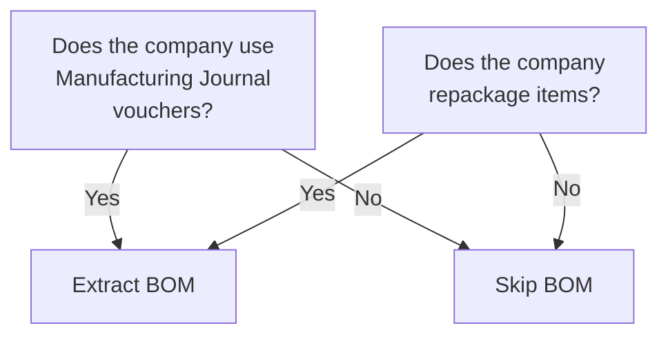

A Bill of Materials tells you what goes into making a finished product. If you are integrating with a manufacturer or a distributor that does repackaging, BOM is essential. If you are a pure trading company, you can probably skip this page entirely.

## Do You Need This?

Quick check:



Check the company profile's `is_bill_of_materials` flag. If it is `No`, BOM is disabled and there is nothing to extract.

## How BOM Works

A BOM defines the recipe for creating a finished product from raw materials (or sub-assemblies):

```
Finished Good: Paracetamol Gift Pack
  Components:
    - 5 x Paracetamol 500mg Strip/10
    - 2 x Paracetamol Syrup 60ml
    - 1 x Gift Box (packaging)
```

When a Manufacturing Journal voucher is created in Tally, it:
1. **Removes** component quantities from stock (stock OUT)
2. **Adds** the finished good to stock (stock IN)
3. Costs the finished good based on component costs

## Schema

```
mst_stock_item_bom
 +-- parent_item       TEXT FK (finished good)
 +-- component_item    TEXT FK (raw material)
 +-- component_quantity  DECIMAL
 +-- component_unit    TEXT
 +-- component_rate    DECIMAL
 +-- component_value   DECIMAL
```

Each row is one component of one finished good. A finished good with 5 components has 5 rows.

## XML Structure

BOMs appear inside the stock item's XML as `BOMITEM.LIST` entries:

```xml
<STOCKITEM NAME="Paracetamol Gift Pack">
  <!-- ... other fields ... -->

  <BOMITEM.LIST>
    <STOCKITEMNAME>
      Paracetamol 500mg Strip/10
    </STOCKITEMNAME>
    <BOMQUANTITY>
      5 Strip
    </BOMQUANTITY>
    <RATE>50.00/Strip</RATE>
    <AMOUNT>250.00</AMOUNT>
  </BOMITEM.LIST>

  <BOMITEM.LIST>
    <STOCKITEMNAME>
      Paracetamol Syrup 60ml
    </STOCKITEMNAME>
    <BOMQUANTITY>2 Btl</BOMQUANTITY>
    <RATE>80.00/Btl</RATE>
    <AMOUNT>160.00</AMOUNT>
  </BOMITEM.LIST>

  <BOMITEM.LIST>
    <STOCKITEMNAME>
      Gift Box Packaging
    </STOCKITEMNAME>
    <BOMQUANTITY>1 Nos</BOMQUANTITY>
    <RATE>30.00/Nos</RATE>
    <AMOUNT>30.00</AMOUNT>
  </BOMITEM.LIST>
</STOCKITEM>
```

### Parsing Notes

- `BOMQUANTITY` has the embedded unit string, just like other quantity fields. Parse accordingly.
- `RATE` has the `/Unit` suffix. Strip it.
- `AMOUNT` = `BOMQUANTITY` * `RATE` (a simple cross-check for data integrity).

## Real-World Pharma Use Cases

### Repackaging

A distributor buys loose tablets in bulk and repackages into strips:

```
Finished: Paracetamol 500mg Strip/10
  Components:
    - 10 x Paracetamol 500mg Tablet (loose)
    - 1 x Foil Strip (packaging)
```

### Kit Assembly

Combining multiple products into a kit:

```
Finished: First Aid Kit
  Components:
    - 2 x Bandage Roll
    - 1 x Antiseptic Cream 50g
    - 10 x Cotton Swabs
    - 1 x First Aid Box
```

### Compounding

Pharmacy compounding (mixing ingredients):

```
Finished: Custom Ointment 100g
  Components:
    - 80g x Base Cream
    - 15g x Active Ingredient A
    - 5g x Active Ingredient B
    - 1 x Jar
```

## Multi-Level BOM

A finished good's component can itself have a BOM. Tally supports this (a BOM within a BOM), but the connector does not need to recursively resolve it -- just extract one level at a time. Manufacturing Journal vouchers handle the cascading.

```
Gift Pack (finished)
  +-- Paracetamol Strip (component, also a finished good)
  |     +-- Loose Tablets (sub-component)
  |     +-- Foil (sub-component)
  +-- Syrup (component)
  +-- Box (component)
```

## When BOM Data Is Useful Downstream

| Use Case | Why BOM Helps |
|---|---|
| Cost calculation | Roll up component costs to get true production cost |
| Material planning | Know what raw materials to order based on production schedule |
| Stock alerts | Alert when a component is low and production will be affected |
| Margin analysis | Compare BOM cost with selling price |

## What to Watch For

1. **BOM is optional.** Many stock items will have no `BOMITEM.LIST` at all. That is normal -- they are raw materials or traded goods, not manufactured items.

2. **BOM changes over time.** If a recipe changes, Tally updates the BOM on the stock item. Old Manufacturing Journal vouchers still reflect the old BOM (they snapshot the components at creation time).

3. **Circular BOMs.** Theoretically possible but practically rare. If Item A uses Item B which uses Item A, you have a cycle. Tally does not prevent this at the master level, but Manufacturing Journal creation would fail. Your connector should detect and log this.

:::tip
Only extract BOM data if `is_bill_of_materials` is enabled in the company profile. For pure trading/distribution businesses, skip this entirely to keep your sync lean.
:::
