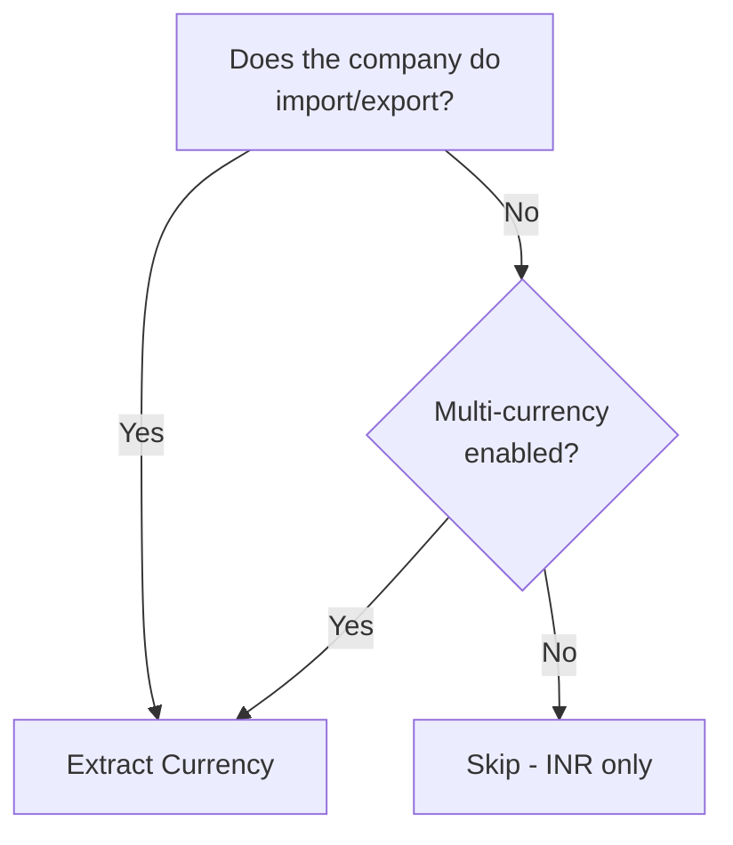

If you are integrating with a domestic Indian distributor who only deals in INR, you can safely skim this page. Currency matters when the business handles **imports, exports, or foreign transactions**. But even then, it is one of the simpler masters to work with.

## Do You Need This?



Most pharma distributors in India operate entirely in INR. The currency master will have exactly one entry: the Indian Rupee. For them, this is a non-issue.

## Schema

```
mst_currency
 +-- guid           VARCHAR(64) PK
 +-- name           TEXT
 +-- formal_name    TEXT
 +-- symbol         TEXT
 +-- decimal_places INTEGER
 +-- alter_id       INTEGER
 +-- master_id      INTEGER
```

Lean and simple.

## Common Currency Entries

| Name | Formal Name | Symbol | Decimals |
|---|---|---|---|
| INR | Indian Rupee | (rupee sign) | 2 |
| USD | US Dollar | $ | 2 |
| EUR | Euro | (euro sign) | 2 |
| GBP | British Pound | (pound sign) | 2 |
| AED | UAE Dirham | AED | 2 |

Most Tally companies in India have INR as the **base currency** (set at company level) and optionally USD, EUR, or others for foreign transactions.

## XML Export Example

```xml
<CURRENCY NAME="$">
  <GUID>cur-guid-001</GUID>
  <ALTERID>10</ALTERID>
  <MASTERID>2</MASTERID>
  <ORIGINALNAME>$</ORIGINALNAME>
  <MAILINGNAME>US Dollar</MAILINGNAME>
  <EXPANDEDSYMBOL>USD</EXPANDEDSYMBOL>
  <DECIMALPLACES>2</DECIMALPLACES>
  <INMILLIONS>No</INMILLIONS>
</CURRENCY>

<CURRENCY NAME="Rs.">
  <GUID>cur-guid-002</GUID>
  <ALTERID>1</ALTERID>
  <MASTERID>1</MASTERID>
  <ORIGINALNAME>Rs.</ORIGINALNAME>
  <MAILINGNAME>Indian Rupee</MAILINGNAME>
  <EXPANDEDSYMBOL>INR</EXPANDEDSYMBOL>
  <DECIMALPLACES>2</DECIMALPLACES>
</CURRENCY>
```

Note that Tally uses the **symbol** as the currency `NAME` attribute (e.g., `$`, not `USD`). The `MAILINGNAME` has the full name, and `EXPANDEDSYMBOL` has the ISO code.

## Collection Export Request

```xml
<ENVELOPE>
  <HEADER>
    <VERSION>1</VERSION>
    <TALLYREQUEST>Export</TALLYREQUEST>
    <TYPE>Collection</TYPE>
    <ID>CurrencyColl</ID>
  </HEADER>
  <BODY>
    <DESC>
      <STATICVARIABLES>
        <SVEXPORTFORMAT>
          $$SysName:XML
        </SVEXPORTFORMAT>
        <SVCURRENTCOMPANY>
          ##CompanyName##
        </SVCURRENTCOMPANY>
      </STATICVARIABLES>
      <TDL><TDLMESSAGE>
        <COLLECTION
          NAME="CurrencyColl"
          ISMODIFY="No">
          <TYPE>Currency</TYPE>
          <NATIVEMETHOD>
            Name, GUID,
            MasterId, AlterId,
            MailingName,
            ExpandedSymbol,
            DecimalPlaces
          </NATIVEMETHOD>
        </COLLECTION>
      </TDLMESSAGE></TDL>
    </DESC>
  </BODY>
</ENVELOPE>
```

## How Forex Appears in Vouchers

When a transaction involves foreign currency, the voucher's accounting entries include additional forex fields:

```xml
<ALLLEDGERENTRIES.LIST>
  <LEDGERNAME>
    US Import Supplier LLC
  </LEDGERNAME>
  <AMOUNT>-830000.00</AMOUNT>
  <CURRENCYNAME>$</CURRENCYNAME>
  <FOREXAMOUNT>-10000.00</FOREXAMOUNT>
  <CURRENCYAMOUNT>-10000.00</CURRENCYAMOUNT>
  <EXCHANGERATE>83.00</EXCHANGERATE>
</ALLLEDGERENTRIES.LIST>
```

Breaking it down:

| Tag | Value | Meaning |
|---|---|---|
| `AMOUNT` | -830000.00 | INR value (base currency) |
| `CURRENCYNAME` | $ | Foreign currency used |
| `FOREXAMOUNT` | -10000.00 | Amount in foreign currency |
| `EXCHANGERATE` | 83.00 | Rate: 1 USD = 83 INR |

The `AMOUNT` is always in the base currency (INR). The `FOREXAMOUNT` is in the foreign currency. The `EXCHANGERATE` is what connects them.

## Exchange Rates

Tally stores exchange rates in two ways:

### Per-Voucher Rate

Each voucher can have its own exchange rate (the rate at the time of the transaction). This is what you see in the `EXCHANGERATE` tag above.

### Standard Rate (optional)

Tally can maintain a standard exchange rate table that provides default rates for new vouchers. These can be date-effective.

For most integration purposes, you only need the per-voucher rate. It is already embedded in the voucher data.

## Forex Gain/Loss

When a foreign currency bill is settled at a different exchange rate than when it was created, there is a forex gain or loss. Tally handles this automatically via Journal vouchers. These show up as:

```xml
<VOUCHER VCHTYPE="Journal">
  <NARRATION>
    Exchange Rate Difference
  </NARRATION>
  <ALLLEDGERENTRIES.LIST>
    <LEDGERNAME>
      Forex Gain/Loss
    </LEDGERNAME>
    <AMOUNT>5000.00</AMOUNT>
  </ALLLEDGERENTRIES.LIST>
</VOUCHER>
```

## Practical Guidance

For a typical Indian distributor:

1. **Sync the currency master** as part of your standard master sync. It is small (1--5 records) and rarely changes.

2. **Store the currency on each accounting entry** that has forex. Most entries will be INR-only and won't have `CURRENCYNAME` / `FOREXAMOUNT` tags.

3. **Use the per-voucher exchange rate** for conversion. Don't try to maintain your own exchange rate table unless you have a specific use case.

:::tip
Even if the company is INR-only today, always include the currency field in your schema. Businesses grow. A pharma distributor might start importing APIs (Active Pharmaceutical Ingredients) from China, and suddenly USD transactions appear. Future-proofing costs nothing here.
:::

## What to Watch For

1. **Currency name is the symbol, not the code.** Tally uses `$` as the name, not `USD`. Map to ISO codes using `EXPANDEDSYMBOL` for downstream systems.

2. **Base currency is always present.** Even if no foreign transactions exist, the INR currency entry is always there.

3. **Decimal places vary.** Most currencies use 2 decimal places. Some (like Kuwaiti Dinar) use 3. Respect the `DECIMALPLACES` field for proper formatting.

4. **Negative forex amounts.** Same debit-negative convention as regular amounts. A negative `FOREXAMOUNT` means a debit in the foreign currency.
