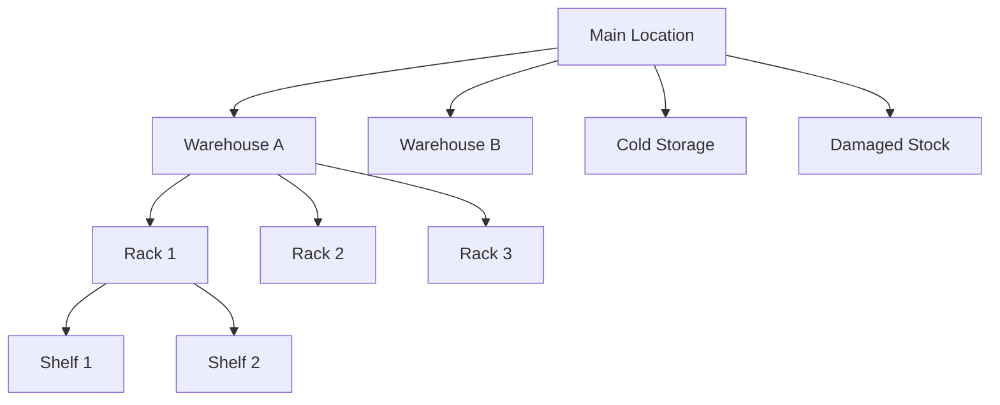

In Tally's world, a warehouse is called a **Godown**. It is where your stock physically lives. Understanding godowns is essential because stock availability is always *per godown* -- an item might be plentiful in Warehouse A but completely out in Cold Storage.

## The Default: Main Location

Every Tally company starts with a single godown called **"Main Location"**. If the company has not enabled multi-godown tracking, all stock lives here by default.

:::tip
Check the company profile's `is_multi_godown` flag. If it is `No`, you will only ever see "Main Location" and can simplify your stock queries significantly.
:::

## Hierarchical Locations

When multi-godown is enabled, locations can nest. This is how a real-world warehouse maps to Tally:



The depth is unlimited. A pharma distributor might go:

```
Main Location
  +-- Warehouse A (General)
  |     +-- Rack 1 (Analgesics)
  |     +-- Rack 2 (Antibiotics)
  |     +-- Rack 3 (OTC)
  +-- Cold Storage (2-8 deg C)
  +-- Controlled Substances
  +-- Damaged / Expired Stock
  +-- Free Goods (samples)
```

## Special-Purpose Godowns

These are not technically different from regular godowns in Tally -- they are just godowns with meaningful names and specific business roles:

| Godown | Purpose |
|---|---|
| Damaged Stock | Items damaged in transit or storage |
| Free Goods | Samples, promotional items |
| Cold Storage | Temperature-controlled medicines |
| Rejected | Items returned or failed QC |
| In Transit | Goods dispatched but not yet received |
| Quarantine | Items pending quality check |

:::caution
Stock in "Damaged Stock" or "Rejected" godowns is technically still inventory in Tally. If your sales fleet app shows total available stock, make sure to **exclude** these special godowns. Otherwise, sales guys will promise stock that cannot be sold.
:::

## Schema

```
mst_godown
 +-- guid             VARCHAR(64) PK
 +-- name             TEXT
 +-- parent           TEXT (parent godown)
 +-- address          TEXT
 +-- has_sub_locations BOOLEAN
 +-- alter_id         INTEGER
 +-- master_id        INTEGER
```

The `parent` field is the hierarchy key. Top-level godowns have `parent = "Main Location"` (or empty, depending on Tally version).

## XML Export Example

```xml
<GODOWN NAME="Warehouse A">
  <GUID>gd-guid-001</GUID>
  <ALTERID>201</ALTERID>
  <MASTERID>5</MASTERID>
  <PARENT>Main Location</PARENT>
  <ADDRESS.LIST>
    <ADDRESS>
      Plot 42, Industrial Area
    </ADDRESS>
    <ADDRESS>
      Ahmedabad, Gujarat 380015
    </ADDRESS>
  </ADDRESS.LIST>
  <HASNOSUBLOCATIONS>No</HASNOSUBLOCATIONS>
</GODOWN>

<GODOWN NAME="Rack 1">
  <GUID>gd-guid-002</GUID>
  <ALTERID>202</ALTERID>
  <MASTERID>6</MASTERID>
  <PARENT>Warehouse A</PARENT>
  <HASNOSUBLOCATIONS>Yes</HASNOSUBLOCATIONS>
</GODOWN>
```

Notice the tag name is `HASNOSUBLOCATIONS` (double negative!). When it says `No`, it means "it is NOT true that this godown has no sub-locations" -- i.e., it DOES have sub-locations. Classic Tally naming.

## Collection Export Request

```xml
<ENVELOPE>
  <HEADER>
    <VERSION>1</VERSION>
    <TALLYREQUEST>Export</TALLYREQUEST>
    <TYPE>Collection</TYPE>
    <ID>GodownColl</ID>
  </HEADER>
  <BODY>
    <DESC>
      <STATICVARIABLES>
        <SVEXPORTFORMAT>
          $$SysName:XML
        </SVEXPORTFORMAT>
        <SVCURRENTCOMPANY>
          ##CompanyName##
        </SVCURRENTCOMPANY>
      </STATICVARIABLES>
      <TDL><TDLMESSAGE>
        <COLLECTION
          NAME="GodownColl"
          ISMODIFY="No">
          <TYPE>Godown</TYPE>
          <NATIVEMETHOD>
            Name, Parent, GUID,
            MasterId, AlterId,
            Address.List,
            HasNoSubLocations
          </NATIVEMETHOD>
        </COLLECTION>
      </TDLMESSAGE></TDL>
    </DESC>
  </BODY>
</ENVELOPE>
```

## Why Godowns Matter for Your Integration

### Stock Availability

The central question your sales fleet app needs to answer:

> "Is Paracetamol 500mg available to sell right now?"

The answer is not just a single number. It is:

| Godown | Qty | Sellable? |
|---|---|---|
| Warehouse A - Rack 1 | 500 | Yes |
| Cold Storage | 0 | Yes |
| Damaged Stock | 20 | No |
| Free Goods | 50 | No |

**Available to sell = 500** (Warehouse A only). Not 570.

### Stock Transfers

When stock moves between godowns (via Stock Journal voucher), the total company stock does not change -- but the per-godown availability does. Your sync must track godown-level positions.

### Dispatch Planning

The warehouse team needs to know *which godown* to pick from. If the sales order says "100 Strips of Paracetamol" and Rack 1 has 80 while Rack 2 has 200, they pick from Rack 2 (or split across both).

## Building the Godown Tree

Same approach as Stock Groups:

1. Index all godowns by name
2. Link each to its parent
3. "Main Location" is the root

:::tip
Store the full path for each godown (e.g., "Main Location > Warehouse A > Rack 1"). This makes it much easier to display in UIs and filter in queries, rather than walking the tree every time.
:::

## Edge Cases

**Single-godown companies.** When `is_multi_godown` is off, all vouchers default to "Main Location." You might not even see a `GODOWNNAME` tag in voucher XML -- it is implied.

**Godown renames.** Like stock items, godowns are referenced by name in vouchers. A rename updates the reference inside Tally but your cache needs a re-sync.

**Empty godowns.** Perfectly valid. A godown with zero stock just means nothing is stored there right now. Do not delete it from your cache -- stock could arrive there tomorrow.
