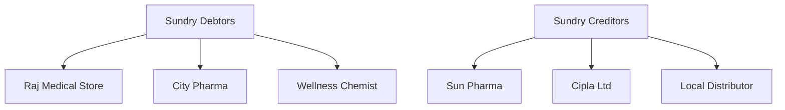

Ledgers are Tally's fundamental accounting building blocks. For our inventory integration, we care about ledgers because they represent **customers** (medical shops, retailers) and **suppliers** (pharma companies, distributors).

But ledgers are more than just parties. Every account in Tally -- bank accounts, tax accounts, income accounts, expense accounts -- is a ledger. Let us untangle what matters for you.

## The Group-Nature Connection

A ledger's *nature* (what it represents) is determined by its **parent group**. This is the single most important thing to understand about ledgers.

| Parent Group | Nature | You Care? |
|---|---|---|
| Sundry Debtors | Customers | Yes |
| Sundry Creditors | Suppliers | Yes |
| Sales Accounts | Revenue | Sometimes |
| Purchase Accounts | Cost | Sometimes |
| Duties & Taxes | Tax accounts (GST) | Sometimes |
| Bank Accounts | Bank | Rarely |
| Cash-in-Hand | Cash | Rarely |

When building a sales fleet app, you primarily need **Sundry Debtors** (the medical shops your sales guys visit) and **Sundry Creditors** (the pharma companies you buy from).



## Schema

```
mst_ledger
 +-- guid             VARCHAR(64) PK
 +-- name             TEXT
 +-- parent           TEXT (group name)
 +-- primary_group    TEXT
 +-- opening_balance  DECIMAL
 +-- closing_balance  DECIMAL
 +-- gstin            TEXT
 +-- state            TEXT
 +-- pan              TEXT
 +-- address          TEXT
 +-- pincode          TEXT
 +-- phone            TEXT
 +-- email            TEXT
 +-- credit_period    INTEGER (days)
 +-- credit_limit     DECIMAL
 +-- bill_credit_period INTEGER
 +-- is_revenue       BOOLEAN
 +-- alter_id         INTEGER
 +-- master_id        INTEGER
```

That is a lot of fields. Let us group them.

## Field Reference

### Identity and Classification

| Field | Type | Description |
|---|---|---|
| `name` | TEXT | Unique ledger name |
| `parent` | TEXT | Group it belongs to |
| `primary_group` | TEXT | Ultimate parent group |

The `parent` might be a sub-group like "Ahmedabad Shops" under "Sundry Debtors". The `primary_group` is always the top-level nature-defining group.

### Party Details (for Sundry Debtors / Creditors)

| Field | Type | Description |
|---|---|---|
| `gstin` | TEXT | GST registration number |
| `state` | TEXT | State for GST (place of supply) |
| `pan` | TEXT | PAN number |
| `address` | TEXT | Full address |
| `phone` | TEXT | Contact phone |
| `email` | TEXT | Contact email |

These fields are populated for party ledgers. For non-party ledgers (like "Sales Account" or "Bank of Baroda"), most of these are empty.

### Credit Management

| Field | Type | Description |
|---|---|---|
| `credit_period` | INTEGER | Days before payment is due |
| `credit_limit` | DECIMAL | Maximum outstanding allowed |
| `opening_balance` | DECIMAL | Balance at FY start |
| `closing_balance` | DECIMAL | Current balance |

:::tip
For a sales fleet app, `closing_balance` on a Sundry Debtor ledger tells you how much the medical shop currently owes. Combine this with `credit_limit` to decide whether to accept a new order: if `closing_balance + new_order_amount > credit_limit`, flag it.
:::

### The Revenue Flag

| Field | Type | Description |
|---|---|---|
| `is_revenue` | BOOLEAN | Revenue/expense account? |

This distinguishes Sales Account, Purchase Account (revenue = Yes) from Balance Sheet items like party ledgers (revenue = No).

## The "Inventory Values Are Affected" Flag

Some ledgers in Tally have the **"Inventory values are affected"** flag set to `Yes`. This is critical. When this flag is on, the ledger appears in the inventory allocation section of vouchers, not just the accounting section.

Common ledgers with this flag:
- Sales Account
- Purchase Account
- Sales Return Account
- Purchase Return Account

For party ledgers (Sundry Debtors/Creditors), this flag is typically `No`.

## The "Both Sundry" Problem

Here is a real-world headache. Sometimes a party is **both** a customer and a supplier. A medical shop might buy medicines from you (they are a Sundry Debtor) but also sell you expired returns (now they are a Sundry Creditor).

Tally handles this in two ways:

**Way 1: Separate ledgers.** Create "Raj Medical - Customer" under Sundry Debtors and "Raj Medical - Supplier" under Sundry Creditors. Clean but doubles the ledger count.

**Way 2: Single ledger.** Keep "Raj Medical" under Sundry Debtors and use it for both sales and purchase transactions. The balance can swing negative (they owe you) or positive (you owe them).

:::caution
Your connector must handle Way 2 gracefully. Do not assume every ledger under Sundry Debtors has a positive (debit) balance. Some will be in credit because of returns, advance payments, or dual-nature relationships.
:::

## XML Export Example

```xml
<LEDGER NAME="Raj Medical Store - Ahmedabad">
  <GUID>led-guid-001</GUID>
  <ALTERID>890</ALTERID>
  <MASTERID>245</MASTERID>
  <PARENT>Sundry Debtors</PARENT>
  <ISBILLWISEON>Yes</ISBILLWISEON>
  <AFFECTSSTOCK>No</AFFECTSSTOCK>
  <ISREVENUE>No</ISREVENUE>
  <OPENINGBALANCE>25000.00 Dr</OPENINGBALANCE>
  <CLOSINGBALANCE>42000.00 Dr</CLOSINGBALANCE>
  <CREDITPERIOD>30 Days</CREDITPERIOD>
  <CREDITLIMIT>100000.00</CREDITLIMIT>
  <ADDRESS.LIST>
    <ADDRESS>
      123 Station Road
    </ADDRESS>
    <ADDRESS>
      Ahmedabad, Gujarat 380001
    </ADDRESS>
  </ADDRESS.LIST>
  <LEDGERPHONE>+91-9876543210</LEDGERPHONE>
  <LEDGEREMAIL>
    raj@medical.com
  </LEDGEREMAIL>
  <LEDSTATENAME>Gujarat</LEDSTATENAME>
  <PARTYGSTIN>
    24ABCDE1234F1Z5
  </PARTYGSTIN>
  <GSTREGISTRATIONTYPE>
    Regular
  </GSTREGISTRATIONTYPE>
</LEDGER>
```

### Parsing Notes

- `OPENINGBALANCE` includes "Dr" or "Cr" suffix. Parse the number and the direction separately.
- `CREDITPERIOD` includes "Days" suffix. Strip it to get the integer.
- `ADDRESS.LIST` is multi-line. Each `<ADDRESS>` tag is a separate line.
- `LEDSTATENAME` is the state as Tally knows it (for GST place-of-supply determination).

## Collection Export Request

```xml
<ENVELOPE>
  <HEADER>
    <VERSION>1</VERSION>
    <TALLYREQUEST>Export</TALLYREQUEST>
    <TYPE>Collection</TYPE>
    <ID>LedgerColl</ID>
  </HEADER>
  <BODY>
    <DESC>
      <STATICVARIABLES>
        <SVEXPORTFORMAT>
          $$SysName:XML
        </SVEXPORTFORMAT>
        <SVCURRENTCOMPANY>
          ##CompanyName##
        </SVCURRENTCOMPANY>
      </STATICVARIABLES>
      <TDL><TDLMESSAGE>
        <COLLECTION
          NAME="LedgerColl"
          ISMODIFY="No">
          <TYPE>Ledger</TYPE>
          <NATIVEMETHOD>
            Name, Parent, GUID,
            MasterId, AlterId,
            OpeningBalance,
            ClosingBalance,
            Address.List,
            LedgerPhone,
            LedgerEmail,
            LedStateName,
            PartyGSTIN,
            GSTRegistrationType,
            CreditPeriod,
            CreditLimit
          </NATIVEMETHOD>
        </COLLECTION>
      </TDLMESSAGE></TDL>
    </DESC>
  </BODY>
</ENVELOPE>
```

:::tip
If you only need party ledgers (customers + suppliers), add a filter to the collection to pull only Sundry Debtors and Sundry Creditors. This reduces response size dramatically for companies with hundreds of accounting ledgers you do not need.
:::

## Auto-Creating Ledgers (Write-Back)

When a sales guy visits a new medical shop and places an order, the party ledger might not exist in Tally yet. Your connector can auto-create it:

```xml
<LEDGER
  NAME="New Medical Shop - Surat"
  ACTION="Create">
  <PARENT>Sundry Debtors</PARENT>
  <ISBILLWISEON>Yes</ISBILLWISEON>
  <AFFECTSSTOCK>No</AFFECTSSTOCK>
  <ADDRESS.LIST TYPE="String">
    <ADDRESS>123 Main Road</ADDRESS>
    <ADDRESS>Surat, Gujarat</ADDRESS>
  </ADDRESS.LIST>
  <LEDGERPHONE>
    +91-9876543210
  </LEDGERPHONE>
  <LEDSTATENAME>Gujarat</LEDSTATENAME>
  <PARTYGSTIN>
    24ABCDE1234F1Z5
  </PARTYGSTIN>
  <GSTREGISTRATIONTYPE>
    Regular
  </GSTREGISTRATIONTYPE>
</LEDGER>
```

This must happen *before* pushing the Sales Order that references this ledger.

## Pharma-Specific UDFs on Ledgers

Medical distributors often add custom fields to party ledgers via TDL:

- **Drug License Number** (DL No.) -- mandatory for selling scheduled drugs
- **FSSAI Number** -- for food/supplement items
- **Shop Category** -- Hospital, Retail Pharmacy, Clinic, Wholesale
- **Territory / Route** -- for sales rep assignment

These appear as UDF tags in the XML export, just like stock item UDFs.

## What to Watch For

1. **Ledger names must be unique across ALL groups.** You cannot have "Cash" under both Bank Accounts and Cash-in-Hand. Tally enforces global name uniqueness for ledgers.

2. **Opening balance signs.** Debtors with "Dr" balance means they owe you (normal). "Cr" balance means you owe them (advance payment or overpayment). Do not discard the Dr/Cr suffix.

3. **Large ledger counts.** A busy distributor with 2,000+ medical shops means 2,000+ Sundry Debtor ledgers. Filter your sync to only pull what you need.

4. **GSTIN validation.** Not all party ledgers have GSTIN filled. Some shops are unregistered. Your app should handle `null` GSTIN gracefully.
