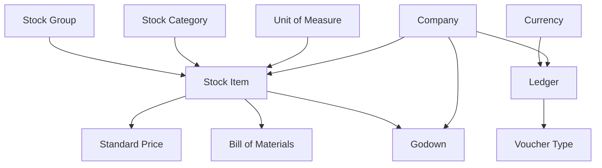
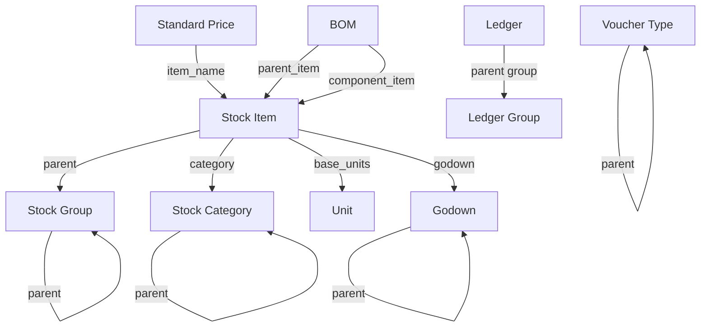

Every transaction in Tally leans on a foundation of **master data**. Before a single invoice gets created, somebody (or some import process) has to set up the items, the parties, the warehouses, and the units of measure.

This section covers all 11 master tables that our connector extracts. Think of this page as your map before diving into the details.

## The Big Picture

Here is how the master tables relate to each other. **Stock Item** sits at the center of everything.



Stock Item is the heart. It belongs to a **Stock Group** (hierarchical), optionally tagged with a **Stock Category** (cross-cutting), measured in a **Unit**, stored in a **Godown**, priced via **Standard Prices**, and composed of components through a **Bill of Materials**.

On the accounting side, **Ledgers** represent your customers and suppliers. **Voucher Types** define what kind of transactions you can create. **Currency** handles multi-currency scenarios.

## How to Think About the Hierarchy

Tally organises inventory masters in a tree structure. Understanding this hierarchy saves you from a lot of head-scratching later.

### Stock Group Hierarchy

Stock Groups are like folders. They nest. A pharma distributor might set them up like this:

```
Primary (root)
  +-- Analgesics
  |     +-- Paracetamol Range
  |     +-- Ibuprofen Range
  +-- Antibiotics
  +-- Cardiac
  +-- OTC Products
```

### Godown Hierarchy

Godowns (warehouses) also nest:

```
Main Location (default)
  +-- Warehouse A
  |     +-- Rack 1
  |     +-- Rack 2
  +-- Cold Storage
  +-- Damaged Stock
```

### Ledger Group Hierarchy

Ledgers inherit their nature from their parent group:

```
Sundry Debtors (customers)
  +-- Ahmedabad Shops
  +-- Surat Shops
Sundry Creditors (suppliers)
  +-- Pharma Companies
  +-- Local Distributors
```

## Quick Reference Table

| Table | What It Stores | Typical Count |
|---|---|---|
| `mst_stock_group` | Hierarchical item grouping | 20 -- 200 |
| `mst_stock_category` | Cross-cutting classification | 5 -- 50 |
| `mst_stock_item` | Products / SKUs | 500 -- 50,000 |
| `mst_godown` | Warehouses and locations | 3 -- 30 |
| `mst_unit` | Units of measure | 5 -- 20 |
| `mst_ledger` | Parties, accounts | 200 -- 10,000 |
| `mst_stock_item_standard_price` | Price lists per item | 1,000 -- 100,000 |
| `mst_stock_item_bom` | Bill of Materials components | 0 -- 5,000 |
| `mst_voucher_type` | Transaction type definitions | 15 -- 50 |
| `mst_currency` | Currency definitions | 1 -- 10 |
| `mst_company` | Company profile and settings | 1 -- 5 |

:::tip
Most small businesses have 1 company, under 20 stock groups, and fewer than 10 godowns. The numbers blow up for large distributors with thousands of SKUs and hundreds of party ledgers.
:::

## Relationships Diagram (Detailed)

Here is a more detailed view showing the key foreign-key-like relationships. Tally does not use actual foreign keys (it is XML-based, not relational), but these are the logical links your connector must maintain.



Notice the self-referential arrows? Stock Groups point to parent Stock Groups. Godowns point to parent Godowns. This is how Tally builds its tree hierarchies.

## What Gets Synced and When

Masters change infrequently compared to vouchers. A typical sync strategy:

| Data | Sync Frequency | Method |
|---|---|---|
| Masters | Every 5 minutes | AlterID-based incremental |
| Vouchers | Every 1 minute | AlterID-based incremental |
| Reports | Every 15 minutes | Full report pull |

:::caution
Masters must be synced **before** vouchers. A voucher references stock items, ledgers, and godowns by name. If the master does not exist in your local cache, you cannot properly parse the voucher.
:::

## Up Next

Dive into each master table in detail. We recommend starting with [Stock Items](/tally-integartion/data-model-masters/stock-items/) since it is the core of everything, then branching out to the supporting masters as needed.
