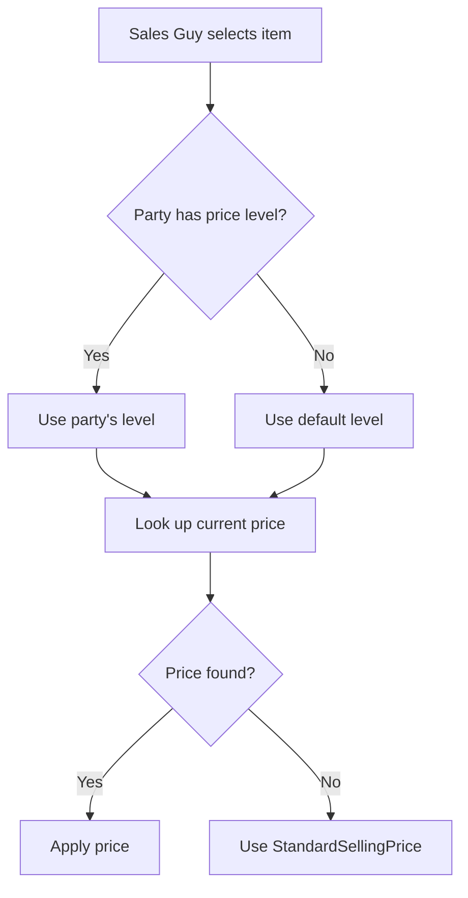

Most businesses do not sell everything at one price. A pharma distributor has MRP for end consumers, a wholesale rate for large orders, a distributor rate for sub-distributors, and a retailer rate for individual shops. Tally handles this through **Standard Prices** (also called Price Levels or Price Lists).

## How Price Levels Work

Price levels are defined at the company level, then rates are assigned per stock item per level. Think of it as a matrix:

| Stock Item | MRP | Wholesale | Distributor | Retailer |
|---|---|---|---|---|
| Paracetamol 500mg | 25.00 | 20.00 | 18.00 | 22.00 |
| Amoxicillin 250mg | 85.00 | 72.00 | 65.00 | 78.00 |
| Cough Syrup 100ml | 120.00 | 100.00 | 90.00 | 110.00 |

Each cell is a `STANDARDPRICE.LIST` entry.

## Schema

```
mst_stock_item_standard_price
 +-- item_name    TEXT FK
 +-- date         DATE
 +-- rate         DECIMAL
 +-- price_level  TEXT
```

Simple and flat. The composite key is `(item_name, date, price_level)`.

## Date-Effective Prices

Prices change over time. Tally tracks this with the `date` field (stored as `APPLICABLEFROM` in XML):

```
Paracetamol 500mg - MRP:
  From 2025-04-01: 22.00
  From 2025-10-01: 24.00
  From 2026-01-01: 25.00
```

The **current price** is the one with the latest `date` that is on or before today.

### Extracting Current Price

```
For a given item + price_level:
  1. Filter by item_name and price_level
  2. Filter by date <= today
  3. Order by date DESC
  4. Take the first row
  -> That is your current price
```

:::tip
Cache the "current as of today" price separately from the full history. Your sales fleet app needs instant lookup of "what is the MRP right now?" without scanning through date ranges every time.
:::

## XML Structure

Price lists appear as nested lists inside the stock item export:

```xml
<STOCKITEM NAME="Paracetamol 500mg">
  <!-- ... other fields ... -->

  <STANDARDPRICE.LIST>
    <DATE>20260101</DATE>
    <RATE>25.00/Strip</RATE>
    <PRICELEVEL>MRP</PRICELEVEL>
  </STANDARDPRICE.LIST>

  <STANDARDPRICE.LIST>
    <DATE>20260101</DATE>
    <RATE>20.00/Strip</RATE>
    <PRICELEVEL>Wholesale</PRICELEVEL>
  </STANDARDPRICE.LIST>

  <STANDARDPRICE.LIST>
    <DATE>20260101</DATE>
    <RATE>18.00/Strip</RATE>
    <PRICELEVEL>Distributor</PRICELEVEL>
  </STANDARDPRICE.LIST>

  <STANDARDPRICE.LIST>
    <DATE>20251001</DATE>
    <RATE>24.00/Strip</RATE>
    <PRICELEVEL>MRP</PRICELEVEL>
  </STANDARDPRICE.LIST>
</STOCKITEM>
```

Notice there can be **multiple** `STANDARDPRICE.LIST` entries per item -- one per price level per effective date.

### Parsing Notes

- `RATE` includes the unit suffix (`/Strip`). Strip it before parsing the numeric value.
- `DATE` is in `YYYYMMDD` format. Normalize to `YYYY-MM-DD`.
- Multiple entries for the same `PRICELEVEL` with different `DATE` values represent price history.

## Common Price Level Names

These are user-defined, so they vary by business. Common ones we see:

| Level | Who It's For |
|---|---|
| MRP | Maximum Retail Price (end consumer) |
| Wholesale | Bulk buyers |
| Distributor | Sub-distributors |
| Retailer | Retail pharmacy shops |
| Stockist | Fellow stockists |
| Hospital | Hospital purchase |
| Institutional | Government/institutional buyers |

:::caution
Price level names are **user-defined strings**. Do not hardcode them. Pull the actual level names from the data during onboarding and map them to your app's pricing tiers.
:::

## Price Discovery for Sales Orders

When a sales guy creates an order in the field app, the app needs to know which price to apply. The logic:



Some businesses assign a default price level to each party ledger (via UDF or naming convention). Others use a simpler rule: all orders use "Retailer" unless overridden.

## No Price Lists? No Problem

Not all Tally companies use standard price lists. Smaller businesses might rely entirely on:

- `StandardSellingPrice` on the stock item (a single default selling price)
- `StandardCost` on the stock item (a single default purchase cost)
- Manual pricing at voucher entry time

If `STANDARDPRICE.LIST` is empty for all items, fall back to `StandardSellingPrice` from the stock item master.

## What to Watch For

1. **Rates include unit suffix.** Always strip the `/Unit` part before parsing.

2. **Date ordering matters.** The most recent `APPLICABLEFROM` that is not in the future is the current price. Watch out for future-dated prices that should not be active yet.

3. **Per-state pricing.** Some businesses set different prices for different states (due to VAT/tax differences). This is less common post-GST but still exists.

4. **Discount structures.** Tally's standard prices do not include discounts. Discounts are typically applied at voucher level, not in the price list. Your sales app may need a separate discount matrix.
