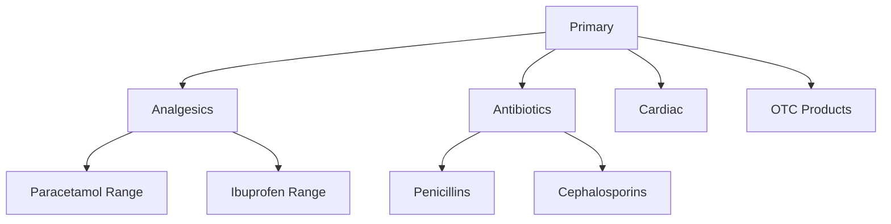

Stock Groups are Tally's way of organizing stock items into a tree. Think of them as folders in a file system -- they can nest inside each other, and every stock item lives in exactly one group.

## Why Stock Groups Matter

Without groups, a distributor with 5,000 SKUs would have a flat, unsearchable list. Groups give structure:

- Reports can be filtered or summarized by group
- Tally's "Stock Summary" rolls up quantities by group hierarchy
- GST returns can be grouped by product category
- The sales fleet app can show items organized by therapeutic category

## The Hierarchy

Every Tally company starts with a single root group called **Primary**. All other groups are children (or grandchildren, or great-grandchildren) of Primary.



The depth is unlimited, but most businesses keep it to 2--3 levels. Deeper hierarchies make Tally's UI slower and reports harder to read.

## Schema

```
mst_stock_group
 +-- guid        VARCHAR(64) PK
 +-- name        TEXT
 +-- parent      TEXT (parent group name)
 +-- narration   TEXT
 +-- alter_id    INTEGER
 +-- master_id   INTEGER
```

That is it. Stock Groups are beautifully simple. The `parent` field is the key -- it tells you where this group sits in the tree.

## Common Patterns by Industry

### Pharma Distributor

```
Primary
  +-- Analgesics
  +-- Antibiotics
  +-- Antacids & GI
  +-- Cardiac & BP
  +-- Diabetes
  +-- Vitamins & Supplements
  +-- Surgical Items
  +-- OTC Products
```

Grouped by **therapeutic category**. Makes sense for medical reps who think in terms of disease areas.

### Garment Business

```
Primary
  +-- Men's Wear
  |     +-- Shirts
  |     +-- Trousers
  |     +-- Ethnic Wear
  +-- Women's Wear
  |     +-- Sarees
  |     +-- Kurtis
  +-- Kids Wear
  +-- Accessories
```

Grouped by **product type and gender**.

### General Distributor

```
Primary
  +-- Brand A
  +-- Brand B
  +-- Brand C
  +-- Unbranded
```

Grouped by **brand**. Common when the distributor carries multiple brand lines.

## XML Export Example

Here is what stock groups look like in Tally's XML:

```xml
<STOCKGROUP NAME="Analgesics">
  <GUID>sg-guid-001</GUID>
  <ALTERID>102</ALTERID>
  <MASTERID>15</MASTERID>
  <PARENT>Primary</PARENT>
  <NARRATION>
    Pain relief medications
  </NARRATION>
</STOCKGROUP>

<STOCKGROUP NAME="Paracetamol Range">
  <GUID>sg-guid-002</GUID>
  <ALTERID>103</ALTERID>
  <MASTERID>16</MASTERID>
  <PARENT>Analgesics</PARENT>
</STOCKGROUP>
```

The `PARENT` tag is the critical link. For root-level groups, `PARENT` is "Primary".

## Collection Export Request

```xml
<ENVELOPE>
  <HEADER>
    <VERSION>1</VERSION>
    <TALLYREQUEST>Export</TALLYREQUEST>
    <TYPE>Collection</TYPE>
    <ID>StockGroupColl</ID>
  </HEADER>
  <BODY>
    <DESC>
      <STATICVARIABLES>
        <SVEXPORTFORMAT>
          $$SysName:XML
        </SVEXPORTFORMAT>
        <SVCURRENTCOMPANY>
          ##CompanyName##
        </SVCURRENTCOMPANY>
      </STATICVARIABLES>
      <TDL><TDLMESSAGE>
        <COLLECTION
          NAME="StockGroupColl"
          ISMODIFY="No">
          <TYPE>StockGroup</TYPE>
          <NATIVEMETHOD>
            Name, Parent, GUID,
            MasterId, AlterId,
            Narration
          </NATIVEMETHOD>
        </COLLECTION>
      </TDLMESSAGE></TDL>
    </DESC>
  </BODY>
</ENVELOPE>
```

## Building the Tree in Your Code

When you pull all stock groups, you get a flat list. To reconstruct the tree:

1. Index all groups by name
2. For each group, look up its `parent` in the index
3. Attach it as a child
4. Groups with `parent = "Primary"` are top-level

```
Input (flat):
  {name: "Primary", parent: ""}
  {name: "Analgesics", parent: "Primary"}
  {name: "PCM Range", parent: "Analgesics"}

Output (tree):
  Primary
    +-- Analgesics
          +-- PCM Range
```

:::tip
Always sync stock groups **before** stock items. Stock items reference their parent group by name. If the group does not exist in your cache yet, you cannot properly classify the item.
:::

## Edge Cases

**Renamed groups.** If a user renames "Painkillers" to "Analgesics", existing stock items automatically update their parent reference inside Tally. But your cache still has the old name until the next sync. Use `GUID` for stable lookups.

**Deleted groups.** You cannot delete a group that has stock items or child groups. Tally enforces this. But a group can be emptied and left orphaned -- your periodic full reconciliation will catch stale groups.

**The "Primary" group.** You will always see it. It is the root. Some businesses put items directly in Primary (lazy setup). Others use it only as the top-level container. Either way, do not skip it.
