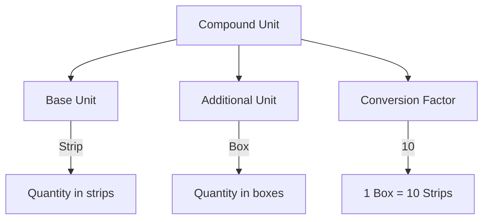

Units of measure seem straightforward until you encounter Tally's compound units. Then things get interesting.

## Simple Units

These are exactly what you think they are:

| Symbol | Name | Common Use |
|---|---|---|
| Nos | Numbers | General counting |
| Pcs | Pieces | General counting |
| Strip | Strip | Pharma (tablet strips) |
| Kg | Kilograms | Weight-based items |
| Ltrs | Litres | Liquid items |
| Mtr | Metres | Fabric, cable |
| Box | Box | Packaging unit |
| Btl | Bottle | Syrups, liquids |

Simple units have `ISSIMPLEUNIT = Yes`. One unit, one meaning, no conversion needed.

## Compound Units

Here is where Tally gets clever. A compound unit expresses a relationship between two simple units:

```
1 Box = 10 Strip
1 Carton = 12 Box
1 Thaan = 40 Mtr
1 Dozen = 12 Pcs
```

In Tally, a compound unit is stored as:

| Field | Example |
|---|---|
| `name` | Box of 10 Strip |
| `is_simple_unit` | No |
| `base_unit` | Strip |
| `additional_unit` | Box |
| `conversion` | 10 |

The `conversion` field tells you: **1 additional_unit = N base_units**.



## Schema

```
mst_unit
 +-- guid             VARCHAR(64) PK
 +-- name             TEXT
 +-- formal_name      TEXT
 +-- is_simple_unit   BOOLEAN
 +-- base_unit        TEXT
 +-- additional_unit  TEXT
 +-- conversion       DECIMAL
 +-- alter_id         INTEGER
 +-- master_id        INTEGER
```

For simple units, `base_unit`, `additional_unit`, and `conversion` are empty.

## XML Export Example

### Simple Unit

```xml
<UNIT NAME="Strip">
  <GUID>unit-guid-001</GUID>
  <ALTERID>30</ALTERID>
  <MASTERID>3</MASTERID>
  <ISSIMPLEUNIT>Yes</ISSIMPLEUNIT>
  <ORIGINALNAME>Strip</ORIGINALNAME>
</UNIT>
```

### Compound Unit

```xml
<UNIT NAME="Box of 10 Strip">
  <GUID>unit-guid-002</GUID>
  <ALTERID>31</ALTERID>
  <MASTERID>4</MASTERID>
  <ISSIMPLEUNIT>No</ISSIMPLEUNIT>
  <BASEUNITS>Strip</BASEUNITS>
  <ADDITIONALUNITS>Box</ADDITIONALUNITS>
  <CONVERSION>10</CONVERSION>
</UNIT>
```

## Collection Export Request

```xml
<ENVELOPE>
  <HEADER>
    <VERSION>1</VERSION>
    <TALLYREQUEST>Export</TALLYREQUEST>
    <TYPE>Collection</TYPE>
    <ID>UnitColl</ID>
  </HEADER>
  <BODY>
    <DESC>
      <STATICVARIABLES>
        <SVEXPORTFORMAT>
          $$SysName:XML
        </SVEXPORTFORMAT>
        <SVCURRENTCOMPANY>
          ##CompanyName##
        </SVCURRENTCOMPANY>
      </STATICVARIABLES>
      <TDL><TDLMESSAGE>
        <COLLECTION
          NAME="UnitColl"
          ISMODIFY="No">
          <TYPE>Unit</TYPE>
          <NATIVEMETHOD>
            Name, GUID,
            MasterId, AlterId,
            IsSimpleUnit,
            BaseUnits,
            AdditionalUnits,
            Conversion
          </NATIVEMETHOD>
        </COLLECTION>
      </TDLMESSAGE></TDL>
    </DESC>
  </BODY>
</ENVELOPE>
```

## Quantity Normalization

This is the practical reason units matter. When your connector pulls voucher data, quantities come with unit strings:

```xml
<ACTUALQTY>5 Box</ACTUALQTY>
```

Is that 5 boxes or 50 strips? You need the conversion factor to normalize.

### The Algorithm

```
1. Parse quantity string: "5 Box"
   -> value = 5, unit = "Box"

2. Look up stock item's base_unit:
   -> "Strip"

3. If unit != base_unit, find conversion:
   -> "Box of 10 Strip" -> factor = 10

4. Normalize:
   -> 5 Box * 10 = 50 Strip

5. Store both:
   -> raw_qty = 5 Box
   -> normalized_qty = 50 Strip
```

:::tip
Always store both the raw quantity (with unit) and the normalized quantity (in base units). The raw value is what the user sees. The normalized value is what you compute with.
:::

## Compound Unit Edge Cases

### Nested Compounds

Tally does not officially support three-level nesting (e.g., "Carton of 12 Box of 10 Strip"), but some users create chains:

```
Strip          (simple)
Box of 10 Strip  (compound)
Carton of 12 Box (compound)
```

To go from Cartons to Strips, you need to chain: `1 Carton = 12 Box = 120 Strip`. Your converter needs to walk the unit chain recursively.

### Fractional Conversions

Not everything is whole numbers:

```
1 Kg = 1000 Gms     (conversion = 1000)
1 Ltr = 1000 Ml     (conversion = 1000)
1 Dozen = 12 Pcs    (conversion = 12)
1 Gross = 144 Pcs   (conversion = 144)
```

These are clean. But you might encounter:

```
1 Thaan = 40.5 Mtr  (conversion = 40.5)
```

Always use `DECIMAL`, not `INTEGER`, for conversion factors.

### Unit Name in Quantity Strings

Tally embeds the unit name directly in quantity strings. The tricky part is that the unit name in the quantity might not match the formal unit name exactly:

```xml
<!-- Unit name: "Strip" -->
<ACTUALQTY>100 Strip</ACTUALQTY>

<!-- Unit name: "Box of 10 Strip" -->
<ACTUALQTY>5 Box of 10 Strip</ACTUALQTY>

<!-- Or sometimes just: -->
<ACTUALQTY>5 Box</ACTUALQTY>
```

Parse the leading numeric value. Use the stock item's configured units to determine which unit is meant.

:::caution
When Tally outputs `"2 Box of 12 pcs"` as a quantity, the actual quantity is 2 (in boxes), not 24. The "of 12 pcs" part is just the compound unit's display name. Parse the leading number only.
:::

## What to Watch For

1. **Units are shared across items.** Multiple stock items can use the same unit. If you delete a unit from Tally, all items using it break.

2. **Unit renames.** Rare, but if "Pcs" gets renamed to "Pieces", all quantity strings in vouchers still show the old name inside Tally's data (though Tally displays the new name). Your parser should handle both.

3. **No unit at all.** Some stock items have no unit defined. Their quantities appear as just numbers without a unit suffix. Handle gracefully.
