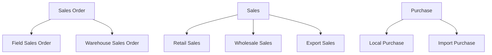

Every transaction in Tally is a **voucher**, and every voucher has a **type**. The Voucher Type Master defines what kinds of transactions exist in the company. Sounds simple, but the catch is that businesses can (and do) create custom voucher types that behave like the standard ones.

## Standard Voucher Types

Tally ships with these built-in types:

| Type | Category | Stock Impact? |
|---|---|---|
| Sales | Accounting + Inventory | Stock OUT |
| Purchase | Accounting + Inventory | Stock IN |
| Sales Order | Order | None |
| Purchase Order | Order | None |
| Receipt Note | Inventory | Stock IN |
| Delivery Note | Inventory | Stock OUT |
| Stock Journal | Inventory | Transfer |
| Manufacturing Journal | Inventory | IN + OUT |
| Physical Stock | Inventory | Adjustment |
| Rejections In | Inventory | Stock IN |
| Rejections Out | Inventory | Stock OUT |
| Debit Note | Accounting (+ optional Inventory) | Optional |
| Credit Note | Accounting (+ optional Inventory) | Optional |
| Payment | Accounting | None |
| Receipt | Accounting | None |
| Journal | Accounting | None |
| Contra | Accounting | None |

These are always present. You cannot delete them.

## Custom Voucher Types

Here is where it gets interesting. Businesses create custom types **under** a standard parent:



A custom type inherits its parent's behavior. "Field Sales Order" acts like a Sales Order in every way -- it just has a different name, separate numbering, and appears as a distinct category in reports.

## Schema

```
mst_voucher_type
 +-- guid              VARCHAR(64) PK
 +-- name              TEXT
 +-- parent            TEXT (base type)
 +-- numbering_method  TEXT
 +-- is_active         BOOLEAN
 +-- alter_id          INTEGER
 +-- master_id         INTEGER
```

The `parent` field is the key. It tells you what standard type this custom type is based on.

## The ISINVENTORYAFFECTED Flag

This flag determines whether a voucher type affects stock:

```xml
<VOUCHERTYPE NAME="Wholesale Sales">
  <PARENT>Sales</PARENT>
  <ISINVENTORYAFFECTED>Yes</ISINVENTORYAFFECTED>
</VOUCHERTYPE>
```

| Flag Value | Meaning |
|---|---|
| `Yes` | Vouchers of this type move stock |
| `No` | Accounting only, no stock impact |

:::danger
**Never hardcode voucher type names** when computing stock levels. A company might use "Wholesale Sales" instead of "Sales" for most of their invoices. Always check the `PARENT` to determine the base behavior, and check `ISINVENTORYAFFECTED` to know if stock is impacted.
:::

## Auto-Numbering (NUMERICFORMAT)

Each voucher type can have its own numbering scheme:

```xml
<VOUCHERTYPE NAME="Field Sales Order">
  <PARENT>Sales Order</PARENT>
  <ISINVENTORYAFFECTED>No</ISINVENTORYAFFECTED>
  <NUMBERINGMETHOD>
    Automatic
  </NUMBERINGMETHOD>
  <PREFIXTEXT>FSO/</PREFIXTEXT>
  <SUFFIXTEXT>/2526</SUFFIXTEXT>
  <STARTINGFROM>1</STARTINGFROM>
</VOUCHERTYPE>
```

This produces numbers like `FSO/0001/2526`, `FSO/0002/2526`, etc.

When your connector pushes Sales Orders into Tally, you have two choices:

1. **Let Tally auto-number.** Omit the `VOUCHERNUMBER` tag in the import XML. Tally assigns the next number in sequence. Safest approach.

2. **Provide your own number.** Include `VOUCHERNUMBER` with a unique prefix (e.g., `FIELD/0042`). Risk: number collision if someone also creates vouchers manually in Tally.

:::tip
Use a unique prefix for connector-generated vouchers (like `FIELD/` or `API/`). This prevents collisions with manually entered vouchers and makes it easy to identify which vouchers came from the integration.
:::

## XML Export Example

```xml
<VOUCHERTYPE NAME="Field Sales Order">
  <GUID>vt-guid-001</GUID>
  <ALTERID>301</ALTERID>
  <MASTERID>22</MASTERID>
  <PARENT>Sales Order</PARENT>
  <ISINVENTORYAFFECTED>No</ISINVENTORYAFFECTED>
  <ISACTIVE>Yes</ISACTIVE>
  <NUMBERINGMETHOD>
    Automatic
  </NUMBERINGMETHOD>
</VOUCHERTYPE>

<VOUCHERTYPE NAME="Sales">
  <GUID>vt-guid-002</GUID>
  <ALTERID>1</ALTERID>
  <MASTERID>1</MASTERID>
  <PARENT></PARENT>
  <ISINVENTORYAFFECTED>Yes</ISINVENTORYAFFECTED>
  <ISACTIVE>Yes</ISACTIVE>
</VOUCHERTYPE>
```

Standard types have an empty `PARENT` (or sometimes `PARENT` is the same as the name). Custom types always have a `PARENT` pointing to a standard type.

## Collection Export Request

```xml
<ENVELOPE>
  <HEADER>
    <VERSION>1</VERSION>
    <TALLYREQUEST>Export</TALLYREQUEST>
    <TYPE>Collection</TYPE>
    <ID>VchTypeColl</ID>
  </HEADER>
  <BODY>
    <DESC>
      <STATICVARIABLES>
        <SVEXPORTFORMAT>
          $$SysName:XML
        </SVEXPORTFORMAT>
        <SVCURRENTCOMPANY>
          ##CompanyName##
        </SVCURRENTCOMPANY>
      </STATICVARIABLES>
      <TDL><TDLMESSAGE>
        <COLLECTION
          NAME="VchTypeColl"
          ISMODIFY="No">
          <TYPE>VoucherType</TYPE>
          <NATIVEMETHOD>
            Name, Parent, GUID,
            MasterId, AlterId,
            IsInventoryAffected,
            NumberingMethod,
            IsActive
          </NATIVEMETHOD>
        </COLLECTION>
      </TDLMESSAGE></TDL>
    </DESC>
  </BODY>
</ENVELOPE>
```

## Building a Type Resolution Map

Your connector should build a lookup that maps every voucher type to its base behavior:

```
Map:
  "Sales"              -> base: "Sales"
  "Wholesale Sales"    -> base: "Sales"
  "Export Sales"       -> base: "Sales"
  "Sales Order"        -> base: "Sales Order"
  "Field Sales Order"  -> base: "Sales Order"
  "Purchase"           -> base: "Purchase"
  "Local Purchase"     -> base: "Purchase"
```

Then when processing a voucher:

```
voucher.type = "Wholesale Sales"
base_type = resolve("Wholesale Sales")
  -> "Sales"
  -> stock impact: YES
  -> direction: OUT
```

## Why This Matters for Write-Back

When pushing a Sales Order into Tally, you need the exact voucher type name:

```xml
<VOUCHER VCHTYPE="Field Sales Order"
  ACTION="Create">
  <VOUCHERTYPENAME>
    Field Sales Order
  </VOUCHERTYPENAME>
  <!-- ... -->
</VOUCHER>
```

If you hardcode `"Sales Order"` but the company uses `"Field Sales Order"`, the import might still work (Tally falls back to the parent type), but the voucher will appear under the wrong type in reports and the numbering will be wrong.

:::caution
During onboarding, discover all custom voucher types and let the admin configure which type to use for connector-generated Sales Orders. Store this in your configuration, not in code.
:::

## What to Watch For

1. **Inactive types.** Types with `is_active = No` cannot be used for new vouchers but might still have historical vouchers. Do not filter them out entirely.

2. **Type names in vouchers.** Vouchers store the type by name, not by GUID. A rename of the voucher type does not update old vouchers inside Tally's data.

3. **Custom types with custom behavior.** TDL customizations can add validation rules, required fields, or different numbering to custom types. Your import XML might need adjustments per type.
