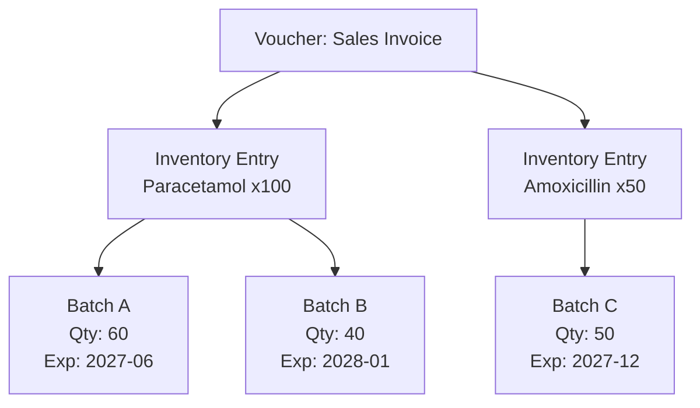

If you're integrating Tally for a pharmaceutical distributor, this page is arguably the most important in the entire guide. Batch allocations are where regulatory compliance lives.

## Why Batches Matter

Every medicine that moves through a stockist has a batch identity:

- **Batch number** -- traced back to the manufacturer
- **Manufacturing date** -- when it was made
- **Expiry date** -- when it becomes illegal to sell
- **MRP** -- maximum retail price (sometimes embedded in the batch name)

Without this data, you can't do FIFO enforcement, expiry alerts, or recall tracking. The Drug Inspector doesn't care about your elegant data model -- they care about which batch of Amoxicillin went to which medical shop and whether it expired.

## The trn_batch Table

```sql
trn_batch
├── guid          VARCHAR(64) FK
├── item          TEXT
├── batch_name    TEXT
├── godown        TEXT
├── quantity      DECIMAL
├── rate          DECIMAL
├── amount        DECIMAL
├── mfg_date      DATE
├── expiry_date   DATE
└── tracking_number TEXT
```

The `guid` links to the parent voucher. The `item` tells you which stock item this batch applies to (because one voucher can have multiple items, each with their own batches).

## XML Structure

Batch allocations nest *inside* inventory entries:

```xml
<ALLINVENTORYENTRIES.LIST>
  <STOCKITEMNAME>
    Paracetamol 500mg Strip/10
  </STOCKITEMNAME>
  <ACTUALQTY>100 Strip</ACTUALQTY>
  <AMOUNT>5000.00</AMOUNT>

  <BATCHALLOCATIONS.LIST>
    <BATCHNAME>BATCH-2026-001</BATCHNAME>
    <GODOWNNAME>Main Location</GODOWNNAME>
    <DESTINATIONGODOWNNAME>
      Main Location
    </DESTINATIONGODOWNNAME>
    <BATCHNAME>BATCH-2026-001</BATCHNAME>
    <MFGDATE>20260101</MFGDATE>
    <EXPIRYDATE>20280101</EXPIRYDATE>
    <AMOUNT>5000.00</AMOUNT>
    <ACTUALQTY>100 Strip</ACTUALQTY>
    <BILLEDQTY>100 Strip</BILLEDQTY>
  </BATCHALLOCATIONS.LIST>
</ALLINVENTORYENTRIES.LIST>
```

:::tip
One inventory entry can have **multiple** batch allocations. If you sell 100 strips but they come from two different batches (60 from Batch A, 40 from Batch B), you'll see two `BATCHALLOCATIONS.LIST` elements inside the same inventory entry.
:::

## Multiple Batches Per Line Item



The quantities across batch allocations must sum to the parent inventory entry's quantity. If the item shows 100 strips, the batches must add up to 100 strips.

## The MRP-in-Batch-Name Hack

Here's a pattern you'll see constantly in Indian pharmaceutical distribution. Since Tally doesn't have a dedicated MRP field at the batch level, stockists embed the MRP in the batch name:

```
BATCH-2026-001-MRP85.50
PCM500-B001-M92
LOT20260115-85.50
```

There's no standard format. Every stockist invents their own convention. Your connector should:

1. Store the batch name as-is (never modify it)
2. Optionally attempt to extract MRP using regex patterns
3. Store the extracted MRP separately if found

```
// Common patterns to try:
// MRP85.50 or MRP-85.50 or M85.50
// -MRP followed by digits
regex: MRP[-]?(\d+\.?\d*)
```

:::caution
Don't rely on MRP extraction being accurate. It's a hack at the Tally end, not a structured field. Always treat extracted MRP as "best effort" and flag it for human verification.
:::

## Manufacturing and Expiry Dates

```xml
<MFGDATE>20260101</MFGDATE>
<EXPIRYDATE>20280101</EXPIRYDATE>
```

Both dates use Tally's `YYYYMMDD` format. But here's the catch: these fields are only present when the stock item has `has_mfg_date` and `has_expiry_date` enabled in its master.

| Stock Item Setting | MFG Date | Expiry Date |
|---|---|---|
| Both enabled | Present | Present |
| Only expiry | Absent | Present |
| Neither | Absent | Absent |

For pharma items, both should always be enabled. If they're not, that's a data quality issue worth flagging during the profile discovery phase.

## When Batches Are Absent

The entire `BATCHALLOCATIONS.LIST` section disappears when:

1. **Company-level**: `HASBATCHES = No` in company settings. No items in this company use batch tracking.
2. **Item-level**: The specific stock item has `MaintainInBatches = No`. This item doesn't track batches even though others might.
3. **Voucher type**: Some voucher types (like Journal entries) may not carry batch detail.

```xml
<!-- No batches: entry goes straight to godown -->
<ALLINVENTORYENTRIES.LIST>
  <STOCKITEMNAME>Office Supplies</STOCKITEMNAME>
  <ACTUALQTY>10 pcs</ACTUALQTY>
  <AMOUNT>500.00</AMOUNT>
  <!-- No BATCHALLOCATIONS.LIST here -->
</ALLINVENTORYENTRIES.LIST>
```

Your connector should check for the presence of batch allocations, not assume they exist. A missing `BATCHALLOCATIONS.LIST` is perfectly normal for non-batch items.

## Godown in Batch Allocations

You'll notice the godown appears in batch allocations too:

```xml
<GODOWNNAME>Main Location</GODOWNNAME>
<DESTINATIONGODOWNNAME>
  Main Location
</DESTINATIONGODOWNNAME>
```

For stock transfers (Stock Journal), the `GODOWNNAME` is the source and `DESTINATIONGODOWNNAME` is the target. For regular sales/purchases, both are typically the same.

## Batch Allocations and Stock Position

:::danger
**Never compute stock position from batch allocations alone.** Tally's Stock Summary and Batch Summary reports account for opening balances, valuation methods, and corrections that individual voucher entries don't capture. Always pull the authoritative stock position from Tally's reports.
:::

That said, batch allocations are essential for:

- **Tracing batch movement** -- which batch went to which customer
- **Expiry alerting** -- finding batches nearing expiry across all godowns
- **FIFO validation** -- ensuring older batches are dispatched first
- **Recall support** -- if a manufacturer recalls Batch X, find every voucher that moved it

## Key Queries

```sql
-- Batches expiring in next 90 days
SELECT item, batch_name, expiry_date,
       SUM(quantity) as net_qty
FROM trn_batch
WHERE expiry_date <= date('now', '+90 days')
  AND expiry_date > date('now')
GROUP BY item, batch_name, expiry_date;

-- All movement for a specific batch
SELECT v.date, v.voucher_type,
       v.party_name, b.quantity
FROM trn_batch b
JOIN trn_voucher v ON b.guid = v.guid
WHERE b.batch_name = 'BATCH-2026-001'
ORDER BY v.date;
```

:::tip
Index `trn_batch` on `(item, batch_name)` and `(expiry_date)`. These are your two most common access patterns: "tell me about this batch" and "what's expiring soon."
:::
