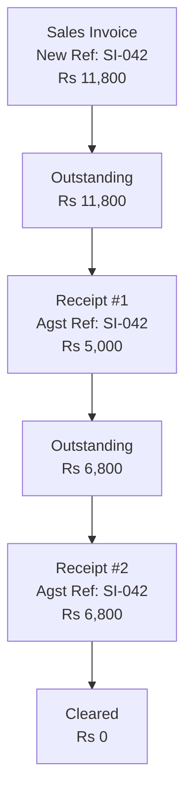

Bill allocations answer the question every distributor asks daily: "Who owes us money, and for how long?"

When a stockist sells on credit (which is almost always in pharma distribution), Tally tracks each invoice as a separate "bill." Payment receipts are then matched against these bills. The difference is the outstanding amount.

## The trn_bill Table

```sql
trn_bill
├── guid               VARCHAR(64) FK
├── ledger             TEXT
├── bill_type          TEXT
├── bill_name          TEXT
├── bill_amount        DECIMAL
├── bill_due_date      DATE
└── bill_credit_period INTEGER
```

## XML Structure

Bill allocations nest inside accounting entries:

```xml
<ALLLEDGERENTRIES.LIST>
  <LEDGERNAME>Raj Medical Store</LEDGERNAME>
  <AMOUNT>-11800.00</AMOUNT>

  <BILLALLOCATIONS.LIST>
    <BILLTYPE>New Ref</BILLTYPE>
    <NAME>SI/2026/0042</NAME>
    <AMOUNT>-11800.00</AMOUNT>
    <BILLCREDITPERIOD>30 Days</BILLCREDITPERIOD>
  </BILLALLOCATIONS.LIST>
</ALLLEDGERENTRIES.LIST>
```

## The Three Bill Types

Every bill allocation has one of three types:

| Bill Type | Meaning | When Used |
|---|---|---|
| **New Ref** | New bill being created | Sales Invoice, Purchase Invoice |
| **Agst Ref** | Payment against existing bill | Receipt, Payment vouchers |
| **On Account** | Advance payment, no bill ref | Advance receipts |

Here's how they work together:



When the Sales Invoice is created, a **New Ref** bill allocation creates the receivable. When payments come in, **Agst Ref** allocations reduce the outstanding.

## Credit Period and Due Date

```xml
<BILLCREDITPERIOD>30 Days</BILLCREDITPERIOD>
```

The credit period is set at the ledger level (in `mst_ledger`) but can be overridden per voucher. The due date is computed as:

```
Due Date = Voucher Date + Credit Period
```

Some Tally setups store the due date explicitly:

```xml
<BILLCREDITPERIOD>
  30 Days
</BILLCREDITPERIOD>
```

If not explicit, you'll need to compute it from the voucher date plus the credit period days.

:::tip
The credit period string can vary: "30 Days", "45 Days", "60 Days", or just a number. Parse the leading integer and ignore the rest.
:::

## Aging Analysis from Bill Allocations

This is where bill allocations become really powerful. By querying all "New Ref" allocations and subtracting matched "Agst Ref" allocations, you can compute aging:

```sql
-- Outstanding bills by age bucket
SELECT
  ledger,
  bill_name,
  bill_amount,
  bill_due_date,
  CASE
    WHEN bill_due_date >= date('now')
      THEN 'Not Due'
    WHEN bill_due_date >= date('now','-30 days')
      THEN '0-30 Days'
    WHEN bill_due_date >= date('now','-60 days')
      THEN '31-60 Days'
    WHEN bill_due_date >= date('now','-90 days')
      THEN '61-90 Days'
    ELSE '90+ Days'
  END as age_bucket
FROM trn_bill
WHERE bill_type = 'New Ref';
```

For a proper outstanding report, you need to net "New Ref" and "Agst Ref" amounts per bill name:

```sql
SELECT
  ledger,
  bill_name,
  SUM(bill_amount) as outstanding
FROM trn_bill
WHERE ledger = 'Raj Medical Store'
GROUP BY ledger, bill_name
HAVING SUM(bill_amount) != 0;
```

The SUM works because "New Ref" amounts are negative (debit for receivables) and "Agst Ref" amounts are positive (credit when payment received). If they cancel out, the bill is settled.

## When Bill Allocations Are Absent

Bill allocations only appear when **bill-wise accounting** is enabled on the party ledger:

```xml
<!-- In the Ledger master -->
<ISBILLWISEON>Yes</ISBILLWISEON>
```

If `ISBILLWISEON` is `No`, the entire `BILLALLOCATIONS.LIST` section is absent from voucher entries. The money is still tracked at the ledger level (opening/closing balance), but you lose the bill-by-bill detail.

:::caution
Most Tally setups for distributors have bill-wise enabled for Sundry Debtors and Sundry Creditors. But don't assume it. Check the ledger master during the profile phase and log a warning if bill-wise tracking is off for party ledgers.
:::

## Multiple Bills in One Voucher

A single Receipt voucher can settle multiple bills:

```xml
<ALLLEDGERENTRIES.LIST>
  <LEDGERNAME>Raj Medical Store</LEDGERNAME>
  <AMOUNT>25000.00</AMOUNT>

  <BILLALLOCATIONS.LIST>
    <BILLTYPE>Agst Ref</BILLTYPE>
    <NAME>SI/2026/0040</NAME>
    <AMOUNT>11800.00</AMOUNT>
  </BILLALLOCATIONS.LIST>

  <BILLALLOCATIONS.LIST>
    <BILLTYPE>Agst Ref</BILLTYPE>
    <NAME>SI/2026/0041</NAME>
    <AMOUNT>13200.00</AMOUNT>
  </BILLALLOCATIONS.LIST>
</ALLLEDGERENTRIES.LIST>
```

The amounts across bill allocations must sum to the parent ledger entry amount. In this case: 11,800 + 13,200 = 25,000.

## On Account Payments

When a medical shop pays an advance without referencing any specific bill:

```xml
<BILLALLOCATIONS.LIST>
  <BILLTYPE>On Account</BILLTYPE>
  <AMOUNT>10000.00</AMOUNT>
</BILLALLOCATIONS.LIST>
```

"On Account" amounts float as unallocated credit until the stockist manually adjusts them against future invoices.

## Why This Matters for the Sales Fleet

The field sales team needs to know before walking into a medical shop:

1. **Total outstanding** -- sum of all open bills
2. **Overdue amount** -- bills past their due date
3. **Credit limit status** -- is the shop maxed out?
4. **Payment pattern** -- do they pay on time?

All of this comes from bill allocations. It's the backbone of credit management for any distribution business.
