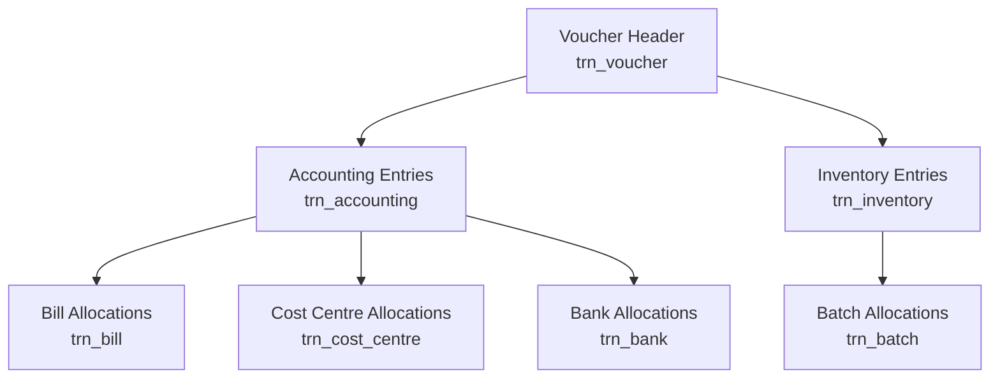

Every time someone creates a Sales Invoice, Purchase, Receipt Note, or any other voucher in Tally, a surprisingly rich data structure gets created behind the scenes. One voucher can fan out into **7 different tables** in your local SQLite cache.

Let's break down the anatomy.

## Voucher Anatomy

Here's how a single Tally voucher decomposes into its constituent parts:



Think of it as a tree. The **voucher header** is the trunk. It branches into **accounting entries** (the money side) and **inventory entries** (the stuff side). Each of those can branch further into allocations for batches, bills, cost centres, and banking instruments.

## How a Sales Invoice Fans Out

Let's trace a real example. Say a stockist sells 100 strips of Paracetamol and 50 strips of Amoxicillin to Raj Medical Store, with 18% GST.

That single Sales Invoice creates:

| Table | Records | What's in them |
|---|---|---|
| `trn_voucher` | 1 | Date, party, voucher number, type |
| `trn_accounting` | 3-4 | Party debit, sales credit, GST credit(s) |
| `trn_inventory` | 2 | One per stock item line |
| `trn_batch` | 2+ | One per batch per item |
| `trn_bill` | 1 | The receivable reference |
| `trn_cost_centre` | 0-2 | If salesman tracking is on |
| `trn_bank` | 0 | Only for payment vouchers |

One voucher. Potentially **10+ rows** across 5-6 tables. Now multiply that by 50,000 vouchers per year for a busy stockist, and you see why the data model matters.

## The 7 Transaction Tables

Here's your quick reference:

| Table | XML Source | Purpose |
|---|---|---|
| `trn_voucher` | `VOUCHER` | Header: date, type, party, flags |
| `trn_accounting` | `ALLLEDGERENTRIES.LIST` | Debit/credit entries per ledger |
| `trn_inventory` | `ALLINVENTORYENTRIES.LIST` | Stock item movements |
| `trn_batch` | `BATCHALLOCATIONS.LIST` | Batch, expiry, godown detail |
| `trn_bill` | `BILLALLOCATIONS.LIST` | Receivable/payable tracking |
| `trn_cost_centre` | `COSTCENTREALLOCATIONS.LIST` | Department/salesman allocation |
| `trn_bank` | `BANKALLOCATIONS.LIST` | Cheque, instrument details |

## Not All Tables Are Always Present

This is important. The lower-level tables only exist when the corresponding Tally feature is enabled:

- **Batch allocations** -- only when `HASBATCHES = Yes` on the company (critical for pharma, often absent for garments)
- **Bill allocations** -- only when bill-wise accounting is enabled on the party ledger
- **Cost centre allocations** -- only when cost centres are configured
- **Bank allocations** -- only on payment/receipt vouchers involving bank ledgers

Your connector should handle missing sub-tables gracefully. An absent section in the XML means "not applicable," not "something went wrong."

## Linking It All Together

Every sub-table links back to the parent voucher via the `guid` field. This is Tally's globally unique identifier for the voucher. The relationship is:

```
trn_voucher.guid  (PK)
  ├── trn_accounting.guid   (FK)
  ├── trn_inventory.guid    (FK)
  │     └── trn_batch.guid  (FK)
  ├── trn_bill.guid         (FK)
  ├── trn_cost_centre.guid  (FK)
  └── trn_bank.guid         (FK)
```

:::tip
When pulling voucher data, always fetch the header first, then hydrate the sub-tables. This lets you skip sub-table queries for voucher types that don't need them (e.g., Journal entries rarely have inventory entries).
:::

## What's Next

Dive into each table in detail:

1. [Voucher Header](/tally-integartion/data-model-transactions/voucher-header/) -- the foundation of every transaction
2. [Accounting Entries](/tally-integartion/data-model-transactions/accounting-entries/) -- where the money flows
3. [Inventory Entries](/tally-integartion/data-model-transactions/inventory-entries/) -- where the stock moves
4. [Batch Allocations](/tally-integartion/data-model-transactions/batch-allocations/) -- expiry dates, manufacturing dates, pharma compliance
5. [Bill Allocations](/tally-integartion/data-model-transactions/bill-allocations/) -- receivables, payables, aging
6. [Cost Centre & Bank](/tally-integartion/data-model-transactions/cost-centre-bank/) -- salesman tracking and cheque details
