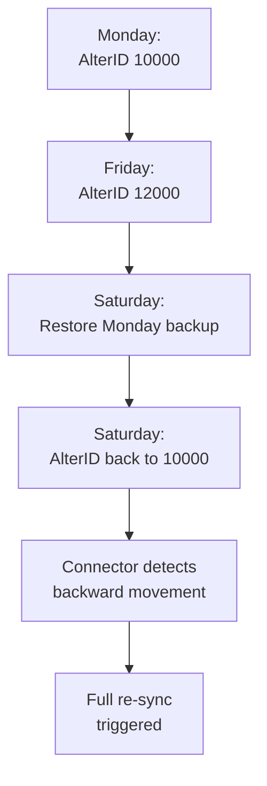

AlterID is your best friend for incremental sync. It's a monotonically increasing counter that bumps every time **any** object in the company changes. But "monotonically increasing" has some asterisks.

## How AlterID Works (The Happy Path)

Every time a master or transaction is created, modified, or deleted in a Tally company, the global AlterID counter increments:

```
Action                    AlterID
Create Stock Item         1001
Create Ledger             1002
Create Sales Voucher      1003
Edit that Ledger          1004
Delete a Payment          1005
```

Your connector stores a watermark (the last-seen AlterID) and on the next sync, asks: "give me everything with AlterID > 1005."

Simple, elegant, and it works -- until it doesn't.

## Edge Case 1: AlterID Resets After Data Repair

When a CA runs **Data Repair** (Gateway > Data > Repair), Tally rebuilds internal indices. This can **reset** AlterIDs to new values.

```
Before repair:
  Max AlterID: 15000

After repair:
  Max AlterID: 8500   (lower!)
```

Your stored watermark says 15000. Tally's max is now 8500. Everything with AlterID between 8501 and 15000 has been renumbered. Your incremental sync will miss all of it.

### Detection

```
if current_max_alterid < stored_watermark:
    # AlterID went BACKWARDS
    # Data was restored or repaired
    trigger_full_resync()
```

:::danger
If you don't check for backwards AlterID, you'll operate on stale data indefinitely. Every sync will return "nothing changed" because nothing exceeds your inflated watermark.
:::

## Edge Case 2: AlterID Resets After Backup Restore

Same scenario, different cause. The operator restores a backup from last week. AlterIDs revert to last week's values. Everything entered this week is gone from Tally but still in your cache.



## Edge Case 3: The Gap Problem

When objects are deleted, their AlterIDs don't get reused. This creates gaps:

```
AlterID 1001: Stock Item A (exists)
AlterID 1002: Ledger B (DELETED)
AlterID 1003: Voucher C (exists)
```

AlterID 1002 is a "hole". Your incremental sync won't find it because the object is gone. That's actually fine -- unless you need to detect deletions.

### Detecting Deletions

AlterID-based sync **cannot detect deletions** on its own. A deleted object simply disappears. Your options:

1. **Full reconciliation** -- periodically pull all GUIDs and compare with your cache
2. **Deletion log** -- Tally doesn't provide one natively
3. **GUID comparison** -- weekly job that spots GUIDs in your cache but missing from Tally

```sql
-- Find objects in cache but missing from Tally
SELECT guid FROM mst_stock_item
WHERE guid NOT IN (
  SELECT guid FROM tally_current_guids
);
```

## Edge Case 4: AlterID Spike After Bulk Operations

When a CA runs bulk operations (import, merge, mass alteration), the AlterID can jump by thousands in seconds:

```
Before:  AlterID 10000
CA imports 500 entries
After:   AlterID 10500
```

Your incremental sync suddenly has 500 changes to process. This is expected but can cause timeouts if your sync tries to pull all 500 in one request.

**Solution:** Batch the incremental pull. If the gap between watermark and current max is large (>1000), pull in chunks.

## Edge Case 5: Multiple Users, Same Counter

In Tally Gold (multi-user), all users share the same AlterID counter. Two users saving simultaneously get consecutive AlterIDs:

```
User A saves Stock Item  -> AlterID 1001
User B saves Voucher     -> AlterID 1002
```

This is fine for your connector -- the counter is atomic and consistent. But it means a high-activity company bumps the counter fast. Your polling interval should account for this.

## Recovery Strategy Summary

| Scenario | Detection | Recovery |
|---|---|---|
| AlterID backwards | `current < watermark` | Full re-sync |
| Large gap (bulk op) | `current - watermark > 1000` | Batched incremental |
| Deleted objects | Missing GUIDs in full reconciliation | Mark deleted in cache |
| AlterID holes | N/A (expected) | No action needed |

## The Watermark Update Rule

:::tip
Only update your stored watermark **after** successfully processing all changes up to that point. If sync fails mid-way, keep the old watermark so the next sync retries from the same point.
:::

```python
new_max = get_tally_max_alterid()

if new_max < watermark:
    full_resync()
    watermark = new_max
elif new_max > watermark:
    changes = pull_changes(since=watermark)
    if process_all(changes):
        watermark = new_max
    # else: keep old watermark, retry next cycle
```
