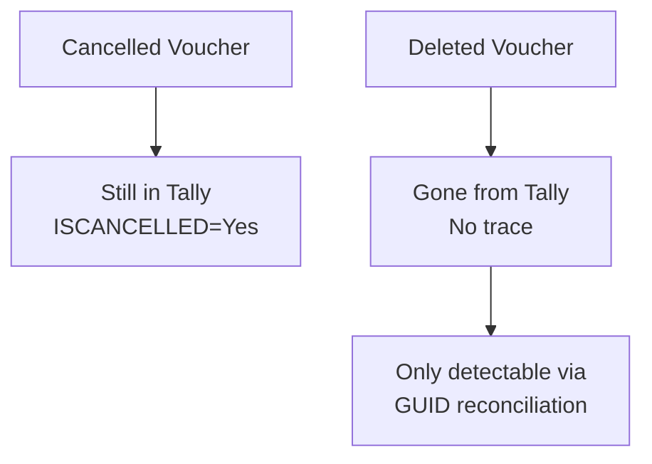

Chartered Accountants (CAs) are essential to every Indian business. They're also the most common source of integration disruptions. Not because they're doing anything wrong -- they're doing their job. But their job involves operations that can break your connector's assumptions.

## The CA Disruption Catalog

### Ledger Renaming

**What the CA does:** Renames "ABC Medical" to "ABC Medical Store, Ahmedabad" for clarity in reports.

**What breaks:** Any name-based matching or lookup. Your cache says "ABC Medical", Tally now says "ABC Medical Store, Ahmedabad".

**Recovery:** GUID stays the same. Your connector detects the name change via AlterID, updates the cache. No data loss if you match by GUID.

### Ledger Merging

**What the CA does:** Discovers two duplicate ledgers for the same party. Merges them using Tally's merge feature.

**What breaks:** One ledger disappears. Its vouchers move to the surviving ledger. Both AlterIDs and GUIDs change for affected vouchers.

**Recovery:** Full re-sync recommended. The merged ledger's GUID survives, but all associated voucher references change.

:::danger
Ledger merging is the most destructive routine CA operation. Your connector should detect it (multiple GUIDs disappearing simultaneously) and trigger a full re-sync.
:::

### Group Restructuring

**What the CA does:** Moves a ledger from one group to another -- e.g., from "Sundry Creditors" to "Sundry Debtors" because the party is actually a customer.

**What breaks:** Your group-based filtering. If you identify customers by `PrimaryGroup = "Sundry Debtors"`, this party just switched sides.

**Recovery:** AlterID catches the change. Re-evaluate group membership on sync.

### Voucher Deletion (Not Cancellation)

**What the CA does:** Deletes an incorrect voucher outright instead of cancelling it.

**What breaks:** The voucher GUID vanishes from Tally. Your cache still has it. Your reports show a transaction that Tally says never happened.

**Recovery:** Only detectable via full GUID reconciliation. Cancelled vouchers have `ISCANCELLED=Yes`; deleted vouchers simply don't exist anymore.

### Data Repair ("Rewrite Data")

**What the CA does:** Runs Gateway > Data > Repair to fix database corruption or inconsistencies.

**What breaks:** AlterIDs get reset/resequenced. Internal indices rebuild. Your watermark becomes invalid.

**Recovery:** Detect AlterID going backwards. Trigger full re-sync.

### Company Splitting

**What the CA does:** Splits a company by financial year -- e.g., separates FY 2024-25 data from FY 2025-26 into two company files.

**What breaks:** The company GUID changes for the new company. Folder structure changes. Your connector's company reference is now stale.

**Recovery:** Re-run company discovery. Re-profile the new company. Re-establish sync from scratch for the new entity.

### Company Merging

**What the CA does:** Merges two companies into one (rare, but happens during business restructuring).

**What breaks:** Duplicate GUIDs possible. Data from two sources now in one company. AlterIDs from the merged company are interleaved.

**Recovery:** Full re-sync of the merged company.

## Monthly CA Activity Calendar

| Month | Activity | Disruption Risk |
|---|---|---|
| March (last week) | Year-end closing, stock verification, ledger cleanup | HIGH |
| April (first week) | New FY setup, numbering reset, company split | HIGH |
| July | GSTR-1/3B filing, GST corrections | MEDIUM |
| September | Half-yearly review, voucher corrections | MEDIUM |
| October | GSTR-9 annual return prep, reconciliation | MEDIUM |
| December-January | Tax audit, back-dated entries | MEDIUM |
| Any time | Data repair after corruption | HIGH |
| Random | Tally version upgrade | MEDIUM |

:::tip
The safest months for initial deployment and major connector changes are **May-June** and **November** -- the quietest periods for CA activity.
:::

## Impact on Connector State

| CA Operation | GUID Impact | AlterID Impact | Recommended Response |
|---|---|---|---|
| Rename | Same GUID | Increments | Update name in cache |
| Merge | One GUID gone | Bulk change | Full re-sync |
| Restructure | Same GUID | Increments | Update group in cache |
| Delete voucher | GUID vanishes | No increment | GUID reconciliation |
| Data repair | Same GUIDs | Resets | Full re-sync |
| Company split | New GUIDs | New counter | Re-discover |

## Defensive Strategies

1. **Weekly full reconciliation** -- don't rely solely on incremental sync
2. **AlterID regression detection** -- always compare current max with stored watermark
3. **GUID inventory** -- maintain a complete list of known GUIDs and diff regularly
4. **Graceful degradation** -- when disruption is detected, serve from cache while re-syncing in the background
5. **CA communication** -- if possible, get notified before major operations (data repair, splits, merges)
