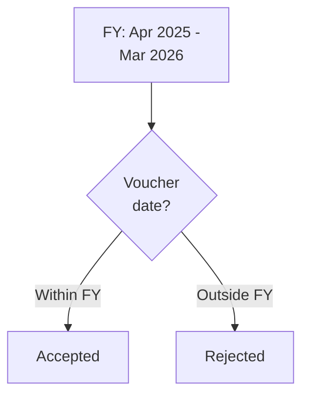

If you come from a world where data is clean, validated, and consistent -- welcome to Indian SMB accounting. The "bugs" described here are actually **features** of how businesses operate.

## Negative Stock Is Normal

Tally allows negative stock by default. Many distributors operate this way because the billing clerk enters sales before the purchase is recorded.

```
Dolo 650 Tab:
  Opening:   0
  Sale:     -50  (sold before purchase arrived)
  Purchase: +100
  Closing:   50
```

At the point of sale, stock was **-50**. This is valid. This is expected.

:::caution
Your connector must NOT reject negative stock values. They represent real business operations. If you filter them out, you'll have phantom inventory discrepancies.
:::

## Duplicate Voucher Numbers

With manual numbering and "Prevent Duplicates = No", the same voucher number can exist on multiple vouchers:

```
Voucher #1001 -> Sales, 15-Mar-2026
Voucher #1001 -> Sales, 18-Mar-2026
```

Both are valid. Both exist in Tally. Both have different GUIDs.

**Rules:**
- Never use voucher number as a unique key
- Always use GUID for identification
- Display voucher numbers for humans, use GUIDs for machines

## Date Boundary Issues

### Financial Year Boundaries

Every Tally company has a date range (FY). Voucher dates **must** fall within it. A Sales Order dated 01-Apr-2026 will fail if the FY ends 31-Mar-2026 and the next year hasn't been created yet.



### Post-Dated Vouchers

Tally supports post-dated cheques and vouchers. These appear as:

```xml
<ISPOSTDATED>Yes</ISPOSTDATED>
```

Filter these from current-period reports. They're future-dated intentionally.

### Back-Dated Entries by CAs

CAs frequently enter back-dated entries for corrections. A voucher created today might be dated three months ago. AlterID catches the *change*, but the voucher *date* is in the past. Your date-range sync must account for this.

## Cancelled, Optional, and Void Vouchers

Tally has three flavours of "not real" vouchers:

| Flag | Meaning | Filter? |
|---|---|---|
| `ISCANCELLED=Yes` | Cancelled invoice | Yes -- exclude from all reports |
| `ISOPTIONAL=Yes` | Quotation / proforma | Yes -- not actual transactions |
| `ISVOID=Yes` | Voided by user | Yes -- exclude everywhere |

:::danger
These vouchers still exist in the database. They still have GUIDs. They still appear in XML exports. If you don't filter them, your numbers will be wrong.
:::

```xml
<VOUCHER>
  <ISCANCELLED>Yes</ISCANCELLED>
  <VOUCHERNUMBER>1042</VOUCHERNUMBER>
  <!-- This voucher should be IGNORED -->
</VOUCHER>
```

## Unit Mismatches

A Stock Item might be created with unit "Strip" but transactions reference "pcs" or "Nos":

```
Stock Item:   Dolo 650 (Unit: Strip)
Sales Voucher: 100 pcs of Dolo 650
```

Tally handles this via compound units and conversion factors. Your connector must:

1. Know the item's base unit
2. Know the compound unit conversion
3. Convert all quantities to the base unit for comparison

## The "Both Sundry" Problem

The same party can appear under **both** Sundry Debtors and Sundry Creditors:

```
"ABC Pharma - S/Dr" (Sundry Debtors)
"ABC Pharma - S/Cr" (Sundry Creditors)
```

This is a documented Tally workaround for tracking the same entity in both buyer and seller roles. Your connector must map both to the same party entity. Use GSTIN as the linking key.

## Round-Off Differences

GST calculations on multiple line items create rounding differences of Rs 0.01 to Rs 1.00. For push operations, Dr must equal Cr to the paisa. Add a round-off entry:

```xml
<ALLLEDGERENTRIES.LIST>
  <LEDGERNAME>Rounded Off</LEDGERNAME>
  <ISDEEMEDPOSITIVE>No</ISDEEMEDPOSITIVE>
  <AMOUNT>0.50</AMOUNT>
</ALLLEDGERENTRIES.LIST>
```

:::tip
If the round-off difference exceeds Rs 1.00, something is fundamentally wrong with your calculations. Don't use round-off as a band-aid -- investigate the root cause.
:::

## Spelling Variations Across Vouchers

The same item might be spelled differently in different vouchers because users type the name slightly differently each time. This is especially common with pharma items:

```
Voucher 1: "Dolo 650 Tab"
Voucher 2: "DOLO 650 TAB"
Voucher 3: "Dolo-650 Tab"
```

Tally's type-ahead usually prevents this, but manual entry (especially imports from other systems) creates these variations. Your sync should match on GUID, not name, and your search should be case-insensitive and fuzzy.

## The "Inventory Values Not Affected" Trap

A Purchase Account ledger can have `Inventory values are affected = No`. When this happens, a purchase voucher using that ledger **does not update stock** even though it has stock items. The accounting entry exists, but inventory doesn't move.

Check this flag when reconciling stock positions. Missing stock movements might not be bugs -- they might be ledger configuration.
