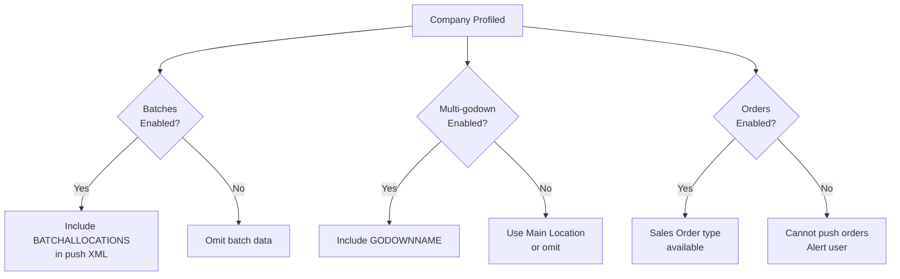

Tally's features are configurable per company. Push XML that references a disabled feature and you'll get one of three outcomes: silent failure, data dropped, or a cryptic error. None of them are good.

## The Core Problem

Your connector builds XML based on what it *thinks* the company supports. If your assumptions are wrong, the import fails in ways that are hard to debug.

## Feature Detection

Before any push operation, query the company's feature flags:

```xml
<ENVELOPE>
  <HEADER>
    <TALLYREQUEST>Export</TALLYREQUEST>
    <TYPE>Object</TYPE>
    <SUBTYPE>Company</SUBTYPE>
    <ID>##COMPANY_NAME##</ID>
  </HEADER>
  <BODY><DESC><STATICVARIABLES>
    <SVEXPORTFORMAT>
      $$SysName:XML
    </SVEXPORTFORMAT>
  </STATICVARIABLES></DESC></BODY>
</ENVELOPE>
```

## The Mismatch Matrix

| Feature | XML Flag | If You Push With It OFF |
|---|---|---|
| Batches | `ISBATCHENABLED` | Batch allocations **ignored** -- stock goes to "Primary" batch |
| Multi-godown | `ISMULTISTORAGEOPTION` | Godown names **ignored** -- everything goes to "Main Location" |
| Cost Centres | `ISCOSTCENTRESAVAILABLE` | Cost centre data **silently dropped** |
| Expiry Dates | `ISUSEEXPDATEFORSTOCK` | Expiry date data **ignored** |
| Bill-wise | `ISBILLWISEON` | Bill allocations **dropped** -- no bill tracking |
| Order Processing | `ISUSEORDERPROCESSING` | Sales Order/Purchase Order types **don't exist** -- import fails |
| Tracking Numbers | `ISUSETRACKING` | Tracking data **ignored** |
| BOM | `ISUSEBOM` | BOM references **fail** |

## Scenario 1: Batches Disabled

You push:
```xml
<BATCHALLOCATIONS.LIST>
  <BATCHNAME>B-12345</BATCHNAME>
  <ACTUALQTY>100 Strip</ACTUALQTY>
  <AMOUNT>5000.00</AMOUNT>
</BATCHALLOCATIONS.LIST>
```

Company has `ISBATCHENABLED = No`.

**Result:** The batch allocation is silently ignored. Stock lands with no batch assignment. No error returned. But the **reverse** is worse.

### The Reverse: Batches Enabled But You Don't Send Them

Company has `ISBATCHENABLED = Yes`. You push a voucher **without** batch allocations.

**Result:** Import fails. Error: "Batch details required."

:::danger
The "required when enabled" direction is more dangerous than "ignored when disabled." If batches are ON, you **must** include `BATCHALLOCATIONS.LIST`. There's no graceful fallback.
:::

## Scenario 2: Multi-Godown Disabled

You push godown names in your batch allocations:

```xml
<BATCHALLOCATIONS.LIST>
  <GODOWNNAME>Warehouse A</GODOWNNAME>
  <ACTUALQTY>100 Strip</ACTUALQTY>
</BATCHALLOCATIONS.LIST>
```

Company has `ISMULTISTORAGEOPTION = No`.

**Result:** Godown name ignored. Stock goes to "Main Location" (the single default godown). No error.

## Scenario 3: Cost Centres Missing

You push cost centre allocations:

```xml
<COSTCENTREALLOCATIONS.LIST>
  <NAME>Amit Kumar</NAME>
  <AMOUNT>-11800.00</AMOUNT>
</COSTCENTREALLOCATIONS.LIST>
```

Company has `ISCOSTCENTRESAVAILABLE = No`.

**Result:** Cost centre data silently dropped. The voucher imports but without salesman/department tracking. This is especially problematic for connectors that track sales force performance.

## Scenario 4: Order Processing Disabled

You push a Sales Order:

```xml
<VOUCHER VCHTYPE="Sales Order">
  ...
</VOUCHER>
```

Company has `ISUSEORDERPROCESSING = No`.

**Result:** The "Sales Order" voucher type doesn't exist. Import fails with an error about invalid voucher type.

## The Detection Flow



## Feature-to-XML Mapping Table

Use this as your reference when building push XML:

| Feature Flag | When ON: Required in XML | When OFF: Behavior |
|---|---|---|
| `ISBATCHENABLED` | `BATCHALLOCATIONS.LIST` | Omit batch data |
| `ISMULTISTORAGEOPTION` | `GODOWNNAME` in allocations | Use "Main Location" |
| `ISUSEEXPDATEFORSTOCK` | `EXPIRYPERIOD` in batch | Omit expiry |
| `ISMAINTAINBALANCEBILLWISE` | Bill allocations in Payment/Receipt | Omit bill refs |
| `ISCOSTCENTRESAVAILABLE` | `COSTCENTREALLOCATIONS.LIST` | Omit cost centres |
| `ISUSEORDERPROCESSING` | Order voucher types exist | Cannot push orders |
| `ISUSETRACKING` | Tracking numbers in DN/RN | Omit tracking |

## Best Practice: Profile Once, Cache, Re-Check Periodically

```python
def profile_features(company_guid):
    xml = export_company_object(company_guid)
    return {
        "batches": xml.get("ISBATCHENABLED"),
        "godowns": xml.get("ISMULTISTORAGEOPTION"),
        "expiry": xml.get("ISUSEEXPDATEFORSTOCK"),
        "orders": xml.get("ISUSEORDERPROCESSING"),
        "cost_centres": xml.get("ISCOSTCENTRESAVAILABLE"),
        "billwise": xml.get("ISBILLWISEON"),
    }

# Cache in _tally_profile
# Re-check weekly or when company config changes
```

:::tip
Feature flags rarely change once a company is set up. Profile during onboarding and re-check weekly. But if a push suddenly starts failing, re-profile immediately -- the CA may have toggled a feature.
:::
