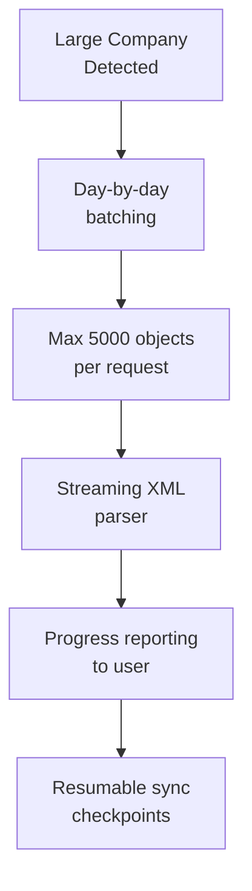

Tally runs as a desktop GUI application -- not a server, not a service. This shapes every infrastructure decision your connector makes.

## Tally Silver vs Gold

This is the most impactful infrastructure constraint:

| | Tally Silver | Tally Gold |
|---|---|---|
| Users | Single | Multi-user |
| HTTP connections | One at a time | Concurrent |
| Connector impact | Blocks user during sync | Runs alongside |
| License cost | Lower | Higher |

### Silver: The Concurrency Problem

Tally Silver allows only **one** HTTP connection. If the operator is using Tally, your connector's requests either queue, time out, or fail.

**Mitigation strategies:**
- Schedule heavy sync during off-hours (lunch, night)
- Use lightweight requests during business hours (AlterID check only)
- Keep every request **fast** -- never hold a connection open
- Implement a "sync now" button the operator triggers when free
- Aggressive timeout (5-10 seconds) and retry

:::caution
Never hold an HTTP connection open for more than a few seconds on Tally Silver. The operator will notice their Tally freezing and blame your software.
:::

## Port Conflicts

Tally defaults to port 9000. Other software might grab that port first:

- Other Tally instances
- Development servers (React, webpack)
- Some anti-virus or management agents

### Detection

```
1. Try connecting to configured port
2. If connection fails, check tally.ini
3. Port may have been changed:
   [Tally]
   Port = 9001
```

Make the port configurable in your connector. Never hardcode 9000.

## Large Companies (500K+ Vouchers)

Some stockists have been using Tally for years without splitting. Their company files contain 500,000+ vouchers.

### Problems

- Full sync takes hours
- Single export request can freeze Tally
- XML response can be hundreds of megabytes
- Memory pressure on both Tally and the connector

### Solutions



- **Batch by date**: Pull one day at a time
- **Object limit**: Never request more than 5,000 objects per HTTP call
- **Streaming parser**: Use SAX/StAX, never DOM
- **Progress tracking**: Store the last synced date so you can resume after interruption
- **Off-hours scheduling**: Run initial full sync overnight

## Company Switching Mid-Sync

The operator can switch companies while your connector is mid-sync. You send a request expecting Company A's data and get Company B's instead.

### Detection

Always verify the company name/GUID in the response:

```xml
<!-- Check this matches your target -->
<CURRENTCOMPANY>
  Raj Pharma Distributors
</CURRENTCOMPANY>
```

If the company doesn't match, abort the sync and wait. Don't process the wrong company's data.

### Prevention

Poll the loaded company before every sync cycle:

```xml
<ENVELOPE>
  <HEADER>
    <TALLYREQUEST>Export</TALLYREQUEST>
    <TYPE>Function</TYPE>
    <ID>$$CmpLoaded</ID>
  </HEADER>
  <BODY><DESC><STATICVARIABLES>
    <SVEXPORTFORMAT>
      $$SysName:XML
    </SVEXPORTFORMAT>
  </STATICVARIABLES></DESC></BODY>
</ENVELOPE>
```

## Tally on a VM or Cloud

"Tally-on-Cloud" is a growing segment in India. Providers like Tally Solutions (TallyPrime Server), Ace Cloud, and various IT partners host Tally on remote Windows VMs.

### What Changes

| Factor | Local Tally | Cloud Tally |
|---|---|---|
| Latency | <1ms | 50-200ms |
| Availability | Office hours | 24/7 (usually) |
| Port access | localhost | Remote IP/VPN |
| Firewall | Rarely an issue | Often blocked |

### Connector Adjustments

- **Increase timeouts** -- network latency adds up over many requests
- **VPN/tunnel** -- the connector may need to connect through a VPN to reach the Tally instance
- **Port forwarding** -- the Tally HTTP port must be exposed through the cloud provider's firewall
- **Shared instances** -- some providers run multiple Tally instances for different clients on the same VM

:::tip
Ask the stockist upfront: "Is Tally running on your local machine or on a cloud server?" This determines your entire networking strategy.
:::

## Multiple Tally Instances

Some businesses run multiple Tally instances on the same machine (different ports) for different divisions or branches:

```
Instance 1: Port 9000 (Pharma division)
Instance 2: Port 9001 (FMCG division)
```

Your connector must support configuring multiple endpoints.

## The "Tally Running But No Company Loaded" State

Tally can be running with no company open (the operator is on the company selection screen). In this state:

- HTTP server is active
- Requests return responses
- But data requests return errors or empty results

Detect this state and wait. Don't log errors -- just poll until a company is loaded.

## Windows Firewall

Rare but possible: Windows Firewall blocks localhost connections. This typically only happens in locked-down corporate environments. The fix is a firewall rule allowing inbound connections on Tally's port, but your connector should surface a clear error message guiding the operator to the fix.
