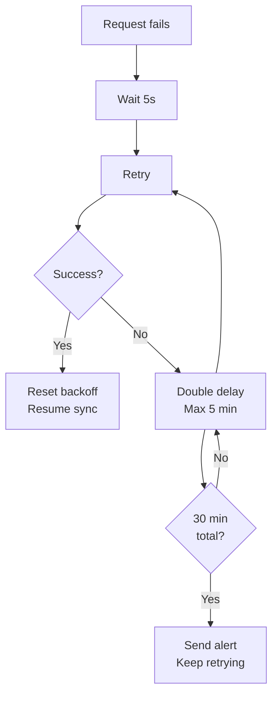

Tally will go down. Not "might" -- **will**. Your connector's job is to handle every downtime scenario gracefully, serve cached data during outages, and resume seamlessly when Tally comes back.

## The 7 Failure Causes

### 1. Tally Not Running

The operator closed Tally, or the machine rebooted.

**Detection:** No TCP connection on the configured port.

**Recovery:** Retry with exponential backoff (see below).

### 2. Tally Running, No Company Loaded

The operator is on the company selection screen.

**Detection:** TCP connects, HTTP responds, but data requests return empty or error XML.

**Recovery:** Send a lightweight "List of Companies" request. If companies exist but none is loaded, wait and retry.

### 3. Tally Running, Company Being Repaired

The CA is running a data repair operation. Tally locks the company.

**Detection:** HTTP request returns an error response mentioning data repair or lock.

**Recovery:** Wait. This can take minutes to hours depending on company size. Alert after 30 minutes.

### 4. HTTP Server Disabled

Tally's HTTP server was turned off in settings.

**Detection:** TCP connection refused despite Tally being visibly running.

**Recovery:** Cannot be fixed remotely. Alert the operator to enable the HTTP server (F1 > Settings > Advanced).

### 5. Port Conflict

Another application grabbed Tally's port.

**Detection:** TCP connects but responses aren't Tally XML.

**Recovery:** Check `tally.ini` for the configured port. Try alternate ports. Alert the operator.

### 6. Tally Frozen

Processing a large export, or data corruption caused a hang.

**Detection:** TCP connects, HTTP request sent, but no response within timeout (60+ seconds).

**Recovery:** Disconnect. Wait 5 minutes. Retry. If frozen for 15+ minutes, alert the operator to restart Tally.

### 7. Network/Firewall Block

For remote Tally instances or Tally-on-Cloud.

**Detection:** TCP connection timeout (distinct from connection refused).

**Recovery:** Check VPN status, network connectivity. Alert if persistent.

## Retry Logic: Exponential Backoff

```
Initial delay:   5 seconds
Multiplier:      2x per attempt
Maximum delay:   5 minutes
Jitter:          +/- 20% randomization

Attempt  Delay
1        5s
2        10s
3        20s
4        40s
5        80s
6        160s
7        300s (capped at 5 min)
8+       300s
```



:::tip
Add 20% random jitter to prevent thundering herd if multiple connectors restart simultaneously.
:::

## Alert Thresholds

| Duration | Action |
|---|---|
| 0-5 min | Normal retry, no alert |
| 5-15 min | Log warning |
| 15-30 min | Elevated warning |
| 30+ min | Send alert to monitoring system |
| 2+ hours | Escalate -- likely needs human intervention |

## Graceful Degradation: SQLite Cache

When Tally is down, your connector should **not** stop working. Serve from the local SQLite cache:

```
Tally UP:
  Fresh data from Tally -> SQLite -> App

Tally DOWN:
  SQLite cache -> App
  (with "last synced" timestamp warning)
```

The app should clearly indicate data staleness:

```
Last synced: 2 hours ago
Tally status: Offline
```

Users can still:
- View product catalogs
- Check last-known stock levels
- Create orders (queued for push when Tally returns)
- Review outstanding balances

Users cannot:
- Get real-time stock confirmation
- Push vouchers immediately
- Get up-to-date financial reports

## The Golden Rule

:::danger
Never crash the connector. Ever.

Not on connection refused. Not on timeout. Not on malformed XML. Not on unexpected HTTP status codes. Not on out-of-memory (use streaming parsing). Not on disk full (rotate logs).

Log the error. Retry. Serve from cache. Alert if persistent. But never, ever crash.
:::

## Recovery After Extended Downtime

When Tally comes back after a long outage:

```
1. Verify company is loaded
2. Check AlterID watermark
3. If AlterID went backwards:
     -> Full re-sync (data was restored)
4. If AlterID advanced normally:
     -> Incremental sync from watermark
5. Push any queued write operations
6. Resume normal polling cycle
```

## Health Monitoring

Implement a lightweight heartbeat that runs every 60 seconds:

```xml
<ENVELOPE>
  <HEADER>
    <TALLYREQUEST>Export</TALLYREQUEST>
    <TYPE>Function</TYPE>
    <ID>$$CmpLoaded</ID>
  </HEADER>
  <BODY><DESC><STATICVARIABLES>
    <SVEXPORTFORMAT>
      $$SysName:XML
    </SVEXPORTFORMAT>
  </STATICVARIABLES></DESC></BODY>
</ENVELOPE>
```

This returns the loaded company name (or empty). Tiny payload, fast response. No load on Tally.

For change detection, poll `$$MaxMasterAlterID` every 1-5 minutes. Single-value function evaluation. Takes milliseconds.
