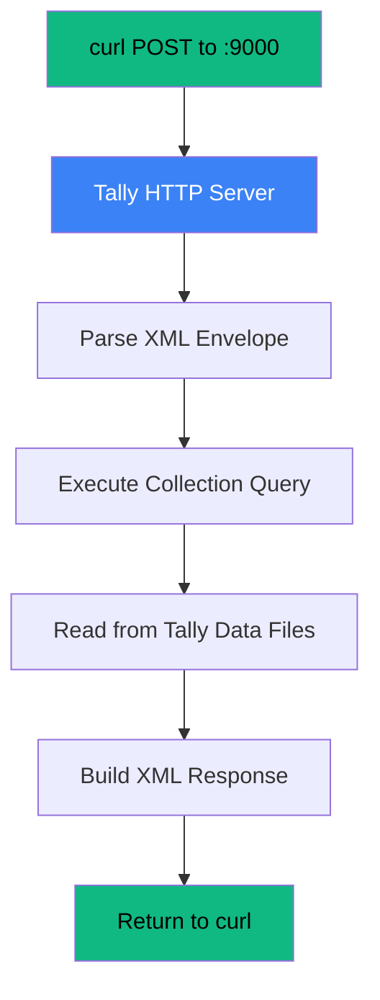

import { Steps } from '@astrojs/starlight/components';

Time to get your hands dirty. In the next
five minutes, you'll talk to TallyPrime
over HTTP and pull real data out of it.

No SDK. No library. Just `curl` and XML.

## Prerequisites

Before we start, make sure you have:

- **TallyPrime running** on your Windows
  machine (or accessible on your network)
- **HTTP server enabled** — go to
  F1 > Settings > Advanced Configuration
  and set the server port (default `9000`)
- **At least one company loaded** — open
  a company in Tally before querying
- **curl** installed (comes with Windows 10+,
  macOS, and Linux)

:::tip[Check Tally is Listening]
Open a browser and go to
`http://localhost:9000`. If Tally is
running with the HTTP server enabled,
you'll see a basic HTML page listing
loaded companies. If you get a connection
error, double-check the port setting in
Tally.
:::

## Step 1: Fetch the Company List

<Steps>

1. **Create the XML request**

   Save this as `company-list.xml` (or
   just pipe it directly with curl):

   ```xml
   <ENVELOPE>
     <HEADER>
       <VERSION>1</VERSION>
       <TALLYREQUEST>Export</TALLYREQUEST>
       <TYPE>Data</TYPE>
       <ID>List of Companies</ID>
     </HEADER>
     <BODY>
       <DESC>
         <STATICVARIABLES>
           <SVEXPORTFORMAT>
             $$SysName:XML
           </SVEXPORTFORMAT>
         </STATICVARIABLES>
       </DESC>
     </BODY>
   </ENVELOPE>
   ```

2. **Fire the request**

   ```bash
   curl -s -X POST \
     http://localhost:9000 \
     -H "Content-Type: text/xml" \
     -d @company-list.xml
   ```

   Or if you prefer a one-liner without
   a file:

   ```bash
   curl -s -X POST \
     http://localhost:9000 \
     -H "Content-Type: text/xml" \
     -d '<ENVELOPE>
     <HEADER><VERSION>1</VERSION>
     <TALLYREQUEST>Export</TALLYREQUEST>
     <TYPE>Data</TYPE>
     <ID>List of Companies</ID></HEADER>
     <BODY><DESC><STATICVARIABLES>
     <SVEXPORTFORMAT>$$SysName:XML
     </SVEXPORTFORMAT>
     </STATICVARIABLES></DESC></BODY>
     </ENVELOPE>'
   ```

3. **Read the response**

   You'll get back something like this:

   ```xml
   <ENVELOPE>
     <BODY>
       <DATA>
         <COLLECTION>
           <COMPANY>
             <NAME>
               Stockist Pharma Pvt Ltd
             </NAME>
             <STARTINGFROM>
               20250401
             </STARTINGFROM>
             <ENDINGAT>
               20260331
             </ENDINGAT>
           </COMPANY>
         </COLLECTION>
       </DATA>
     </BODY>
   </ENVELOPE>
   ```

   That's your company list. Note the date
   format: `YYYYMMDD`. Always.

</Steps>

:::caution[No Company Loaded?]
If Tally has no company open, you'll get
an empty `<COLLECTION/>` or an error.
Make sure you've opened a company in
Tally before running the query.
:::

## Step 2: Fetch Stock Items

Now let's pull actual inventory data.
This uses an **inline TDL collection** —
a request that defines what fields to
fetch right inside the XML.

<Steps>

1. **Create the request**

   Save this as `stock-items.xml`:

   ```xml
   <ENVELOPE>
     <HEADER>
       <VERSION>1</VERSION>
       <TALLYREQUEST>Export</TALLYREQUEST>
       <TYPE>Collection</TYPE>
       <ID>StockItemList</ID>
     </HEADER>
     <BODY>
       <DESC>
         <STATICVARIABLES>
           <SVEXPORTFORMAT>
             $$SysName:XML
           </SVEXPORTFORMAT>
           <SVCURRENTCOMPANY>
             Stockist Pharma Pvt Ltd
           </SVCURRENTCOMPANY>
         </STATICVARIABLES>
         <TDL>
           <TDLMESSAGE>
             <COLLECTION
               NAME="StockItemList"
               ISMODIFY="No">
               <TYPE>StockItem</TYPE>
               <NATIVEMETHOD>
                 Name, Parent, BaseUnits
               </NATIVEMETHOD>
               <NATIVEMETHOD>
                 GUID, MasterId, AlterId
               </NATIVEMETHOD>
               <NATIVEMETHOD>
                 ClosingBalance,
                 ClosingValue
               </NATIVEMETHOD>
             </COLLECTION>
           </TDLMESSAGE>
         </TDL>
       </DESC>
     </BODY>
   </ENVELOPE>
   ```

   :::caution[Replace the Company Name]
   Change `Stockist Pharma Pvt Ltd` to
   the exact company name from Step 1.
   It must match exactly — Tally is
   case-sensitive.
   :::

2. **Send it**

   ```bash
   curl -s -X POST \
     http://localhost:9000 \
     -H "Content-Type: text/xml" \
     -d @stock-items.xml
   ```

3. **Read the response**

   ```xml
   <ENVELOPE>
     <BODY>
       <DATA>
         <COLLECTION>
           <STOCKITEM NAME="Paracetamol
             500mg Strip/10">
             <PARENT>Analgesics</PARENT>
             <BASEUNITS>Strip</BASEUNITS>
             <GUID>abc123-def456</GUID>
             <MASTERID>42</MASTERID>
             <ALTERID>1087</ALTERID>
             <CLOSINGBALANCE>
               250 Strip
             </CLOSINGBALANCE>
             <CLOSINGVALUE>
               -12500.00
             </CLOSINGVALUE>
           </STOCKITEM>
           <STOCKITEM NAME="Amoxicillin
             250mg Cap/10">
             <PARENT>Antibiotics</PARENT>
             <BASEUNITS>Strip</BASEUNITS>
             <GUID>xyz789-uvw012</GUID>
             <MASTERID>43</MASTERID>
             <ALTERID>1092</ALTERID>
             <CLOSINGBALANCE>
               180 Strip
             </CLOSINGBALANCE>
             <CLOSINGVALUE>
               -18000.00
             </CLOSINGVALUE>
           </STOCKITEM>
         </COLLECTION>
       </DATA>
     </BODY>
   </ENVELOPE>
   ```

</Steps>

## Anatomy of the Response

Let's break down what you just got back,
because there are a few surprises here.

### The STOCKITEM element

Each `<STOCKITEM>` has a `NAME` attribute
on the tag itself. This is the primary
key in Tally's world — the stock item
name, not a numeric ID.

### Closing Balance: a string, not a number

```xml
<CLOSINGBALANCE>250 Strip</CLOSINGBALANCE>
```

That's `250 Strip` — the quantity *and*
the unit of measure, mashed into one
string. Your parser needs to split this:

| Raw Value | Quantity | Unit |
|-----------|----------|------|
| `250 Strip` | 250 | Strip |
| `2 Box of 12 pcs` | 2 | Box of 12 pcs |
| `50 pcs` | 50 | pcs |

:::tip[Parsing Strategy]
Split on the first space. Everything
before is the number, everything after
is the unit. For compound units like
`Box of 12 pcs`, just keep the full
string as the unit — Tally handles the
conversion internally.
:::

### Closing Value: negative means debit

```xml
<CLOSINGVALUE>-12500.00</CLOSINGVALUE>
```

The negative sign is Tally's debit
convention. Stock is an asset (debit
balance), so the value is negative.
In your database, you'll probably want to
store the absolute value and track the
sign semantics separately.

### AlterID: your sync watermark

```xml
<ALTERID>1087</ALTERID>
```

This number increases every time *any*
object in the company is created or
modified. Record the highest AlterID
you've seen. Next time, only fetch items
where `AlterID > 1087`. That's incremental
sync in one sentence.

### GUID: the true unique identifier

```xml
<GUID>abc123-def456</GUID>
```

The GUID is globally unique and stable
across backups and restores. Use this
as your foreign key, not the name.

## What Just Happened?

Let's trace the full round trip:



1. You sent a **Collection Export** request
2. The inline `<TDL>` block defined a
   collection called `StockItemList` with
   specific `NATIVEMETHOD` fields
3. Tally queried its internal data store
4. It returned matching stock items with
   only the fields you asked for

The `NATIVEMETHOD` tag is the key — it
controls which fields appear in the
response. Ask for less, get a smaller
(and faster) response.

## Try These Next

Now that you have the basic pattern, try
these variations:

### Fetch all ledgers (customers/suppliers)

```xml
<COLLECTION
  NAME="LedgerList"
  ISMODIFY="No">
  <TYPE>Ledger</TYPE>
  <NATIVEMETHOD>
    Name, Parent, GUID,
    OpeningBalance,
    ClosingBalance
  </NATIVEMETHOD>
</COLLECTION>
```

### Fetch godowns (warehouses)

```xml
<COLLECTION
  NAME="GodownList"
  ISMODIFY="No">
  <TYPE>Godown</TYPE>
  <NATIVEMETHOD>
    Name, Parent, GUID, AlterId
  </NATIVEMETHOD>
</COLLECTION>
```

### Fetch today's vouchers

```xml
<ENVELOPE>
  <HEADER>
    <VERSION>1</VERSION>
    <TALLYREQUEST>Export</TALLYREQUEST>
    <TYPE>Data</TYPE>
    <ID>Daybook</ID>
  </HEADER>
  <BODY>
    <DESC>
      <STATICVARIABLES>
        <SVCURRENTCOMPANY>
          Your Company Name
        </SVCURRENTCOMPANY>
        <SVFROMDATE>20260326</SVFROMDATE>
        <SVTODATE>20260326</SVTODATE>
        <SVEXPORTFORMAT>
          $$SysName:XML
        </SVEXPORTFORMAT>
      </STATICVARIABLES>
    </DESC>
  </BODY>
</ENVELOPE>
```

:::danger[Watch the Date Format]
Dates are always `YYYYMMDD`. Not
`YYYY-MM-DD`. Not `DD/MM/YYYY`. If you
get the format wrong, Tally silently
returns an empty result instead of an
error. Ask me how I know.
:::

## Recap

Here's what you learned:

- Tally listens on HTTP port 9000
- You POST XML, you get XML back
- The `<HEADER>` controls the request type
- Inline `<TDL>` blocks define what to fetch
- Quantities include units (`250 Strip`)
- Values use debit-negative convention
- `AlterID` enables incremental sync
- `GUID` is the true unique key

You've just completed your first Tally
integration. From here, we'll dive deeper
into the XML protocol, the full data model,
and how to build a production sync engine.

Welcome to the club.
