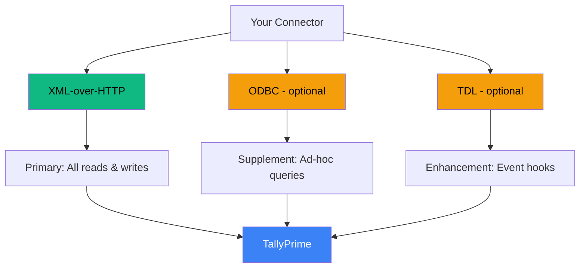

import {
  Tabs,
  TabItem,
} from '@astrojs/starlight/components';

There are five known ways to get data in
and out of TallyPrime. Only one of them
is the right primary interface. But the
others have their place.

Let's walk through each one.

## The Quick Comparison

Before we dive in, here's the cheat sheet:

| Approach | Direction | Real-Time | Setup |
|----------|-----------|-----------|-------|
| XML-over-HTTP | Read + Write | Yes | Minimal |
| ODBC | Read only | Yes | Medium |
| TDL | Enhancement | N/A | Heavy |
| File Import/Export | Read + Write | No | None |
| Tally.NET Sync | Tally-to-Tally | Yes | Heavy |

Now let's look at each one in detail.

## The Five Approaches

<Tabs>
  <TabItem label="XML-over-HTTP">

### XML-over-HTTP

**The winner.** This is how the entire Tally
integration ecosystem works.

**How it works:** POST an XML envelope to
Tally's embedded HTTP server
(`http://localhost:9000`). Get XML back.

**What you can do:**

- **Export** master data (stock items,
  ledgers, godowns)
- **Export** transactions (vouchers,
  filtered by date)
- **Export** computed reports (stock
  summary, outstanding bills)
- **Import** masters (create/alter
  ledgers, stock items)
- **Import** vouchers (push sales orders,
  invoices)
- **Execute** TDL actions

**The request format:**

```xml
<ENVELOPE>
  <HEADER>
    <VERSION>1</VERSION>
    <TALLYREQUEST>Export</TALLYREQUEST>
    <TYPE>Collection</TYPE>
    <ID>MyCollection</ID>
  </HEADER>
  <BODY>
    <DESC>
      <STATICVARIABLES>
        <SVCURRENTCOMPANY>
          Your Company
        </SVCURRENTCOMPANY>
      </STATICVARIABLES>
    </DESC>
  </BODY>
</ENVELOPE>
```

**Pros:**
- Full read AND write access
- No TDL installation required
- Works with every TallyPrime version
- Battle-tested by the entire ecosystem
- Can embed inline TDL for custom queries
- TallyPrime 7.0+ also supports JSON

**Cons:**
- Verbose XML format
- No built-in auth (localhost only)
- Tally freezes on very large requests
- XML parsing has many quirky conventions

:::tip[The Power Feature]
You can embed TDL code *inside* your XML
request. This means your connector can
define custom collections, filters, and
computed fields on the fly — without
installing anything on the Tally machine.
:::

  </TabItem>

  <TabItem label="ODBC">

### ODBC Interface

**Good for quick queries.** Not a primary
integration path.

**How it works:** TallyPrime ships with an
ODBC driver (`TallyODBC64_9000`). Connect
from any ODBC client and run SQL queries.

```sql
SELECT $Name, $Parent, $BaseUnits
FROM StockItem
WHERE $Parent = 'Analgesics'
```

**Pros:**
- Familiar SQL interface
- Great for ad-hoc queries
- Works with Power BI, Excel, Python
- No XML parsing needed

**Cons:**
- **Read-only** for external consumers
- Limited default tables exposed
- Extending tables requires TDL
- No write-back capability
- No built-in change detection

:::caution[Limited by Default]
Only a handful of collections are exposed
via ODBC out of the box (Ledger, StockItem,
Voucher basics). Anything beyond that needs
TDL development to expose additional
collections with the `IsODBCTable` attribute.
:::

**When to use:** Quick BI connectivity,
ad-hoc data exploration, supplemental
queries alongside your XML integration.

  </TabItem>

  <TabItem label="TDL">

### TDL Customization

**An enhancement layer, not a standalone
integration path.**

**How it works:** TDL (Tally Definition
Language) is Tally's native scripting
language. You write `.tdl` or `.tcp` files
and load them into Tally.

**What TDL can do:**

- Add custom fields (UDFs) to masters
  and vouchers
- Create custom voucher types
- Add event hooks (e.g., trigger HTTP
  callback on voucher save)
- Expose new ODBC tables
- Modify reports, UI, and validation

**Pros:**
- Deep customization of Tally behavior
- Can create push-based notifications
- Can add computed fields and custom
  collections
- Can extend ODBC exposure

**Cons:**
- Requires TDL development expertise
  (niche skill)
- Must deploy `.tdl` files to every
  Tally installation
- Stockist may already have conflicting
  TDLs loaded
- Adds maintenance burden

:::tip[The Sweet Spot]
Use TDL as a *supplement* to XML-over-HTTP.
For example, a TDL that fires an HTTP
webhook to your connector whenever a
voucher is saved — giving you push-based
notifications instead of polling.
:::

**When to use:** Adding event-driven hooks,
exposing custom fields, enhancing the base
integration.

  </TabItem>

  <TabItem label="File-Based">

### File-Based Import/Export

**Fallback only.**

**How it works:** Tally can read from and
write to local files. Formats include XML,
JSON (7.0+), and Excel (4.0+).

**Trigger:** Manual via
Gateway > Import/Export, or automated
via TDL scripts.

**Pros:**
- Zero setup
- Useful for bulk migration
- Supports multiple formats

**Cons:**
- No real-time capability
- Requires manual trigger (or TDL)
- No change detection
- File-system coupling is fragile

**When to use:** Initial bulk data migration,
one-time exports, or environments where
the HTTP server can't be enabled.

  </TabItem>

  <TabItem label="Tally.NET Sync">

### Tally.NET Sync

**Designed for Tally-to-Tally, not for
external systems.**

**How it works:** Native branch
synchronization between TallyPrime
instances. Uses Tally.NET cloud or
direct IP connectivity.

Internally, it tracks changes using
**CreationID (CID)** and
**AlterationID (AID)** — the same change
tracking mechanism we leverage in our
XML-based sync.

**Pros:**
- Built-in change tracking
- Multi-branch sync out of the box

**Cons:**
- Designed for Tally-to-Tally only
- Not extensible to external systems
- Requires Tally.NET subscription

**When to use:** If you need to sync
data *between* Tally installations (e.g.,
branch offices). Not for external
integration.

:::tip[The Takeaway]
You can't use Tally.NET directly, but its
CID/AID mechanism proves that Tally
maintains internal change tracking. We
exploit the same AlterID via XML API for
our incremental sync.
:::

  </TabItem>
</Tabs>

## Our Recommendation

After evaluating all five approaches, here's
the stack we recommend:



### Primary: XML-over-HTTP

Use this for **everything**. Master sync,
voucher extraction, report pulls, write-back.
It's the only interface that gives you
full bidirectional access without requiring
any installation on the Tally machine.

### Supplement: ODBC

Keep this in your back pocket for **quick
queries** and BI tool connectivity. If
someone needs to pull data into Power BI
or run a one-off SQL query, ODBC is faster
than constructing XML envelopes.

### Enhancement: TDL

If you need **push-based notifications**
(instead of polling), or if the stockist
has custom fields (UDFs) that your
integration needs to understand, a thin
TDL layer can help. But keep it minimal
and optional.

### Skip: File-Based and Tally.NET

File-based is a fallback for edge cases.
Tally.NET is for Tally-to-Tally sync.
Neither belongs in your primary integration
architecture.

## The Ecosystem

You're not the first person to build this.
Here's who else is in the space:

| Project | Approach | Notes |
|---------|----------|-------|
| tally-database-loader | Node.js, XML | Best OSS reference |
| TallyConnector | C#, XML | Good XML templates |
| CData Drivers | Commercial ODBC | Enterprise pricing |
| API2Books | TDL + SaaS | Managed service |

:::tip[Start Here]
The `tally-database-loader` project on
GitHub (500+ stars) is the best open-source
reference for XML-over-HTTP integration.
Study its YAML-driven field mapping, voucher
batching strategy, and company auto-detection
before building your own connector.
:::

## Next Steps

Ready to make your first request?
Head to [Hello World](/tally-integartion/getting-started/hello-world/)
and talk to Tally in under two minutes.
