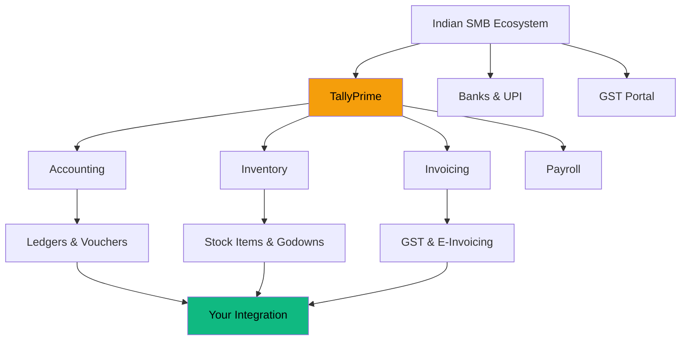
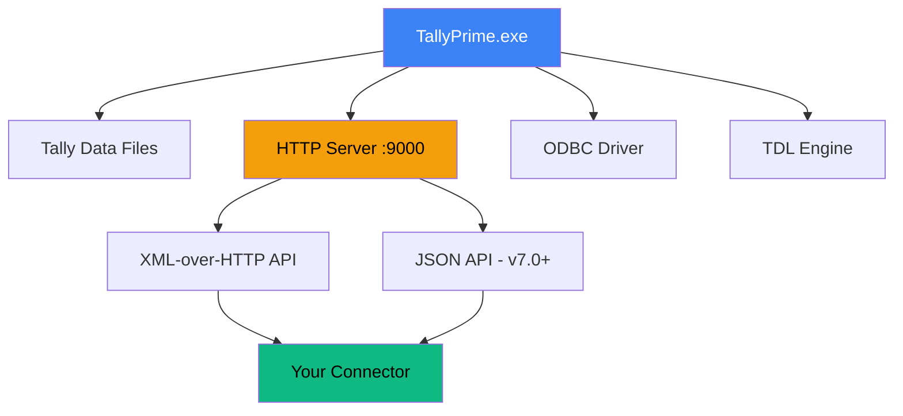

import {
  Card,
  CardGrid,
  Badge,
} from '@astrojs/starlight/components';

If you're building software for Indian
businesses, you will eventually meet Tally.
It's not a question of *if* — it's *when*.

## Tally in 30 Seconds

**TallyPrime** (formerly Tally.ERP 9) is
India's most widely used accounting and
inventory management software.

<CardGrid>
  <Card title="7M+ Businesses" icon="star">
    From corner shops to mid-size
    manufacturers.
  </Card>
  <Card title="Since 1986" icon="open-book">
    Nearly four decades of trust in the
    Indian market.
  </Card>
  <Card title="GST-Native" icon="document">
    Built-in GST compliance, e-invoicing,
    and e-way bill generation.
  </Card>
  <Card title="Desktop-First" icon="laptop">
    A Windows app, not a SaaS product.
    That's the whole story of this guide.
  </Card>
</CardGrid>

## Where Tally Sits

Tally is the financial backbone for Indian
SMBs. Virtually every distributor, stockist,
retailer, and manufacturer runs their
books on it.

The key insight: **Tally IS the source of
truth** for these businesses. If your app
needs stock levels, customer balances, or
order status — the data lives in Tally.

## Architecture: A Desktop App with an API

Here's what surprises most developers:
Tally is a **Windows desktop application**
that ships with an **embedded HTTP server**.

When Tally is running and you've enabled the
HTTP server (F1 > Settings > Advanced Config),
it listens on a configurable port (default
`9000`). You POST XML to it. It returns XML.

That's the integration. No OAuth. No API keys.
No rate limits. Just HTTP and XML.

:::tip[No Cloud Required]
Tally's HTTP server runs locally. Your
connector sits on the same Windows machine,
talks to `localhost:9000`, and has full
read/write access to every master and
transaction in the loaded company.
:::

## The Data Model at a Glance

Tally organizes everything into two
buckets: **Masters** and **Transactions**.

### Masters (relatively static)

Masters are your reference data. They change
infrequently.

| Master | What It Is | Example |
|--------|-----------|---------|
| **Stock Item** | A product in inventory | Paracetamol 500mg |
| **Stock Group** | Category hierarchy | Analgesics > Tablets |
| **Godown** | Warehouse/location | Main Warehouse |
| **Ledger** | An account (customer, supplier, bank) | Raj Medical Store |
| **Unit** | Unit of measure | Strip, Box, Kg |

### Transactions (high volume)

Transactions are vouchers — the actual
business events.

| Voucher Type | What It Does |
|-------------|-------------|
| **Purchase** | Stock IN + accounting |
| **Sales** | Stock OUT + accounting |
| **Sales Order** | Commitment to sell (no stock impact!) |
| **Receipt Note** | Goods received, pending invoice |
| **Delivery Note** | Goods dispatched, pending invoice |
| **Stock Journal** | Inter-godown transfer |

:::caution[Orders vs Actuals]
Sales Orders and Purchase Orders are
**commitments only**. They do NOT affect
stock levels or account balances. This is
one of the most common integration bugs.
Always check `is_order_voucher` before
computing stock positions.
:::

### Change Tracking Built In

Every master and voucher carries two IDs
that make incremental sync possible:

- **MasterID** — assigned on creation,
  never changes
- **AlterID** — incremented on every
  create/alter/delete of *any* object
  across the entire company

Track the highest `AlterID` you've seen.
Next sync, ask for everything above it.
That's your delta.

## Why Integrate?

If Tally is where the data lives, you need
to get it out (and sometimes push data in).
Common use cases:

<CardGrid>
  <Card title="Mobile Sales Apps" icon="star">
    Field reps need real-time stock
    visibility and the ability to place
    orders that flow into Tally.
  </Card>
  <Card title="E-Commerce Sync" icon="rocket">
    Keep your online store's inventory in
    sync with Tally's stock levels.
  </Card>
  <Card title="BI & Reporting" icon="list-format">
    Pull data into dashboards for
    sales trends, aging analysis, and
    demand forecasting.
  </Card>
  <Card title="Compliance Automation" icon="document">
    Auto-generate GST returns, e-invoices,
    and reconciliation reports from
    Tally data.
  </Card>
</CardGrid>

## What Makes It Tricky?

Let's be honest — Tally integration has
earned its reputation. Here's what you're
signing up for:

1. **XML everywhere.** The primary interface
   is verbose XML with Tally-specific
   conventions.

2. **Quantities have units baked in.**
   `"100 Strip"` is a single string, not
   a number and a unit.

3. **Debit is negative.** Tally uses a
   debit-negative, credit-positive
   convention for amounts.

4. **Booleans are `Yes`/`No` strings.**
   Not `true`/`false`.

5. **No auth.** Tally trusts localhost.
   Security is your problem.

6. **Tally freezes on large exports.**
   Pull too much data in one request and
   the accountant's Tally locks up.

:::danger[The Big One]
Never pull more than ~5,000 vouchers in a
single HTTP request. Tally will freeze
indefinitely, and the accountant will call
you. Batch by day. Batch by type. Just
batch.
:::

## Next Steps

Now that you know what you're working with,
let's look at all the ways you can talk to
Tally — and why XML-over-HTTP wins.

Head to the
[Integration Landscape](/tally-integartion/getting-started/integration-landscape/)
to see the full comparison, or skip straight
to [Hello World](/tally-integartion/getting-started/hello-world/)
to fire your first request.
