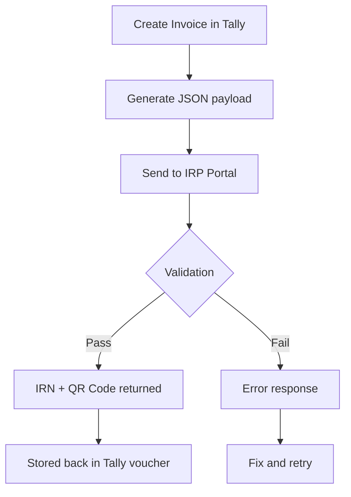

E-invoicing is the Indian government's system for real-time invoice registration. Every B2B invoice above the threshold gets an **IRN** (Invoice Reference Number) and a digitally signed **QR code** from the government's portal. Tally has built-in support for this, and your connector needs to understand how it all flows.

## How E-Invoicing Works

The basic flow is straightforward:



### Key Terminology

| Term | What It Is |
|------|-----------|
| **IRN** | Invoice Reference Number -- 64-char hash, unique per invoice |
| **IRP** | Invoice Registration Portal (government system) |
| **QR Code** | Digitally signed QR containing invoice summary |
| **Ack No** | Acknowledgement number from IRP |
| **Ack Date** | Timestamp of successful registration |

## The IRP Flow in Detail

1. **Invoice created** in Tally (Sales voucher)
2. Tally generates a **JSON payload** with invoice details (seller, buyer, items, tax, HSN codes)
3. JSON is sent to **IRP** (either NIC's portal or a GSP like ClearTax, Cygnet, etc.)
4. IRP validates the invoice data
5. On success, IRP returns **IRN**, **Signed QR Code**, and **Acknowledgement Number**
6. Tally stores these in the voucher
7. The invoice is now legally registered

## Tally's Built-in E-Invoice Support

Tally offers two modes:

### Online Mode (API-based)

Tally connects directly to the IRP via its built-in e-invoice feature. You configure GSP credentials in Tally, and it handles the API calls automatically when you create/alter a Sales voucher.

### Offline Mode (JSON Export)

For companies that prefer manual control:

1. Tally exports invoice data as a JSON file
2. User uploads JSON to the IRP portal manually
3. Downloads the signed response
4. Imports IRN/QR back into Tally

:::tip
Most stockists above the threshold use online mode through a GSP. The offline flow is mainly for companies just crossing the threshold or those with connectivity issues.
:::

## E-Invoice Data in Voucher XML

Once an invoice is registered, the e-invoice data appears in the voucher XML. This is what your connector will see:

```xml
<VOUCHER VCHTYPE="Sales">
  <DATE>20260325</DATE>
  <VOUCHERNUMBER>INV/2025-26/1042</VOUCHERNUMBER>

  <!-- E-Invoice fields -->
  <IRNNUMBER>
    a1b2c3d4e5f6...64chars...
  </IRNNUMBER>
  <IRNACKNO>132456789012</IRNACKNO>
  <IRNACKDATE>25-Mar-2026</IRNACKDATE>
  <SIGNEDQRCODE>
    eyJhbGciOiJSUzI1NiIs...
    (base64 encoded signed data)
  </SIGNEDQRCODE>
  <EINVOICESTATUS>
    Generated
  </EINVOICESTATUS>

  <!-- Regular voucher data follows -->
  <PARTYLEDGERNAME>
    Retailer XYZ
  </PARTYLEDGERNAME>
</VOUCHER>
```

### Fields Your Connector Should Extract

| XML Tag | Store As | Notes |
|---------|---------|-------|
| `IRNNUMBER` | `irn` | 64-char unique hash |
| `IRNACKNO` | `irn_ack_number` | Numeric acknowledgement |
| `IRNACKDATE` | `irn_ack_date` | Registration timestamp |
| `SIGNEDQRCODE` | `signed_qr_code` | Can be very long (2000+ chars) |
| `EINVOICESTATUS` | `einvoice_status` | Generated / Cancelled |

:::caution
The `SIGNEDQRCODE` field can be extremely large. Make sure your database column can handle it -- use `TEXT` type, not `VARCHAR(255)`.
:::

## Bulk IRN Generation

For companies that create many invoices daily, Tally supports bulk e-invoice generation:

1. Create all invoices normally
2. Use **E-Invoice** menu > **Generate in Bulk**
3. Tally sends all pending invoices to IRP in batch
4. Results are stored back on each voucher

From the connector's perspective, you just need to check whether each voucher has an IRN. If it does, the e-invoice was generated. If not, it's still pending.

## E-Invoice Cancellation

An e-invoice can be cancelled within 24 hours of generation. After that, you need a Credit Note. When cancelled:

```xml
<VOUCHER>
  <EINVOICESTATUS>Cancelled</EINVOICESTATUS>
  <IRNCANCELDATE>25-Mar-2026</IRNCANCELDATE>
  <IRNCANCELREASON>
    Data Entry Error
  </IRNCANCELREASON>
</VOUCHER>
```

Your connector should track the status field to distinguish active vs cancelled e-invoices.

## Turnover Threshold for E-Invoicing Mandate

E-invoicing has been rolling out in phases based on annual turnover. See the [Regulatory Timeline](/tally-integartion/gst-compliance/regulatory-timeline/) for the full history.

As of the current rules:

| Turnover | E-Invoicing Required? |
|----------|---------------------|
| Above Rs.5 Crore | Yes (mandatory) |
| Below Rs.5 Crore | Not yet (but coming) |

:::danger
The threshold keeps dropping. It started at Rs.500 Crore in 2020 and has steadily come down. Plan your connector to handle e-invoice data regardless of current threshold -- your client's turnover may cross it, or the threshold may drop further.
:::

## Impact on Your Connector

### Read Path (Tally to Central)

When syncing vouchers, extract all e-invoice fields and store them. The central system needs this data for:

- GST return reconciliation
- Audit trail
- Invoice verification by customers

### Write Path (Central to Tally)

When pushing Sales Orders or Sales Invoices back to Tally, you do **not** need to include e-invoice fields. Tally generates the IRN after the voucher is created. Your flow should be:

```
1. Push Sales Invoice to Tally
2. Tally creates the voucher
3. User/automation triggers e-invoice
4. Next sync cycle picks up the IRN
```

### Validation

Cross-check that invoices above the threshold have IRNs. Flag any Sales vouchers that should have e-invoices but don't -- this could indicate a compliance gap that needs attention.
