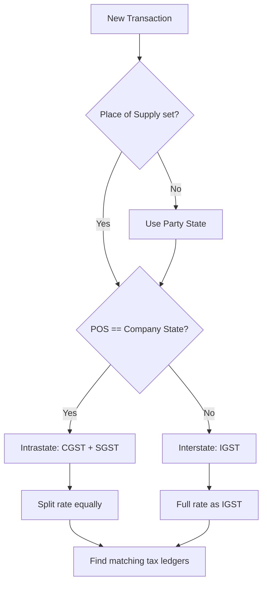

GST is the backbone of every Indian business transaction, and Tally takes it *very* seriously. If you're building a connector, you need to understand how GST flows through Tally's data model -- because getting it wrong means broken invoices and unhappy accountants.

Let's break it down.

## Interstate vs Intrastate: The Big Split

Every GST transaction boils down to one question: **is this interstate or intrastate?**

| Scenario | Tax Applied | How It Works |
|----------|------------|--------------|
| Intrastate (same state) | CGST + SGST | Split equally (e.g., 9% + 9% = 18%) |
| Interstate (different states) | IGST | Single tax at full rate (e.g., 18%) |

The determination is simple in theory:

```
Seller state == Buyer state → CGST + SGST
Seller state != Buyer state → IGST
```

But in practice, it gets interesting fast.

## Place of Supply: Where the Magic Happens

Tally uses a `PLACEOFSUPPLY` tag on every voucher to make the interstate/intrastate decision. This isn't the buyer's address -- it's the **place where goods are delivered or services are consumed**.

```xml
<VOUCHER>
  <PLACEOFSUPPLY>Gujarat</PLACEOFSUPPLY>
  <PARTYLEDGERNAME>
    Medical Shop ABC
  </PARTYLEDGERNAME>
  <!-- If your company is in Gujarat
       and POS is Gujarat → CGST+SGST -->
</VOUCHER>
```

:::tip
The connector must compare `PLACEOFSUPPLY` on the voucher against the company's registered state to determine which tax type applies. Never hardcode this logic based on the party's address alone.
:::

## State Codes

Tally uses the standard GST state code list. You'll see these in GSTINs (first two digits) and in place-of-supply fields.

| Code | State | Code | State |
|------|-------|------|-------|
| 24 | Gujarat | 27 | Maharashtra |
| 29 | Karnataka | 33 | Tamil Nadu |
| 07 | Delhi | 06 | Haryana |
| 09 | Uttar Pradesh | 32 | Kerala |

The GSTIN format is `SSPPPPPPPPPPCZZ` where `SS` is the state code. So `24AABCT1234F1Z5` tells you this registration is in Gujarat.

## Multiple GSTINs Per Company

Here's where it gets real. A stockist operating in multiple states has **separate GSTIN registrations** for each state. In Tally, this shows up in two patterns:

**Pattern 1: Separate Companies**
Each state registration is a different Tally company. Your connector sees them as independent data universes.

**Pattern 2: Multiple Registrations in One Company**
Tally supports `GSTREGISTRATION` entries within a single company:

```xml
<COMPANY>
  <GSTREGISTRATION.LIST>
    <REGISTRATIONNUMBER>
      24AABCT1234F1Z5
    </REGISTRATIONNUMBER>
    <APPLICABLEFROM>20170701</APPLICABLEFROM>
    <STATE>Gujarat</STATE>
  </GSTREGISTRATION.LIST>
  <GSTREGISTRATION.LIST>
    <REGISTRATIONNUMBER>
      27AABCT1234F1Z8
    </REGISTRATIONNUMBER>
    <APPLICABLEFROM>20170701</APPLICABLEFROM>
    <STATE>Maharashtra</STATE>
  </GSTREGISTRATION.LIST>
</COMPANY>
```

:::caution
When your company has multiple GSTINs, each voucher may reference a specific registration. The connector must track which GSTIN applies to each transaction for correct tax reporting.
:::

## How GST Appears in Tally XML

### Tax Ledger Entries

CAs create separate ledgers for each tax type and rate. The naming is wildly inconsistent across companies:

```
"Output CGST 9%"
"CGST on Sales @9%"
"GST-CGST-9%"
"CGST @ 9"
```

:::danger
Never assume tax ledger names. Always identify them by their parent group (`Duties & Taxes`) and the GST rate attributes, not by string matching.
:::

In a sales voucher, tax entries look like this:

```xml
<ALLLEDGERENTRIES.LIST>
  <LEDGERNAME>Output CGST 9%</LEDGERNAME>
  <ISDEEMEDPOSITIVE>No</ISDEEMEDPOSITIVE>
  <AMOUNT>900.00</AMOUNT>
</ALLLEDGERENTRIES.LIST>
<ALLLEDGERENTRIES.LIST>
  <LEDGERNAME>Output SGST 9%</LEDGERNAME>
  <ISDEEMEDPOSITIVE>No</ISDEEMEDPOSITIVE>
  <AMOUNT>900.00</AMOUNT>
</ALLLEDGERENTRIES.LIST>
```

### GST Rate on Stock Items

Stock items carry their default GST rates in the master:

```xml
<STOCKITEM NAME="Paracetamol 500mg">
  <GSTDETAILS.LIST>
    <APPLICABLEFROM>20170701</APPLICABLEFROM>
    <HSNCODE>30049099</HSNCODE>
    <TAXABILITY>Taxable</TAXABILITY>
    <GSTTYPEOFSUPPLY>Goods</GSTTYPEOFSUPPLY>
    <GSTRATE>12</GSTRATE>
    <CGSTRATE>6</CGSTRATE>
    <SGSTRATE>6</SGSTRATE>
    <IGSTRATE>12</IGSTRATE>
  </GSTDETAILS.LIST>
</STOCKITEM>
```

### GST Registration Type on Parties

Each party ledger (customer/supplier) has a registration type that affects tax treatment:

| Type | Meaning | Impact |
|------|---------|--------|
| Regular | Normal GST taxpayer | Standard tax |
| Composition | Small business scheme | No ITC |
| Unregistered | No GSTIN | Reverse charge may apply |
| Consumer | End consumer | B2C invoice |

## The Place-of-Supply Decision Flow

Here's how the connector should determine the correct tax type for any transaction:



## GST Setup Patterns CAs Follow

Understanding how CAs structure GST helps your connector parse it correctly:

1. **Tax ledgers under Duties & Taxes**: Always look for ledgers parented under this group
2. **Rate-specific ledgers**: Separate ledgers per rate (5%, 12%, 18%, 28%)
3. **Direction-specific**: Input CGST vs Output CGST are different ledgers
4. **Date-wise rates**: GST rates can change over time (the government has revised rates multiple times). Stock items store rate history with `APPLICABLEFROM` dates

:::tip
When writing back vouchers, always compute GST fresh based on the current selling price and place of supply. Never blindly copy the default rate from the stock item master -- especially for garments where the rate depends on the selling price.
:::

## What Your Connector Needs to Track

At minimum, your connector should extract and cache:

- Company state and all GSTIN registrations
- Party state and GSTIN for every customer/supplier
- GST rates on every stock item (with date-wise history)
- Tax ledger names and their rate mappings
- Place of supply on every voucher

This data feeds directly into correct tax calculation during write-back operations and ensures your integration stays compliant.
