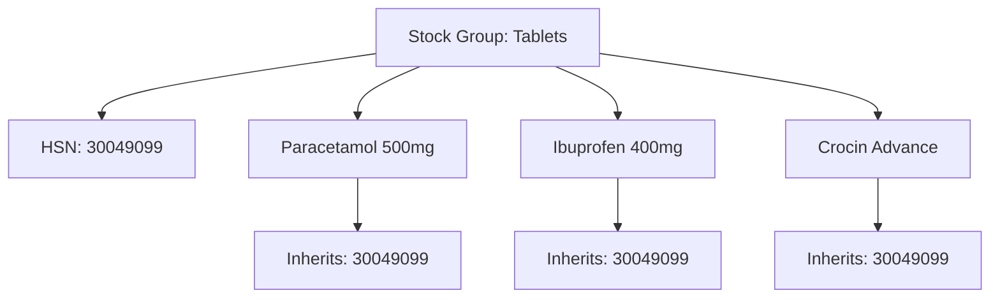

Every taxable item in India needs a classification code. Goods get **HSN** (Harmonised System of Nomenclature) codes. Services get **SAC** (Services Accounting Code) codes. Tally tracks both, and your connector needs to extract them correctly.

## HSN vs SAC: Quick Primer

| Aspect | HSN | SAC |
|--------|-----|-----|
| Full name | Harmonised System of Nomenclature | Services Accounting Code |
| Used for | Goods (physical products) | Services |
| Digits | 2, 4, 6, or 8 | 6 digits |
| Example | `30049099` (pharma) | `998314` (IT services) |

## Digit Levels and What They Mean

HSN codes are hierarchical. More digits = more specific:

```
30        → Pharmaceutical products
3004      → Medicaments (mixed or unmixed)
300490    → Other medicaments
30049099  → Other (specific catchall)
```

For garments:

```
61        → Knitted/crocheted apparel
6105      → Men's shirts, knitted
610510    → Of cotton
61051010  → Formal shirts, cotton
```

## Turnover Thresholds for HSN

The number of HSN digits you *must* report depends on your turnover:

| Annual Turnover | HSN Digits Required |
|----------------|-------------------|
| Up to Rs.5 Crore | 4 digits |
| Above Rs.5 Crore | 6 digits |

:::tip
Most Tally installations use 4 or 8 digit HSN codes. The connector should store whatever Tally provides and let the downstream system decide on truncation for returns filing.
:::

## How HSN Works in Tally

### On Stock Items

The primary place HSN lives is the stock item master:

```xml
<STOCKITEM NAME="Paracetamol 500mg">
  <GSTDETAILS.LIST>
    <HSNCODE>30049099</HSNCODE>
    <GSTTYPEOFSUPPLY>Goods</GSTTYPEOFSUPPLY>
  </GSTDETAILS.LIST>
</STOCKITEM>
```

### Inheritance from Stock Group

Here's the trick: if HSN is set on a **Stock Group**, all items under that group inherit it (unless overridden at the item level).



:::caution
When extracting HSN codes, check the stock item first. If blank, walk up the Stock Group hierarchy until you find one. Some companies set HSN only at the group level to avoid maintaining it on thousands of items.
:::

### SAC for Services

If the stock item represents a service (like "Installation Charges" or "AMC Service"), it uses SAC instead:

```xml
<STOCKITEM NAME="Annual Maintenance">
  <GSTDETAILS.LIST>
    <HSNCODE>998714</HSNCODE>
    <GSTTYPEOFSUPPLY>Services</GSTTYPEOFSUPPLY>
  </GSTDETAILS.LIST>
</STOCKITEM>
```

Yes, confusingly, the XML tag is still `HSNCODE` even for SAC codes. The `GSTTYPEOFSUPPLY` field tells you which it is.

## Common HSN Codes by Vertical

### Pharma

| HSN | Description |
|-----|------------|
| `3004` | Medicaments (broad) |
| `30049099` | Other medicaments |
| `30042099` | Antibiotics |
| `30039090` | Ayurvedic medicines |

### Garments

| HSN | Description |
|-----|------------|
| `6101-6117` | Knitted/crocheted apparel |
| `6201-6217` | Woven apparel |
| `6105` | Men's shirts, knitted |
| `6203` | Men's trousers, woven |
| `6204` | Women's suits/dresses |
| `6206` | Women's blouses |

### Textiles (Fabric)

| HSN | Description |
|-----|------------|
| `5007-5212` | Fabrics |
| `5208` | Woven cotton fabrics |
| `5209` | Woven cotton (heavier) |
| `5407` | Woven synthetic fabrics |

## E-way Bill HSN Requirements

E-way bills require HSN codes for every item being transported. The rules:

- **Mandatory**: At least 2-digit HSN on every line item
- **Recommended**: 4+ digits for accurate classification
- **Validation**: The e-way bill portal validates HSN codes against the official master list

If your connector handles e-way bill generation or data export, make sure every stock item has a valid HSN code. Items without HSN will fail e-way bill generation.

:::danger
A missing or incorrect HSN code can result in goods being detained at checkpoints during transport. For pharma and garment distributors who ship across state lines daily, this is a real operational risk.
:::

## Extraction Strategy for the Connector

Here's the recommended approach:

```
1. Extract HSNCODE from each Stock Item
2. If blank, check parent Stock Group
3. If still blank, walk up the group hierarchy
4. Store the resolved HSN with source info:
   {
     hsn: "30049099",
     source: "stock_group",  // or "stock_item"
     supply_type: "Goods"    // or "Services"
   }
5. Flag items with no HSN at any level
```

Items without HSN codes should be flagged in your sync status reports -- the downstream system needs them for GST returns filing and e-way bill generation.

## HSN Summary Report

Tally generates an HSN Summary report for GST returns (GSTR-1). This report aggregates all outward supplies by HSN code. Your connector can extract this report directly:

```xml
<ENVELOPE>
  <HEADER>
    <TALLYREQUEST>Export</TALLYREQUEST>
    <TYPE>Data</TYPE>
    <ID>GSTR1 HSN Summary</ID>
  </HEADER>
  <BODY><DESC><STATICVARIABLES>
    <SVEXPORTFORMAT>
      $$SysName:XML
    </SVEXPORTFORMAT>
    <SVFROMDATE>20250401</SVFROMDATE>
    <SVTODATE>20260331</SVTODATE>
  </STATICVARIABLES></DESC></BODY>
</ENVELOPE>
```

This gives you a pre-computed summary that's useful for validation -- compare it against your own aggregation to catch discrepancies.
