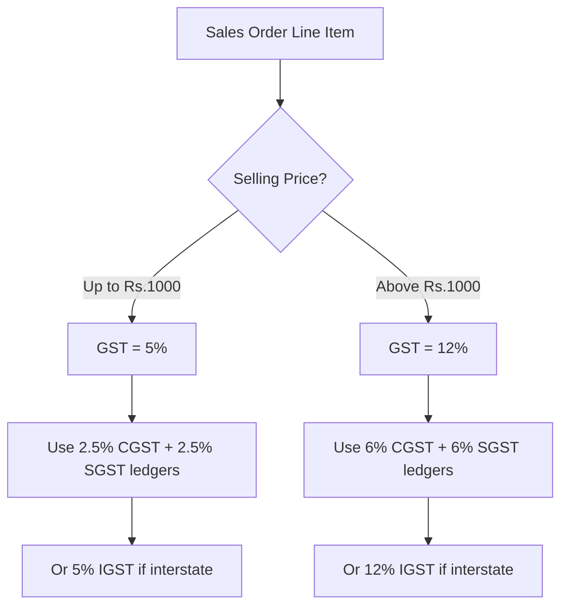

Here's the curveball that makes garment integration tricky: **the same shirt can have two different GST rates depending on how much you sell it for.** This is unique to textiles and footwear in India, and it breaks the assumption that GST rate is a property of the item.

## The Rule

For most textile and apparel items:

| Selling Price | GST Rate |
|--------------|----------|
| Up to Rs.1,000 per piece | **5%** |
| Above Rs.1,000 per piece | **12%** |

That's right. A cotton shirt sold at Rs.999 attracts 5% GST. The *exact same shirt* sold at Rs.1,001 attracts 12% GST. The rate is determined **per transaction line**, not per item.

:::danger
You **cannot** use a fixed GST rate from the stock item master for garments. The connector must compute the correct tax for each line item based on the actual selling price in that specific invoice.
:::

## The Full Textile GST Slab Table

| HSN Range | Description | Threshold | Below | Above |
|-----------|------------|-----------|-------|-------|
| 6101-6117 | Knitted apparel | Rs.1,000 | 5% | 12% |
| 6201-6217 | Woven apparel | Rs.1,000 | 5% | 12% |
| 6301-6310 | Home textiles | Rs.1,000 | 5% | 12% |
| 5007-5212 | Fabrics | -- | 5% flat | 5% flat |
| 5001-5003 | Raw silk/yarn | -- | 5% flat | 5% flat |

And for footwear (a related case):

| HSN | Description | Threshold | Below | Above |
|-----|------------|-----------|-------|-------|
| 6401-6405 | Footwear | Rs.1,000 | 5% | 18% |

:::caution
Fabrics and raw materials typically have a flat 5% rate regardless of price. The price-dependent slab applies primarily to *finished garments* and *footwear*. Make sure your connector distinguishes between fabric items and garment items.
:::

## How This Plays Out in Real Life

Consider a wholesaler selling the same polo shirt to two different retailers:

**Invoice 1**: Polo Shirt at Rs.800/piece (wholesale)
```
Item amount:  800 x 100 = Rs.80,000
CGST @ 2.5%:              Rs. 2,000
SGST @ 2.5%:              Rs. 2,000
Total:                     Rs.84,000
```

**Invoice 2**: Polo Shirt at Rs.1,200/piece (retail)
```
Item amount: 1200 x 50  = Rs.60,000
CGST @ 6%:                Rs. 3,600
SGST @ 6%:                Rs. 3,600
Total:                     Rs.67,200
```

Same item. Different rates. Different tax ledgers.

## Impact on the Connector

### Read Path

When reading vouchers from Tally, the tax is already computed correctly (the billing clerk or Tally's auto-calculation handles it). Your connector just needs to extract whatever tax entries exist on the voucher.

### Write Path (The Hard Part)

When pushing a Sales Order or Sales Invoice back into Tally, **you must compute the correct GST** for each line item:

```
FOR each inventory line in the order:
  rate = line.selling_price
  IF rate <= 1000:
    gst_rate = 5%
  ELSE:
    gst_rate = 12%

  IF intrastate:
    cgst = amount * (gst_rate / 2) / 100
    sgst = amount * (gst_rate / 2) / 100
  ELSE:
    igst = amount * gst_rate / 100
```

### Mixed-Rate Invoices

A single invoice can have lines at *both* rates:

```
Line 1: T-Shirt @ Rs.500  → 5% GST
Line 2: Shirt @ Rs.1,500  → 12% GST
```

This means the voucher needs **two sets of tax ledger entries**:

```xml
<!-- 5% items -->
<ALLLEDGERENTRIES.LIST>
  <LEDGERNAME>Output CGST 2.5%</LEDGERNAME>
  <AMOUNT>625.00</AMOUNT>
</ALLLEDGERENTRIES.LIST>
<ALLLEDGERENTRIES.LIST>
  <LEDGERNAME>Output SGST 2.5%</LEDGERNAME>
  <AMOUNT>625.00</AMOUNT>
</ALLLEDGERENTRIES.LIST>

<!-- 12% items -->
<ALLLEDGERENTRIES.LIST>
  <LEDGERNAME>Output CGST 6%</LEDGERNAME>
  <AMOUNT>4500.00</AMOUNT>
</ALLLEDGERENTRIES.LIST>
<ALLLEDGERENTRIES.LIST>
  <LEDGERNAME>Output SGST 6%</LEDGERNAME>
  <AMOUNT>4500.00</AMOUNT>
</ALLLEDGERENTRIES.LIST>
```

:::tip
Before pushing any garment voucher, your connector must discover which tax ledgers exist in the company for each rate. You can't create tax ledgers on the fly -- the CA has already set them up.
:::

## The Stock Item Default Rate Problem

Tally *does* allow setting a default GST rate on the stock item master:

```xml
<STOCKITEM NAME="Polo T-Shirt Blue M">
  <GSTDETAILS.LIST>
    <GSTRATE>5</GSTRATE>
  </GSTDETAILS.LIST>
</STOCKITEM>
```

But this default is **misleading** for garments. A shirt might have 5% as default because most wholesale transactions are under Rs.1,000. But when sold at retail price above Rs.1,000, the rate jumps to 12%.



## Practical Advice for Connector Developers

1. **Always compute GST from selling price** -- ignore the stock item default for garment items
2. **Check HSN range** -- only apply price-dependent logic for HSN codes in the garment/footwear ranges (61xx, 62xx, 63xx, 64xx)
3. **Cache tax ledger mappings** -- know which ledger names map to which rates in this specific company
4. **Handle the threshold exactly** -- "up to Rs.1,000" means Rs.1,000.00 is still 5%. It's Rs.1,000.01 and above that triggers 12%
5. **Test mixed-rate invoices** -- these are very common in garment wholesale

## When the Government Changes Rates

The textile GST rates have been revised before (they changed in January 2022). When rates change:

- Stock items may have **date-wise rate lists** in `GSTDETAILS.LIST`
- Old invoices retain their original rates
- New invoices must use the updated rates
- Your connector should respect the `APPLICABLEFROM` date in rate lists

This is another reason to compute rates dynamically rather than caching a single rate per item.
