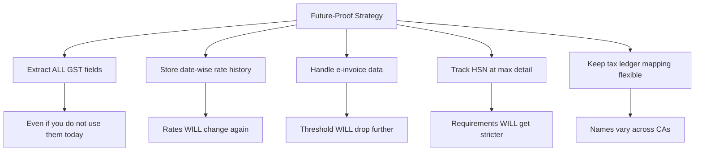

India's GST regulations are a moving target. Rules change frequently, thresholds drop, new requirements appear. If you're building a Tally integration, you need to understand the timeline -- because what's optional today may be mandatory tomorrow.

## E-Invoicing Mandate Rollout

E-invoicing has been phased in over several years, with the turnover threshold steadily decreasing:

| Date | Turnover Threshold | Who's Affected |
|------|-------------------|----------------|
| Oct 2020 | Rs.500 Crore+ | Large enterprises |
| Jan 2021 | Rs.100 Crore+ | Large-mid enterprises |
| Apr 2021 | Rs.50 Crore+ | Mid-size businesses |
| Apr 2022 | Rs.20 Crore+ | Growing businesses |
| Oct 2022 | Rs.10 Crore+ | Small-medium businesses |
| Aug 2023 | Rs.5 Crore+ | Small businesses |
| *Expected* | Rs.1 Crore+ | Micro businesses |

:::caution
The threshold has dropped from Rs.500 Crore to Rs.5 Crore in just three years. The trajectory is clear -- eventually, most registered businesses will need e-invoicing. Build your connector to handle it from day one.
:::

## E-Way Bill Requirements

E-way bills are required for transporting goods worth more than Rs.50,000. Here's what matters for Tally integrations:

| Aspect | Requirement |
|--------|------------|
| Threshold | Goods value > Rs.50,000 |
| Distance | Required for movement > 50 km (some states differ) |
| Validity | 1 day per 200 km (approx.) |
| HSN | Required on every line item |
| Vehicle | Vehicle number must be updated before movement |

### E-Way Bill in Tally

Tally has built-in e-way bill support. The relevant XML fields:

```xml
<VOUCHER>
  <EWAYBILLNO>331001234567</EWAYBILLNO>
  <EWAYBILLDATE>25-Mar-2026</EWAYBILLDATE>
  <EWAYBILLVALIDTILL>
    26-Mar-2026
  </EWAYBILLVALIDTILL>
  <TRANSPORTERID>29AABCT1234F1Z5</TRANSPORTERID>
  <VEHICLENO>GJ01AB1234</VEHICLENO>
  <TRANSPORTMODE>Road</TRANSPORTMODE>
  <DISTANCEINKG>350</DISTANCEINKG>
</VOUCHER>
```

## Key Regulatory Changes That Affect Integrations

### 1. HSN Code Mandate Tightening

The number of HSN digits required in invoices has increased over time. Earlier, 2 digits were sufficient for smaller businesses. Now 4-6 digits are typically required.

**Connector impact**: Make sure every stock item has a sufficiently detailed HSN code. Flag items with fewer than 4 digits.

### 2. Input Tax Credit (ITC) Matching

The government has introduced automated ITC matching where your purchase invoices are matched against your supplier's sales data. Mismatches block ITC claims.

**Connector impact**: Accurate GSTIN, invoice numbers, and amounts on every voucher are critical. A single digit wrong in the GSTIN means the ITC won't match.

### 3. GSTR-1 & GSTR-3B Reconciliation

Monthly/quarterly returns must reconcile. Tally generates these returns, but your central system should be able to cross-verify.

**Connector impact**: Extract GST return data (or the underlying voucher data) to enable reconciliation in your central system.

### 4. QR Code on B2C Invoices

Businesses above certain turnover thresholds must print a dynamic QR code on B2C invoices (not the same as e-invoice QR).

**Connector impact**: Minimal -- Tally handles QR generation for printing. But be aware that QR-related fields may appear in voucher XML.

## Timeline of GST Rate Changes

GST rates themselves have been revised multiple times. Key changes affecting common verticals:

### Textiles/Garments
- **Pre-Jan 2022**: Most garments at 5% flat
- **Jan 2022 onwards**: Price-dependent slab (up to Rs.1000 = 5%, above = 12%)
- See [Price-Dependent GST](/tally-integartion/gst-compliance/price-dependent-gst/) for details

### Pharma
- Most medicines: 12% (stable since GST launch)
- Some formulations: 5%
- Medical devices: varied (5% to 18%)

:::tip
Stock items in Tally store date-wise GST rate history in their `GSTDETAILS.LIST`. When rates change, Tally adds a new entry with an `APPLICABLEFROM` date. Your connector should extract the full history, not just the current rate.
:::

## What to Watch For

### Upcoming Changes (As of 2026)

Several regulatory changes are on the horizon that may affect your integration:

1. **Lower e-invoicing threshold**: Expected to drop to Rs.1 Crore or even universal
2. **Real-time invoice reporting**: Discussion of moving from batch to real-time IRN generation
3. **Automated return filing**: GSTR-1 auto-populated from e-invoices (partially live already)
4. **E-way bill integration with RFID**: Automated tracking at toll plazas
5. **HSN 8-digit mandate**: May become universal regardless of turnover

### How to Future-Proof Your Connector



## Practical Recommendations

1. **Always extract e-invoice fields** from vouchers, even if the client is currently below threshold. They may cross it, or the threshold may drop.

2. **Store GST computation details**, not just totals. Keep the rate, taxable amount, and tax amount per line item. You'll need this for return reconciliation.

3. **Build in rate calculation logic** rather than relying on static mappings. The textile price-dependent slab is the most complex case -- handle it, and everything else is simpler.

4. **Monitor government notifications**. The GST Council meets regularly and announces changes. Your integration may need updates when new rules kick in.

5. **Test with real data** from multiple financial years. Rate changes between years are the most common source of bugs in GST calculations.

:::danger
Regulatory non-compliance can result in penalties, blocked ITC claims, and even business suspension. Your connector is part of the compliance chain -- treat GST data extraction with the same seriousness as financial reporting.
:::
