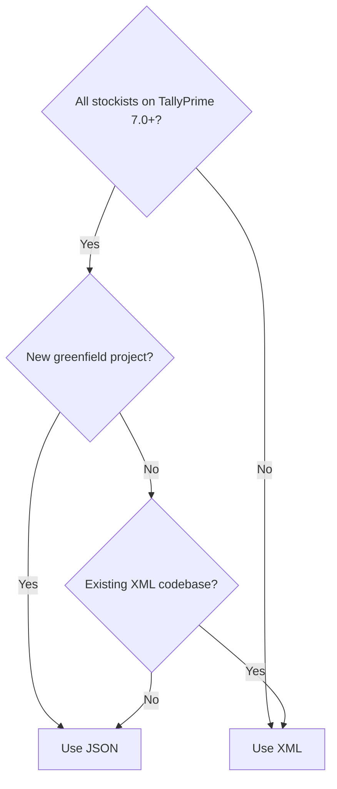

Both JSON and XML work with Tally's HTTP API. But they're not interchangeable in every situation. Here's the honest comparison.

## The Comparison Table

| Aspect | JSON | XML |
|---|---|---|
| **Parsing** | Native in JS, Python, Go | Needs XML parser |
| **Readability** | Cleaner for developers | Verbose but explicit |
| **Tally Version** | 7.0+ only | All versions |
| **Documentation** | Limited | Extensive |
| **Community Examples** | Few | Thousands |
| **Import (write)** | Supported but newer | Battle-tested |
| **Export (read)** | Works well | Works well |
| **Inline TDL** | Supported | Supported |
| **Error messages** | Same content | Same content |
| **Payload size** | ~20% smaller | Larger |

## JSON Advantages

### Simpler Parsing

In most modern languages, JSON parsing is built-in and produces native data structures.

**Python:**
```python
import json
data = json.loads(response.text)
name = data["ENVELOPE"]["BODY"]["DATA"]
```

**Go:**
```go
var resp map[string]interface{}
json.Unmarshal(body, &resp)
```

**JavaScript:**
```javascript
const data = JSON.parse(response);
```

No SAX parsers. No namespace handling. No CDATA sections. Just parse and go.

### Smaller Payloads

JSON skips the closing tags, attribute syntax, and XML declaration overhead. For large collections (thousands of stock items), this means roughly 20% less data over the wire.

### Modern Tooling

REST clients (Postman, Insomnia), API testing frameworks, and logging tools all handle JSON natively. Debugging a JSON payload is easier than squinting at nested XML.

## XML Advantages

### Universal Tally Support

This is the big one. JSON requires TallyPrime 7.0 or later. XML works with:

- TallyPrime 7.0+
- TallyPrime 4.x, 5.x, 6.x
- Tally.ERP 9 (still widely used)

:::danger
Many Indian SMBs still run Tally.ERP 9 or older TallyPrime versions. If your connector needs to work with these, XML is your only option. Don't assume everyone has upgraded.
:::

### More Documentation and Examples

Tally's own documentation, community forums, blog posts, and integration guides are overwhelmingly XML-based. When you hit a weird edge case at 2 AM, you're more likely to find an XML example that solves it.

### Battle-Tested Import Path

XML import has been the standard for 15+ years. Every edge case, every quirk, every workaround has been discovered and documented by the community. JSON import is newer and has less real-world mileage.

### Larger Ecosystem

Tools like tally-database-loader, various Tally integration plugins, and CA-facing utilities all speak XML. If you need to interoperate with existing tools, XML is the common language.

## When to Use Which



### Use JSON When

- Every target Tally instance is TallyPrime 7.0+
- You're building a new project from scratch
- Your team is more comfortable with JSON
- You're building a REST API middleware layer
- Payload size matters (slow networks)

### Use XML When

- You need to support older Tally versions
- You're integrating with existing XML-based tools
- You need the widest community support
- You're following established patterns (like this guide)
- You want the most battle-tested import path

## Why This Guide Uses XML

We made a deliberate choice to use XML as the primary format throughout this guide. Here's why:

1. **Broadest compatibility**: Works with every Tally version you'll encounter in the field
2. **Most examples available**: When we reference patterns, the community examples are in XML
3. **Production-proven**: The write-back patterns in this guide have been tested with XML across dozens of real stockist installations
4. **Easier to translate**: Going from XML to JSON is straightforward (see [Migration Guide](/tally-integartion/json-api/migration-guide/)). Going the other way requires understanding XML's quirks.

:::tip
Think of it this way: if you learn the XML patterns first, switching to JSON later is trivial. The concepts are identical -- only the syntax changes.
:::

## The Hybrid Approach

Nothing stops you from using both. A practical strategy:

| Operation | Format | Why |
|---|---|---|
| Read (export) | JSON | Easier to parse |
| Write (import) | XML | More reliable |
| Health checks | JSON | Simpler payloads |
| Bulk sync | XML | Better error recovery |

Just make sure your code can handle both response formats, since some endpoints may respond in XML regardless of what you sent.

## Feature Parity

As of TallyPrime 7.0, JSON and XML have near-complete feature parity. The few exceptions:

- Some very old TDL functions may not serialize cleanly to JSON
- Complex nested LIST structures can be ambiguous in JSON (is it an array of one, or a single object?)
- The `LINEERROR` field in import responses may format differently

These are edge cases you're unlikely to hit in normal operations. For 99% of use cases, JSON and XML are functionally equivalent.

## Next Steps

If you're ready to make the switch, the [Migration Guide](/tally-integartion/json-api/migration-guide/) walks you through the translation process step by step.
