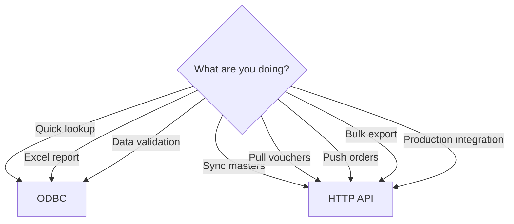

Tally's ODBC interface is handy for quick queries, but it has real limitations. Knowing them upfront will save you from building on a foundation that can't support what you need.

## The Big One: Read-Only

:::danger
ODBC is **read-only**. There is no INSERT, UPDATE, or DELETE. You cannot push data into Tally through ODBC. Period.
:::

If you need to write data (Sales Orders, new ledgers, anything), you must use the HTTP API with XML or JSON. ODBC is exclusively for reading.

```sql
-- This will FAIL
INSERT INTO Ledger ($Name, $Parent)
VALUES ('New Shop', 'Sundry Debtors')

-- Error: Operation not supported
```

## Limited Default Tables

Without TDL extensions, you only get first-level collections. Here's what you **can** and **cannot** access by default:

### Available by Default

| Collection | Access Level |
|---|---|
| Ledger | Full (name, balance, address) |
| StockItem | Full (name, balance, group) |
| StockGroup | Full |
| Voucher | Header only (no line items) |
| VoucherType | Full |
| CostCentre | Full |
| Godown | Full |
| Unit | Full |
| Company | Full |

### NOT Available by Default

| Data | Why Not |
|---|---|
| Voucher line items | Nested sub-collection |
| Batch allocations | Nested sub-collection |
| GST details | Nested sub-collection |
| Bill allocations | Nested sub-collection |
| Inventory entries | Nested sub-collection |
| Stock batch positions | Computed data |
| Outstanding reports | Report, not collection |

To access nested data, you'd need to write TDL that flattens it into an ODBC-accessible collection. That's doable but adds a dependency on a TDL file being loaded in Tally.

## Only First-Level Collections

This deserves emphasis. When you query `Voucher`, you get voucher headers:

```sql
SELECT $VoucherNumber, $Date,
       $PartyLedgerName
FROM Voucher
-- Returns: SO/001, 20260325, Raj Medical
```

But you can't drill into the line items:

```sql
-- What you WANT to do (but can't):
SELECT $VoucherNumber, $StockItemName,
       $Quantity, $Rate
FROM VoucherLineItems
-- Error: Table not found
```

The HTTP API with inline TDL gives you full access to nested structures without requiring the stockist to load any TDL files. That's why it's the primary integration method.

## Performance Issues with Large Datasets

Tally's ODBC interface processes queries by iterating through its internal data structures. There's no query optimizer, no indexes (in the RDBMS sense), and no parallel execution.

| Data Size | ODBC Performance |
|---|---|
| 500 ledgers | Fast (< 1 second) |
| 5,000 stock items | Okay (2-5 seconds) |
| 50,000 vouchers | Slow (30+ seconds) |
| 500,000 vouchers | Very slow (minutes) |

:::caution
For stockists with large datasets (multi-year data, high transaction volume), ODBC queries can freeze Tally's UI. The operator won't be able to work while your query runs. Use the HTTP API for bulk data -- it's designed for this.
:::

## No Incremental Sync Support

ODBC has no built-in mechanism for change detection. You can't ask "what changed since my last query?" directly.

With the HTTP API, you can:
- Filter by `AlterId` to get only changed records
- Use `SVFROMDATE`/`SVTODATE` for date-range queries
- Define custom TDL collections with filters

With ODBC, you'd have to:
- Pull everything and diff locally
- Or query `$AlterId` and compare manually

Neither is efficient for ongoing synchronization.

## No Aggregation or Joins

Tally's ODBC SQL doesn't support:

```sql
-- None of these work:
SELECT $Parent, COUNT(*), SUM($ClosingBalance)
FROM Ledger GROUP BY $Parent

SELECT L.$Name, V.$VoucherNumber
FROM Ledger L JOIN Voucher V
ON L.$Name = V.$PartyLedgerName

SELECT $Name FROM Ledger
WHERE $ClosingBalance > (
  SELECT AVG($ClosingBalance) FROM Ledger
)
```

You'd need to pull the raw data and do aggregation in your application code.

## When ODBC IS Still Useful

Despite all these limitations, ODBC has its place:

### Quick Ad-Hoc Queries

Need to check if a ledger exists? One SQL query, instant answer. No XML template needed.

```sql
SELECT $Name FROM Ledger
WHERE $Name = 'Raj Medical Store'
```

### Excel Reporting

Stockists and CAs love Excel. An ODBC connection to Tally that auto-refreshes a daily stock report? That's a real workflow enhancement, even without your connector in the picture.

### Data Validation

After your connector pushes a Sales Order, verify it landed correctly:

```sql
SELECT $VoucherNumber, $Date, $Amount
FROM Voucher
WHERE $VoucherTypeName = 'Sales Order'
  AND $VoucherNumber = 'FIELD/a1b2c3d4'
```

### Onboarding Discovery

When setting up a new stockist, quickly explore what's in their Tally:

```sql
-- How many ledgers?
SELECT $Name FROM Ledger

-- What stock groups exist?
SELECT $Name FROM StockGroup

-- What godowns?
SELECT $Name FROM Godown
```

### Simple Monitoring

A lightweight check that Tally is running and data is accessible:

```sql
SELECT $Name FROM Company
```

## ODBC vs HTTP API: Decision Matrix

| Need | ODBC | HTTP API |
|---|---|---|
| Quick one-off query | Great | Overkill |
| Excel integration | Great | Possible but harder |
| Write data | Not possible | Required |
| Nested data access | Limited | Full |
| Bulk data export | Slow | Designed for it |
| Incremental sync | Manual | Built-in (AlterId) |
| Cross-platform | Windows only | Any platform |
| No TDL dependency | Limited tables | Full access (inline TDL) |

## The Bottom Line

Think of ODBC as a convenience tool, not an integration backbone. It's great for:
- CAs who want Excel reports
- Developers doing quick debugging
- One-off data validation

For your actual integration pipeline -- syncing masters, pulling vouchers, pushing Sales Orders -- use the HTTP API. That's what it's built for.


