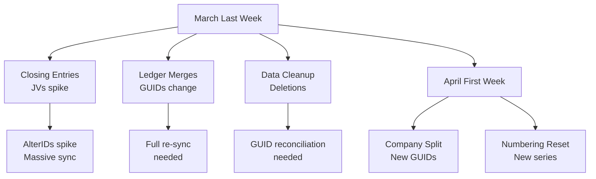

Chartered Accountants follow a predictable annual cycle. Knowing when they'll touch the data lets you schedule deployments, brace for disruptions, and communicate proactively with stockists.

## The 12-Month Calendar

| Month | CA Activity | Disruption Risk | What Happens to Your Connector |
|---|---|---|---|
| **April** | New FY creation, voucher numbering reset, company split | HIGH | Company may split. New company GUID. Re-profile needed. AlterIDs restart. |
| **May** | Settle into new FY, minor corrections | LOW | Quiet period. Good for deployment. |
| **June** | Routine bookkeeping | LOW | Quiet period. Good for deployment. |
| **July** | GSTR-1/3B filing for Q1 | MEDIUM | GST corrections, voucher amendments. Some backdated entries. |
| **August** | IT return filing for individuals | LOW | Minimal Tally impact for businesses. |
| **September** | Half-yearly review, audit prep | MEDIUM | Voucher corrections, ledger renames, group restructuring. |
| **October** | GSTR-9 annual return prep | MEDIUM | Massive reconciliation. GST data corrections. |
| **November** | Routine operations | LOW | Quiet period. Good for deployment. |
| **December** | Tax audit (large entities) | MEDIUM | Back-dated entries, data verification. |
| **January** | Tax audit continued | MEDIUM | Final audit adjustments. |
| **February** | Pre-close preparation | MEDIUM | Stock verification, outstanding reconciliation. |
| **March** | Year-end closing, ledger merges, data cleanup | HIGHEST | Everything happens. See below. |

## The March Madness

March is the most dangerous month for Tally integrations. In the last week of March and first week of April, CAs perform:

- **Year-end closing entries** -- depreciation, provisions, prepaid expenses
- **Stock verification** -- physical count reconciliation adjustments
- **Ledger merging** -- cleaning up duplicate parties
- **Ledger renaming** -- standardising names for audit
- **Data cleanup** -- deleting test entries, correcting wrong classifications
- **Company split** -- separating completed FY from new FY



:::danger
If you're deploying a new connector, **avoid March and April**. If you have a running connector, prepare for turbulence:
- Increase sync frequency during the last week of March
- Run full reconciliation on April 1st
- Re-profile the company after any split
:::

## Best Deployment Windows

| Period | Risk Level | Why |
|---|---|---|
| May - June | Lowest | Post-FY setup is done, routine operations |
| November | Low | Between GST annual return and year-end |
| August | Low | IT filing season but minimal business Tally impact |

## Preparing for High-Risk Months

### Before March (prepare in February)

1. Ensure full reconciliation is running weekly
2. Communicate with the stockist's CA about upcoming changes
3. Backup your connector's state (SQLite database, profiles)
4. Test your full re-sync mechanism

### During March-April

1. Increase AlterID polling frequency
2. Monitor for AlterID regression (data repair/restore)
3. Watch for company split (new company appearing)
4. Run GUID reconciliation daily
5. Accept that some disruption is inevitable

### After April (recovery)

1. Re-profile the company (features may have changed)
2. Run full re-sync
3. Verify voucher type mappings (new numbering series)
4. Check for new or merged ledgers
5. Confirm stock summary matches your cached data

## The Quarterly GST Cycle

GST filing creates smaller but regular disruption waves:

```
Q1 Filing (July):     Corrections for Apr-Jun
Q2 Filing (October):  Corrections for Jul-Sep
Q3 Filing (January):  Corrections for Oct-Dec
Q4 Filing (April):    Corrections for Jan-Mar
                      (overlaps with year-end!)
```

During filing months, expect:
- Back-dated voucher corrections
- GST rate fixes
- Place of Supply corrections
- Ledger amendments for GSTIN corrections

:::tip
Your connector's AlterID-based incremental sync handles these routine corrections automatically. The issue isn't detecting the changes -- it's processing the higher volume of changes during these months.
:::

## CA Communication Template

Consider sharing something like this with new stockists:

> "Our connector syncs automatically with Tally. During routine operations, everything is seamless. However, major changes like company splits, ledger merges, or data repair require a re-sync. Please let us know before your CA performs these operations so we can prepare."

This simple heads-up prevents 80% of support tickets.
