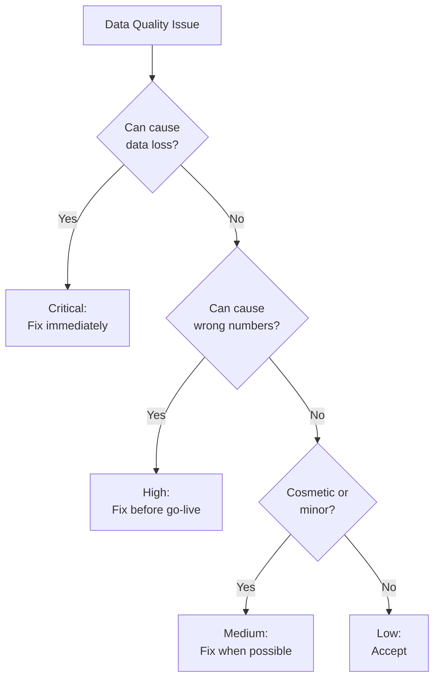

Perfect data is a fantasy. Here's what you'll actually find -- ranked by how often it bites and how hard.

## The Matrix

| # | Issue | Frequency | Impact | Handling Strategy |
|---|---|---|---|---|
| 1 | Duplicate ledgers | Very High | Double-counted outstandings | [Fuzzy dedup](/tally-integartion/real-world-data/party-deduplication/) by GSTIN or name |
| 2 | Missing GSTIN | Very High | No reliable entity matching | Fall back to fuzzy name matching |
| 3 | Negative stock | Very High | Incorrect available qty | Accept as valid; don't filter |
| 4 | Spelling variations | Very High | Item/party matching fails | Case-insensitive fuzzy search |
| 5 | Round-off differences | Very High | Import Dr/Cr mismatch | Add round-off entry (max Rs 1) |
| 6 | Unit mismatches | High | Quantity comparison fails | Convert via compound unit factor |
| 7 | Duplicate stock items | High | Stock split across entries | Alias-based matching |
| 8 | Opening balance wrong | High | Inventory totals unreliable | Trust Tally's Stock Summary |
| 9 | Cancelled vouchers | Medium | Inflated sales/purchase figures | Filter `ISCANCELLED=Yes` |
| 10 | Optional vouchers | Medium | False orders in pipeline | Filter `ISOPTIONAL=Yes` |
| 11 | Wrong group classification | Medium | Party type misidentified | Verify against primary group |
| 12 | Post-dated vouchers | Medium | Future dates in reports | Filter `ISPOSTDATED=Yes` |
| 13 | Rate includes tax | Medium | Amount computation off | Check GST inclusive/exclusive flag |

## Deep Dive by Severity

### Very High Frequency Issues

These appear in **almost every** Tally installation. Your connector must handle them from day one.

**Duplicate Ledgers** -- The same medical shop appears as "Raj Medical", "Raj Medical Store", and "M/s Raj Medical Store, Ahmedabad". Three ledgers, one business. See [Party Deduplication](/tally-integartion/real-world-data/party-deduplication/).

**Missing GSTIN** -- Small medical shops, especially in rural areas, are often unregistered. No GSTIN means no reliable identifier. Fuzzy name matching is your only option.

**Negative Stock** -- Sales entered before purchase. The billing clerk processes the sales invoice while the goods receipt is still pending. Completely normal in pharma distribution.

**Spelling Variations** -- Same item, different spellings across vouchers. "Dolo 650 Tab" vs "DOLO 650 TAB" vs "Dolo-650". Case-insensitive, fuzzy search is mandatory.

**Round-off Differences** -- GST at 12% on Rs 143.75 = Rs 17.25. But across 10 items, rounding accumulates to a Rs 0.01-1.00 gap between debit and credit totals.

### High Frequency Issues

Present in most installations. Handle during initial development.

**Unit Mismatches** -- Stock Item defined as "Strip" but a voucher says "pcs". Compound unit conversions (1 Box = 10 Strips) must be resolved.

**Duplicate Stock Items** -- "Dolo 650" and "DOLO 650 Tab" and "Dolo-650" -- all the same product with separate stock quantities.

**Opening Balance Issues** -- After company splits or CA adjustments, opening balances may not match expected values. Always defer to Tally's reports.

### Medium Frequency Issues

Present in many installations. Handle before production deployment.

**Cancelled Vouchers** -- Exist in the database with `ISCANCELLED=Yes`. Must be excluded from all calculations.

**Optional Vouchers** -- Proforma invoices or quotations stored as `ISOPTIONAL=Yes`. Not real transactions.

**Wrong Group** -- A customer placed under Sundry Creditors by mistake. Your group-based filtering will misclassify them.

## Impact Assessment



| Category | Issues |
|---|---|
| Critical | Duplicate voucher imports, missing masters |
| High | Duplicate ledgers, negative stock, round-offs |
| Medium | Spelling variations, wrong groups |
| Low | Post-dated vouchers, optional vouchers |

## Automated Detection Queries

Run these periodically to assess data quality:

```sql
-- Duplicate ledgers by GSTIN
SELECT gstin, COUNT(*)
FROM mst_ledger
WHERE gstin != ''
GROUP BY gstin HAVING COUNT(*) > 1;

-- Negative stock items
SELECT name, closing_balance
FROM mst_stock_item
WHERE closing_balance < 0;

-- Cancelled vouchers still in reports
SELECT COUNT(*)
FROM trn_voucher
WHERE is_cancelled = 1
  AND is_excluded = 0;
```

:::tip
Build a "data quality dashboard" for each stockist. Run these checks weekly. It helps both your team and the stockist's CA understand the data landscape.
:::
