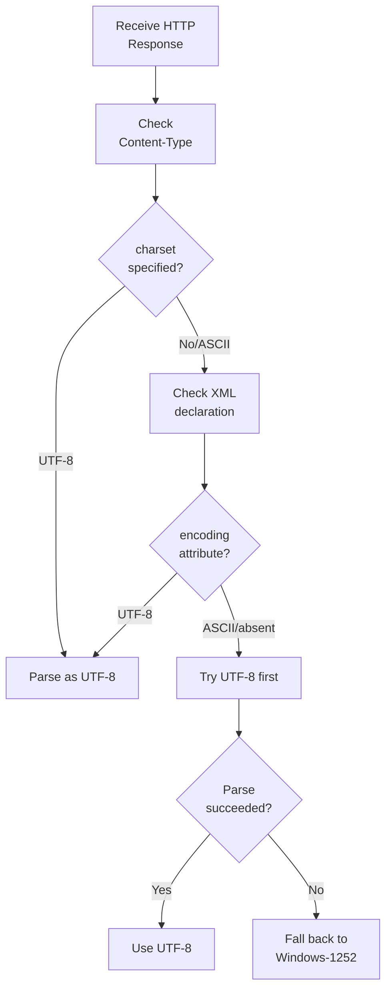

Character encoding seems like a solved problem until you deal with Indian SMB data. You'll encounter UTF-8, Windows-1252, Hindi, Gujarati, English -- sometimes all in the same company file.

## TallyPrime: UTF-8 by Default

TallyPrime (the current version) defaults to UTF-8 encoding for XML exports. Your HTTP response Content-Type will typically be:

```
Content-Type: text/xml; charset=UTF-8
```

This is the happy path.

## Tally ERP 9: Here Be Dragons

Older Tally ERP 9 installations export in Windows-1252 (ANSI) encoding. The XML declaration may say:

```xml
<?xml version="1.0" encoding="ASCII"?>
```

But the content contains Windows-1252 characters (the Rupee symbol, smart quotes, etc.). Your parser must handle this mismatch.

## Mixed-Language Content

Gujarat-based stockists frequently use multiple languages:

```
English:  Paracetamol 500mg Tab
Hindi:    पेरासिटामोल 500mg टैबलेट
Gujarati: પેરાસિટામોલ 500mg ટેબલેટ
Mixed:    Paracetamol 500mg गोली
```

All of these can exist in the **same** Tally company. A Stock Item might have an English primary name with Hindi aliases, or a Ledger might use Gujarati script entirely.

### Your Connector Must:

- Use UTF-8 for all HTTP requests
- Store all strings as TEXT (not ASCII-restricted types)
- Never truncate or re-encode -- pass through as-is
- Use Unicode-aware collation for search and matching

## Case Sensitivity: The Tally Quirk

Tally auto-capitalises the first letter of every master name on creation:

```
User types:    "raj medical store"
Tally stores:  "Raj medical store"

User types:    "RAJ MEDICAL STORE"
Tally stores:  "RAJ MEDICAL STORE"
```

Only the first letter gets capitalised. Everything else stays as typed. This means name casing is **inconsistent**.

:::tip
All name comparisons must be case-insensitive. Always. No exceptions.
:::

```python
# Always compare like this
if name1.lower() == name2.lower():
    # Same entity
```

## BOM (Byte Order Mark) Handling

Some Tally exports include a UTF-8 BOM (`0xEF 0xBB 0xBF`) at the start of the response. This invisible prefix can break XML parsers that don't expect it.

**Detection:**

```python
data = response.content
if data[:3] == b'\xef\xbb\xbf':
    data = data[3:]  # Strip BOM
```

In Go:

```go
data := resp.Body
if bytes.HasPrefix(data, []byte{
    0xEF, 0xBB, 0xBF,
}) {
    data = data[3:]
}
```

## Practical Encoding Detection Strategy



### Quick Detection Heuristic

Look for the Rupee symbol as a signal:

| Byte Sequence | Encoding |
|---|---|
| `0xE2 0x82 0xB9` (three bytes) | UTF-8 (correct) |
| `0x80` (single byte) | Windows-1252 (Euro sign, but sometimes misused) |

## The Non-Breaking Space Trap

Tally sometimes inserts non-breaking spaces (`\u00A0`) instead of regular spaces in names and descriptions. These look identical visually but fail string comparison:

```python
"Raj Medical"   # Regular spaces
"Raj\xa0Medical"  # Non-breaking space
```

Normalise spaces before comparison:

```python
import unicodedata

def normalize_spaces(s):
    return ' '.join(s.split())
```

Python's `split()` handles both regular and non-breaking spaces.

## Recommended Encoding Stack

| Layer | Recommendation |
|---|---|
| HTTP requests to Tally | UTF-8, always |
| XML parsing | Auto-detect, prefer UTF-8 |
| SQLite storage | TEXT columns (UTF-8 native) |
| Search / matching | Case-insensitive, Unicode-aware |
| Display | UTF-8, support Devanagari and Gujarati scripts |

:::caution
Never store encoded bytes in your database -- always decode to Unicode strings first. A Windows-1252 byte stream stored as-is in a UTF-8 database produces mojibake that's very hard to fix retroactively.
:::
