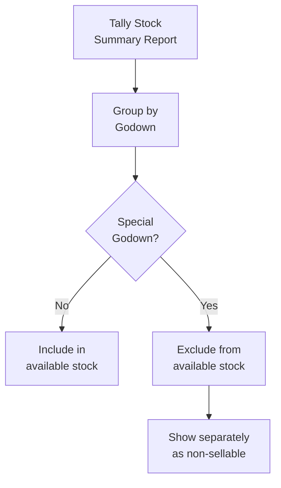

"Godown" is the Indian term for warehouse or storage location. In Tally, godowns track where inventory physically sits. The naming patterns range from obvious to creative.

## Simple Defaults

Every Tally company starts with one godown:

```
Main Location
```

:::caution
Never rename "Main Location" in Tally -- it's a legacy default that some older TDLs reference by name. It's fine to add more godowns, but leave this one alone.
:::

Other simple patterns:

```
Warehouse
Godown
Counter
Shop Floor
```

## Hierarchical Naming

Tally supports godown hierarchies. Distributors with large warehouses use them:

```
Ahmedabad Warehouse > Rack A
Ahmedabad Warehouse > Rack B
Main > Section 1
Main > Section 2
Main > Cold Storage
```

In XML, hierarchy is expressed via `PARENT`:

```xml
<GODOWN NAME="Rack A">
  <PARENT>Ahmedabad Warehouse</PARENT>
</GODOWN>
```

## Special-Purpose Godowns

This is where it gets interesting. Distributors create godowns for **operational states**, not just physical locations:

| Godown Name | Purpose | Include in Available Stock? |
|---|---|---|
| Main Location | Primary storage | Yes |
| Counter | Retail counter | Yes |
| Cold Storage | Temperature-controlled | Yes (with flag) |
| Damaged Stock | Physically damaged items | No |
| Expired Stock | Past expiry date | No |
| Return Stock | Customer returns pending inspection | No |
| QC Pending | Quality check pending | No |
| In Transit | Between locations | No |
| Vehicle | On delivery vehicle | No |
| Free Goods | Promotional/scheme stock | No |
| Sample Stock | Demo/sample items | No |

## Detection Strategy

Your connector needs to identify special godowns to exclude them from available stock calculations:

```python
EXCLUDE_KEYWORDS = [
    "damaged", "damage",
    "expired", "expiry",
    "return", "returned",
    "transit", "vehicle",
    "free goods", "free stock",
    "sample", "demo",
    "qc pending", "quarantine",
    "scrap", "waste",
    "rejected",
]

def is_special_godown(name):
    lower = name.lower()
    return any(
        kw in lower
        for kw in EXCLUDE_KEYWORDS
    )
```

## Available Stock Calculation



The correct way to get stock by godown:

```xml
<ENVELOPE>
  <HEADER>
    <TALLYREQUEST>Export</TALLYREQUEST>
    <TYPE>Data</TYPE>
    <ID>Stock Summary</ID>
  </HEADER>
  <BODY><DESC><STATICVARIABLES>
    <SVEXPORTFORMAT>
      $$SysName:XML
    </SVEXPORTFORMAT>
    <EXPLODEFLAG>Yes</EXPLODEFLAG>
  </STATICVARIABLES></DESC></BODY>
</ENVELOPE>
```

Then filter the results by godown classification.

## The "Free Goods" Godown Pattern

Pharma distributors handle scheme goods (buy 10 get 2 free) by putting free items in a separate godown. This is one of three methods for handling schemes:

```xml
<BATCHALLOCATIONS.LIST>
  <GODOWNNAME>Free Goods</GODOWNNAME>
  <AMOUNT>0</AMOUNT>
  <ACTUALQTY>2 Strip</ACTUALQTY>
</BATCHALLOCATIONS.LIST>
```

Stock in the "Free Goods" godown has zero value but real quantity. Your connector should track it but not include it in saleable inventory or valuation.

## Cold Storage: A Special Case

Cold storage godowns need a flag rather than exclusion:

```
Cold Storage items:
  - Insulin variants
  - Certain eye drops
  - Biological preparations
  - Vaccines
```

These ARE saleable but require special handling. Your sales app should flag orders containing cold storage items so the delivery team knows to arrange temperature-controlled transport.

:::tip
When profiling a new stockist, export the full godown list and classify each one. Store the classification in your connector's profile. Don't re-classify on every sync -- godown lists rarely change.
:::

## When Multi-Godown Is Disabled

If the company has `ISMULTISTORAGEOPTION = No`, there's only one godown ("Main Location") and godown names don't appear in voucher XML. Your connector should handle this gracefully:

```python
if not features["multi_godown"]:
    # All stock is in "Main Location"
    # No godown filtering needed
    available_stock = total_stock
```
