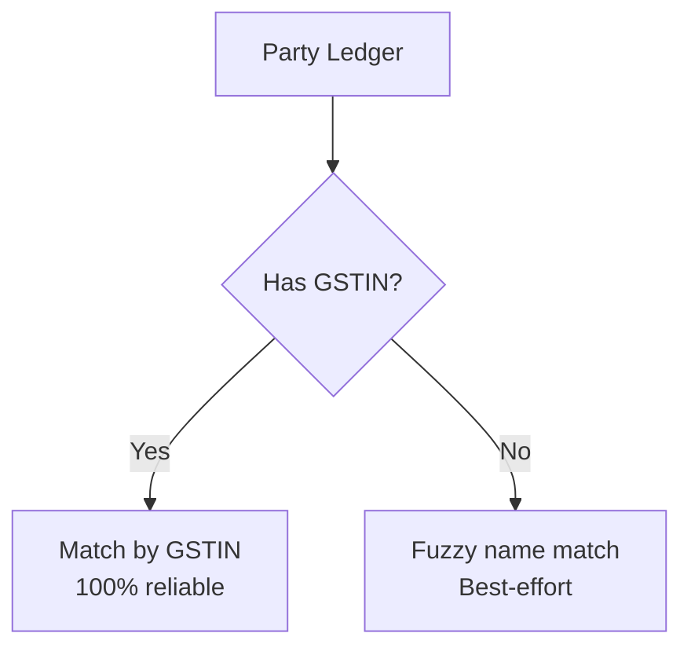
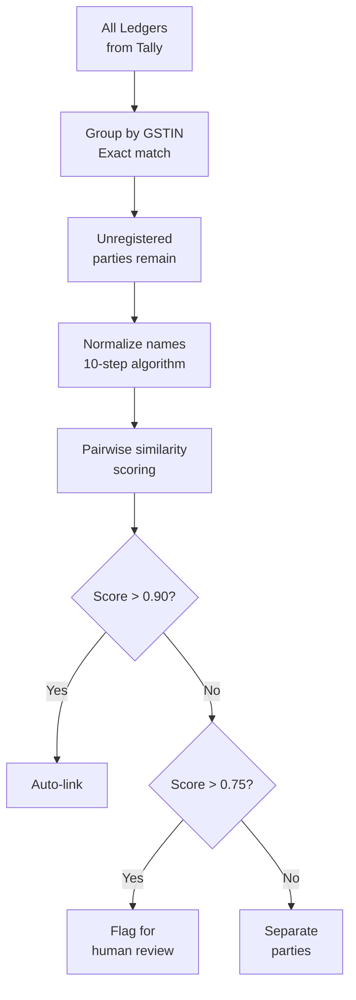

You've seen the [party naming chaos](/tally-integartion/real-world-data/party-naming-chaos/). Now let's solve it. How do you determine that "M/s Raj Medical Store, Ahmedabad" and "RAJ MED" are the same entity?

## The Two-Track Approach



## Track 1: GSTIN Matching (Registered Parties)

GSTIN (Goods and Services Tax Identification Number) is the **only** reliable identifier for a business entity across different Tally installations.

Format: `22ABCDE1234F1Z5` (15 characters)
- First 2 digits: State code
- Next 10 chars: PAN number
- Next 2 chars: Entity number
- Last char: Check digit

:::tip
Two parties with the same GSTIN are the **same legal entity**, regardless of how their names are spelled. This is your primary deduplication key.
:::

```sql
-- Find duplicate parties by GSTIN
SELECT gstin, COUNT(*) as cnt,
  GROUP_CONCAT(name) as names
FROM mst_ledger
WHERE gstin IS NOT NULL
  AND gstin != ''
GROUP BY gstin
HAVING cnt > 1;
```

## Track 2: Fuzzy Matching (Unregistered Parties)

Many small medical shops and retailers are unregistered (no GSTIN). For these, we fall back to name-based fuzzy matching.

### The 10-Step Algorithm

```
Input: two ledger names to compare

Step 1:  Lowercase both names
Step 2:  Strip prefixes:
         "m/s ", "m/s. ", "messrs ",
         "shri ", "smt "
Step 3:  Strip suffixes:
         " - s/dr", " - s/cr",
         " (old)", " - do not use"
Step 4:  Remove content in brackets:
         (AHM), [MN-AHM], (24)
Step 5:  Remove known city names:
         ahmedabad, surat, baroda,
         rajkot, vadodara, mumbai, etc.
Step 6:  Remove separators between
         name and location:
         " - ", " / "
Step 7:  Remove phone numbers
         (10+ consecutive digits)
Step 8:  Remove GSTIN patterns
         (15-char alphanumeric)
Step 9:  Collapse spaces, trim
Step 10: Compare using Levenshtein
         distance or trigram similarity
```

### Pseudocode

```python
def normalize_party_name(name):
    n = name.lower()

    # Step 2: Strip prefixes
    for p in ["m/s. ", "m/s ", "messrs ",
              "shri ", "smt "]:
        if n.startswith(p):
            n = n[len(p):]

    # Step 3: Strip suffixes
    for s in [" - s/dr", " - s/cr",
              " (old)",
              " - do not use"]:
        n = n.replace(s, "")

    # Step 4: Remove brackets
    n = re.sub(r'\([^)]*\)', '', n)
    n = re.sub(r'\[[^\]]*\]', '', n)

    # Step 5: Remove city names
    for city in KNOWN_CITIES:
        n = n.replace(city, "")

    # Step 6-8: Clean separators,
    # phone, GSTIN
    n = re.sub(r'\s*[-/]\s*$', '', n)
    n = re.sub(r'\d{10,}', '', n)
    n = re.sub(
        r'[0-9]{2}[A-Z]{5}\d{4}[A-Z]\d[A-Z]\d',
        '', n)

    # Step 9: Collapse spaces
    n = re.sub(r'\s+', ' ', n).strip()

    return n

def match_parties(name1, name2):
    n1 = normalize_party_name(name1)
    n2 = normalize_party_name(name2)

    dist = levenshtein(n1, n2)
    max_len = max(len(n1), len(n2))
    if max_len == 0:
        return 0.0
    similarity = 1 - (dist / max_len)
    return similarity
```

### Threshold Recommendations

| Similarity | Verdict | Action |
|---|---|---|
| > 0.90 | Very likely same party | Auto-merge |
| 0.75 - 0.90 | Probably same party | Flag for review |
| 0.50 - 0.75 | Unclear | Manual review only |
| < 0.50 | Different parties | No action |

:::caution
Never auto-merge below 0.90 similarity. False positives (merging different parties) are worse than false negatives (keeping duplicates). When in doubt, flag for human review.
:::

## Handling the "Both Sundry" Pattern

The same party may appear twice intentionally:

```
"ABC Pharma - S/Dr" (Sundry Debtors)
"ABC Pharma - S/Cr" (Sundry Creditors)
```

After normalization, both become "abc pharma". The fuzzy matcher will flag them as the same entity. Link them in your data model -- they represent buy/sell roles for the same business.

## The Alias System

Tally supports aliases. Check `LANGUAGENAME.LIST > NAME.LIST` for additional names:

```xml
<LEDGER NAME="Raj Medical Store">
  <LANGUAGENAME.LIST>
    <NAME.LIST TYPE="String">
      <NAME>Raj Medical Store</NAME>
      <NAME>Raj Med</NAME>
      <NAME>RMS Ahmedabad</NAME>
    </NAME.LIST>
  </LANGUAGENAME.LIST>
</LEDGER>
```

Index aliases alongside the primary name in your search/match system.

## Deduplication Pipeline


