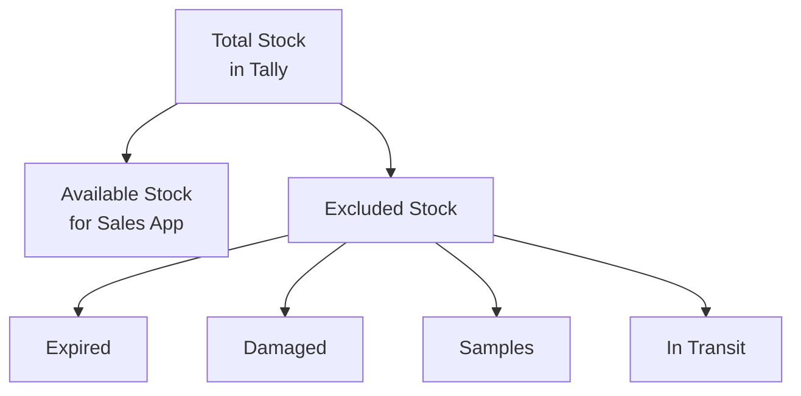

Stock Groups in Tally are like folders for your products. In theory, they provide clean categorisation. In practice, they're a fascinating window into how each business thinks about their inventory.

## The Four Organising Principles

### 1. By Therapeutic Category (Most Common)

CAs and experienced operators group by medical use:

```
Analgesics
Antibiotics
Anti-inflammatory
Cardiac
Diabetic
Gastro
Ortho
Derma
Opthal (Ophthalmology)
Ayurvedic
Homoeopathy
OTC
Surgical
```

This is the cleanest pattern. If you see these groups, the stockist (or their CA) put thought into the structure.

### 2. By Company / Brand

Distributors with strong company relationships:

```
Cipla
Sun Pharma
Micro Labs
Zydus
Alkem
Mankind
```

Makes sense for purchase-side analysis (how much are we buying from Cipla?) but muddies therapeutic categorisation.

### 3. By Drug Schedule

Regulatory-focused grouping:

```
Schedule H
Schedule H1
Schedule X
OTC Products
```

Useful for compliance but coarse-grained.

### 4. The Chaotic Mix

And then there's reality -- a blend of all three plus operational labels:

```
Cipla Products
Sun Pharma - Cardiac
General Medicines
Fast Moving
Slow Moving
Expired Stock
Near Expiry
Damaged
FMCG
```

## Handling Non-Product Groups

Some stock groups don't represent product categories at all. They represent **operational states**:

| Group Name | Is a Product Category? | How to Handle |
|---|---|---|
| Analgesics | Yes | Include in catalog |
| Cipla | Yes (by company) | Include in catalog |
| Expired Stock | No -- operational | Exclude from available stock |
| Damaged | No -- operational | Exclude from available stock |
| Near Expiry | No -- operational | Flag but include |
| Fast Moving | No -- operational | Ignore for categorisation |
| Slow Moving | No -- operational | Ignore for categorisation |
| Free Goods | No -- operational | Exclude from saleable stock |
| Sample Stock | No -- operational | Exclude from saleable stock |

:::tip
Build a detection list of common operational group names. When you encounter one, flag it as a non-product group so your catalog doesn't include "Expired Stock" as a product category.
:::

## Common Operational Group Keywords

```python
OPERATIONAL_KEYWORDS = [
    "expired", "expiry",
    "damaged", "damage",
    "fast moving", "slow moving",
    "free goods", "free stock",
    "sample", "demo",
    "return", "returned",
    "in transit", "transit",
    "scrap", "waste",
    "qc pending", "quarantine",
]

def is_operational_group(name):
    lower = name.lower()
    return any(
        kw in lower
        for kw in OPERATIONAL_KEYWORDS
    )
```

## Group Hierarchy

Groups can be nested. Tally has one built-in root: "Primary" (or "Stock-in-Hand"). Everything hangs off it:

```
Primary (built-in)
  ├── Analgesics
  │   ├── Pain Relief
  │   └── Fever
  ├── Antibiotics
  │   ├── Oral
  │   └── Injectable
  ├── Cipla Products
  ├── OTC / FMCG
  └── Expired Stock
```

When traversing the hierarchy, the `PARENT` field on each group tells you its parent:

```xml
<STOCKGROUP NAME="Pain Relief">
  <PARENT>Analgesics</PARENT>
</STOCKGROUP>
```

## Impact on Stock Calculations

If a Stock Item is under "Expired Stock" group, it's still counted in Tally's total inventory. But for your sales app, it should be **excluded** from available/saleable stock.



Your connector should:
1. Sync all stock groups from Tally
2. Tag operational groups with a flag
3. Exclude flagged groups when computing available stock
4. Still sync the data -- just don't show it as sellable
