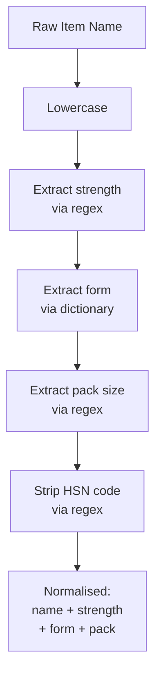

Pharma stock item naming is wildly inconsistent. The same product can be named a dozen different ways across (or even within) a single Tally company. Understanding the patterns is essential for product matching and search.

## The 5 Naming Patterns

### Pattern 1: Name + Strength + Form

The most structured pattern, but still varies:

```
Paracetamol 500mg Tab
PARACETAMOL 500 MG TABLET
Paracetamol-500mg Tab
Paracetamol 500 mg Tablets
PARA 500 TAB
Pcm 500
```

"Pcm 500" is the same drug. Good luck with that.

### Pattern 2: Brand Name + Form

```
Dolo 650
DOLO-650 TAB
Dolo 650mg Tablet
DOLO 650 TAB 15S
```

Note how pack size sneaks into the name in that last example.

### Pattern 3: Brand + Company

```
Dolo 650 (Micro Labs)
DOLO 650 - MICRO
Dolo 650 Tab [ML]
```

Company name is added for disambiguation when multiple manufacturers make the same molecule.

### Pattern 4: Pack Size in Name

```
Paracetamol 500mg 10s
Paracetamol 500mg Strip/10
Paracetamol 500mg x 10
Amoxicillin 250mg 10x10
Crocin Advance 15s
Pan-D Cap 10s
Augmentin 625 Duo Tab 10s
Azithral 500 Tab 3s
Betadine 50ml
Benadryl Syrup 100ml
Moov Spray 80g
```

Pack size appears as "10s", "Strip/10", "x 10", or "10x10" (10 strips of 10 = 100).

### Pattern 5: HSN Code in Name

```
Paracetamol 500mg (30049099)
Para 500 Tab-30049099
```

HSN (Harmonized System of Nomenclature) codes are embedded because the operator wants quick GST classification visibility.

## The Abbreviation Dictionary

Build a normalisation layer that maps variants to canonical forms:

| Variants | Canonical |
|---|---|
| Tab, Tablet, Tablets, TAB | Tablet |
| Cap, Capsule, Capsules, CAP | Capsule |
| Inj, Injection, Vial, INJ | Injection |
| Syr, Syrup, SYR | Syrup |
| Drop, Drops, DRP | Drops |
| Cream, CRM | Cream |
| Oint, Ointment | Ointment |
| Spray, SPR | Spray |
| Gel | Gel |
| Susp, Suspension | Suspension |
| Bot, Bottle, Btl | Bottle |

## Regex Patterns for Extraction

### Strength Extraction

```
/(\d+\.?\d*)\s*(mg|mcg|g|ml|%|iu)/i
```

Examples:
```
"Paracetamol 500mg"    -> 500, mg
"Augmentin 625 Duo"    -> 625, (implied mg)
"Benadryl Syrup 100ml" -> 100, ml
"Betadine 5%"          -> 5, %
```

### Pack Size Extraction

```
/(\d+)\s*[sx]/i
/strip\s*\/?\s*(\d+)/i
```

Examples:
```
"DOLO 650 TAB 15S"     -> 15
"Strip/10"             -> 10
"10x10"                -> 100 (10 * 10)
"Pan-D Cap 10s"        -> 10
```

### HSN Extraction

```
/\(?(\d{4,8})\)?$/
```

Examples:
```
"Para 500 Tab-30049099" -> 30049099
"(30049099)"            -> 30049099
```

## Compound Units

Pharma uses compound units that your parser must understand:

```
"Box of 10 Strip"
"Carton of 100 Strip"
"Dozen of 12 Nos"
"Case of 50 Bottle"
```

```xml
<BASEUNITS>Strip</BASEUNITS>
<ADDITIONALUNITS>Box</ADDITIONALUNITS>
<CONVERSION>10</CONVERSION>
<!-- 1 Box = 10 Strips -->
```

## Practical Normalisation Pipeline



:::tip
Don't try to make naming consistent within Tally -- you'll break the operator's workflow. Normalise in your connector's **search index** instead. Store the raw name as-is, but build a normalised version for matching and search.
:::

## The Alias Lifeline

Tally supports multiple aliases per stock item:

```xml
<STOCKITEM NAME="Paracetamol 500mg Tab">
  <LANGUAGENAME.LIST>
    <NAME.LIST TYPE="String">
      <NAME>Paracetamol 500mg Tab</NAME>
      <NAME>Dolo 650</NAME>
      <NAME>Crocin 500</NAME>
      <NAME>PCM 500</NAME>
    </NAME.LIST>
  </LANGUAGENAME.LIST>
</STOCKITEM>
```

Always extract and index aliases. The sales app should search across primary name **and** all aliases.
