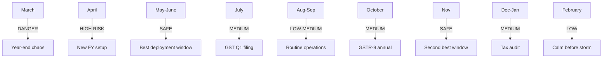
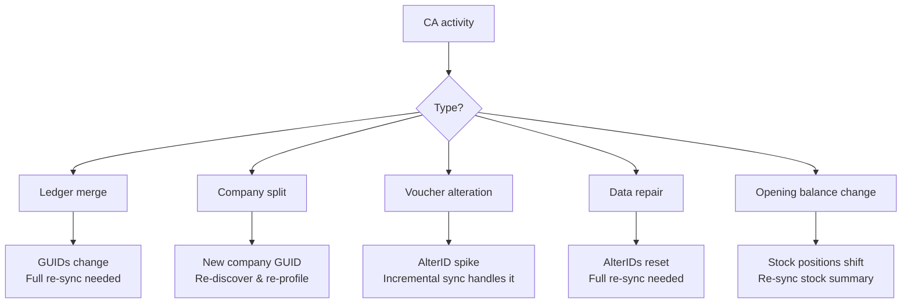

Timing your connector deployment is almost as important as building it. Indian businesses run on a rhythm dictated by the CA (Chartered Accountant) calendar, and certain months are absolute minefields for integration stability.

Deploy at the wrong time, and you'll spend your first week fighting data restructuring instead of actually syncing.

## The CA Calendar at a Glance



## Month-by-Month Risk Assessment

| Month | CA Activity | Risk | Why |
|---|---|---|---|
| **March** | Year-end closing | DANGER | Massive voucher alteration, stock verification, ledger corrections |
| **April** | New FY setup | HIGH | Company split, new company creation, opening balances, voucher numbering reset |
| **May** | Post-FY settling | LOW | Routine operations resume |
| **June** | Normal operations | LOW | Stable period |
| **July** | GSTR-1/3B Q1 filing | MEDIUM | GST corrections, voucher amendments for Q1 |
| **August** | Normal operations | LOW | Routine |
| **September** | Half-yearly review | MEDIUM | Some reconciliation, corrections |
| **October** | GSTR-9 annual prep | MEDIUM | Major GST reconciliation, corrections going back months |
| **November** | Normal operations | LOW | Stable period |
| **December** | Tax audit prep | MEDIUM | Back-dated entries, data verification for large entities |
| **January** | Tax audit continues | MEDIUM | More back-dated entries |
| **February** | Pre-year-end | LOW | Calm before the March storm |

## The Danger Zones

### March: Year-End Chaos

March is when CAs earn their fees. Here's what happens in a typical stockist's Tally:

- **Stock verification**: Physical stock count vs Tally count. Adjustments via Stock Journal vouchers
- **Outstanding reconciliation**: Debtor/creditor balance confirmations, adjustments
- **Ledger merging**: Duplicate ledgers get merged (both GUIDs and AlterIDs change)
- **Voucher corrections**: Back-dated entries, cancellations, alterations
- **Depreciation entries**: Fixed asset depreciation posted
- **Provisioning**: Accrual entries for unpaid expenses

:::danger
**Never deploy a new connector in March.** AlterIDs will spike. Ledgers will be renamed and merged. Vouchers will be backdated, altered, and deleted. Your connector's incremental sync will struggle to keep up with the chaos.
:::

**Connector impact:**
- AlterID watermarks become unreliable
- Ledger GUIDs may change (after merge)
- Stock positions shift dramatically
- Full re-sync may be needed after year-end

### April: New Financial Year

April brings structural changes:

- **Company split**: CA splits last year's data into a separate company. Company GUIDs change.
- **New company creation**: Some stockists start fresh each year
- **Opening balances**: Carried forward from previous year. May take weeks to finalize.
- **Voucher numbering reset**: Serial numbers restart from 1
- **GST registration updates**: New year, sometimes new registration details

:::caution
If you deploy in April, your connector might discover a company, profile it, sync all the data -- and then the CA splits the company and everything changes. Wait until the dust settles.
:::

## The Safe Windows

### May-June: The Best Time

By May, the year-end dust has settled. The CA has finished their adjustments. Opening balances are set. The new FY is running smoothly. This is when you want to deploy:

- Data is stable
- Operations are routine
- The stockist has bandwidth to help with setup
- You have months of stable running before the next disruption

### November: The Second-Best Time

November sits in a quiet pocket between the October GST annual filing and the December tax audit. It's a good window for:

- New deployments
- Major connector upgrades
- Full re-sync operations
- Data migration

## What "Disruption" Looks Like for Your Connector

When a CA makes structural changes, here's what your connector faces:



### Severity by Activity

| CA Activity | Connector Impact | Recovery |
|---|---|---|
| Voucher alteration | Low | AlterID catches it |
| Ledger rename | Low | GUID stable, name updated |
| Ledger merge | High | Full re-sync |
| Company split | Critical | Re-discover everything |
| Data repair | Critical | Full re-sync |
| Opening balance change | Medium | Re-sync stock summary |

## Planning Your Deployment

### Pre-Deployment Checklist

```
[ ] Check if CA has finished year-end work
[ ] Verify company is not mid-split
[ ] Confirm opening balances are finalized
[ ] Ask stockist about upcoming CA visits
[ ] Verify no Tally upgrade planned
```

### Deployment Day Best Practices

1. **Deploy on a weekday** -- the stockist is available to help
2. **Start the initial sync in the evening** -- heavy data pull runs overnight
3. **Verify data the next morning** -- spot-check stock items and recent vouchers
4. **Run a full week** in observation mode before going live

### Post-Deployment Monitoring

For the first month, watch for:

- AlterID spikes (CA making corrections)
- Company GUID changes (split)
- Sudden increase in error rates
- Stock position mismatches

## The "CA Is Coming" Protocol

When a stockist tells you their CA is visiting next week:

1. **Run a full reconciliation** before the CA arrives
2. **Increase monitoring** during the CA visit
3. **Expect AlterID spikes** -- back-dated entries, corrections
4. **Run another reconciliation** after the CA leaves
5. **Check for ledger merges** -- compare GUID lists before and after
6. **If AlterID went backwards** -- trigger full re-sync

Think of CA visits as planned maintenance windows. You know disruption is coming -- prepare for it.
