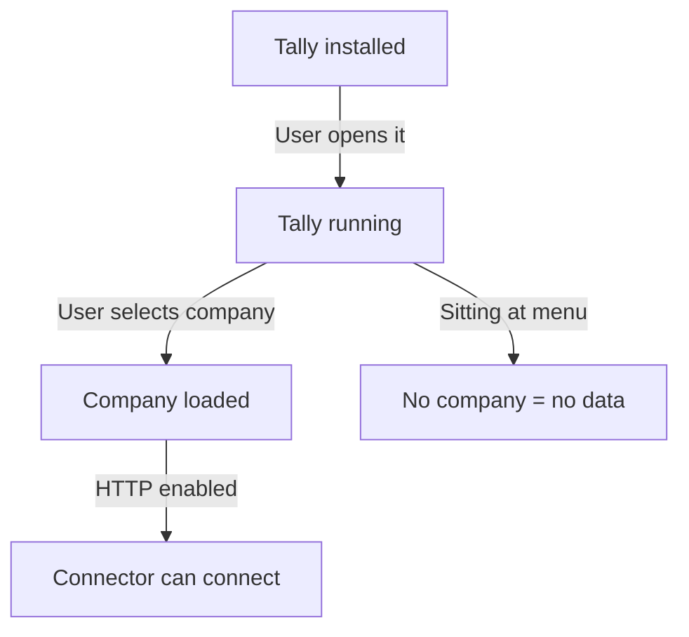

Here's a fact that surprises most developers on day one: Tally is a GUI application. It's not a headless service. It's not a daemon. There is no "start Tally in the background" mode.

For your connector to work, someone must have Tally open on their screen with a company loaded.

## The Loading Requirement



The chain is:

1. Tally must be **installed**
2. Tally must be **running** (GUI visible)
3. A company must be **loaded** (selected by the user)
4. The HTTP server must be **enabled**

Break any link in that chain and your connector gets nothing.

## Multi-Company Scenarios

Tally can have **multiple companies loaded** simultaneously. This is extremely common in Indian SMBs:

- Pharma distributors often maintain two companies (Ethical drugs + OTC/FMCG)
- Businesses with multiple GSTINs run separate companies per state
- CAs managing multiple clients load them side by side

When multiple companies are loaded, Tally processes your XML request against the **active** company (the one currently displayed). You can also specify a target company in your request:

```xml
<ENVELOPE>
  <HEADER>
    <VERSION>1</VERSION>
    <TALLYREQUEST>Export</TALLYREQUEST>
    <TYPE>Data</TYPE>
    <ID>List of Companies</ID>
  </HEADER>
  <BODY><DESC>
    <STATICVARIABLES>
      <SVCURRENTCOMPANY>
        My Pharma Pvt Ltd
      </SVCURRENTCOMPANY>
      <SVEXPORTFORMAT>
        $$SysName:XML
      </SVEXPORTFORMAT>
    </STATICVARIABLES>
  </DESC></BODY>
</ENVELOPE>
```

:::tip
Always specify `SVCURRENTCOMPANY` in your requests. If you don't, Tally uses whichever company the operator is currently looking at -- and that can change at any moment.
:::

## Company Discovery

On startup, your connector should always ask "what companies are loaded?"

```xml
<ENVELOPE>
  <HEADER>
    <VERSION>1</VERSION>
    <TALLYREQUEST>Export</TALLYREQUEST>
    <TYPE>Data</TYPE>
    <ID>List of Companies</ID>
  </HEADER>
  <BODY><DESC>
    <STATICVARIABLES>
      <SVEXPORTFORMAT>
        $$SysName:XML
      </SVEXPORTFORMAT>
    </STATICVARIABLES>
  </DESC></BODY>
</ENVELOPE>
```

This returns every loaded company. Store these names and GUIDs at startup.

## The Company-Switch Problem

Here's a scenario that will bite you if you're not careful:

1. Operator has "Pharma Corp" loaded
2. Your connector starts syncing inventory
3. Operator switches to "FMCG Division"
4. Your connector's next request hits the wrong company

**Detection strategies:**

- **Specify the company name** in every request using `SVCURRENTCOMPANY`
- **Check the response** for the company name before processing
- **Use the heartbeat** (`$$CmpLoaded`) to monitor which company is active

:::caution
If a company is **unloaded** (closed) while your connector is mid-sync, requests will fail with an error or return empty data. Your connector must detect this and pause until the company is available again.
:::

## What Loading Actually Means

When a company is "loaded" in Tally, its data files are open and locked:

```
C:\Users\Public\TallyPrime\Data\
  └── 10000\              ← Company folder
      ├── Company.900     ← Locked while loaded
      ├── manager.900     ← Master data (locked)
      ├── tranmgr.900     ← Transactions (locked)
      └── *.tsf           ← Temp files (active)
```

This means:
- You can't copy data files while a company is loaded
- Backup software may fail on locked files
- The connector should never try to read data files directly

## Company Identification

Companies have both a **name** and a **GUID**. After a company split (common during FY transitions), the name might stay the same but the GUID changes.

```
Before split:
  "ABC Pharma" → GUID: abc-123

After split:
  "ABC Pharma" → GUID: xyz-789 (new!)
  "ABC Pharma (2024-25)" → GUID: abc-123
```

Always identify companies by GUID, not name. If a GUID changes, trigger a full re-sync.

## Handling No Company Loaded

When Tally is running but no company is loaded, your connector should:

1. Detect the state (empty response to `$$CmpLoaded`)
2. Log a warning
3. Retry periodically (every 30 seconds)
4. Alert after 30 minutes of continuous failure
5. **Never crash** -- just wait patiently

The operator will load a company eventually. Your connector's job is to be ready when they do.
